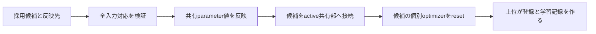

# 設計: 採用候補の共有特徴学習の反映

## Overview / Boundary Commitments
モデル層が共有特徴parameter値の反映を所有する。training層が候補の反映→接続→個別resetの順序を所有する。
上位が候補採否・反映先選択・共有optimizer対応・登録を所有する。今回は登録済みIDや返却bindingを作らない。
Allowed Dependencies: モデル層は既存torchのみ。新training moduleはTorch公開型/属性、ResidualAdapterClassifier、SharedFeatureExtractor、ParameterOptimizerStateの公開型だけ。旧package・設定・学習計算・private helperへ依存しない。
Revalidation Triggers: 値反映方式、parameter identity、optimizer更新時機、反映先選択の変更。

## API / Contracts
SharedFeatureExtractor.copy_parameter_values_from(*, source_feature_extractor: SharedFeatureExtractor) -> None。
exact sourceと自身を既存validate_structureで検証し、source寸法が自身と一致することを確認後、既存load_state_dict（assign既定False）で値だけを転写する。
空hidden tuple/同一sourceも対応する。parameter identityとgradは保持、source state_dictは借用値であり書き換えない。数値有限性は新規条件として追加しない（旧load同様）。
SharedFeatureExtractorの公開構造契約内だけを扱い、追加buffer/private改ざん・並行変更は通常契約外。

integrate_adopted_candidate_shared_features(*, adopted_candidate_classifier: ResidualAdapterClassifier, candidate_concept_specific_parameter_optimizer_state: ParameterOptimizerState, active_shared_feature_extractor: SharedFeatureExtractor) -> None。
全入力を検証してから、active.copy_parameter_values_from(source=candidate.feature_extractor)→candidate.attach_shared_feature_extractor(active)→candidate個別owner.reset_parameter_optimizerの順。
検証: exact classifier/owner/extractors、両共有部の構造・寸法一致、候補adapter+classification順の非空一意CPU32 strided/notnested exactParameterとowner現在exactAdam/SGDのflatten groupsがidentity/順序一致。
個別parameterと双方共有parameterが独立であることも確認する。概念層の外側改ざんは通常契約外。
active共有owner/候補旧共有ownerを引数に取らず操作しない。上位はactive共有ownerとreset後の同じ個別ownerから現在学習記録を作る。
交換前の個別optimizer、候補旧共有部/optimizerを借用する既存記録は旧参照のまま。候補classifierのlive参照はactiveへ変わる。
戻り値Noneは登録/ID対応を意味しない。候補が既にactive共有でも必ず個別resetする。
通常検証失敗は全副作用前。予期しない途中例外は伝播し、完了済み値反映・接続を保持する（全体rollbackなし）。

## File Structure Plan
|パス|変更|責務|
|---|---|---|
|src/federated_learning_experiments/learning/models/shared_feature_extractor.py|変更|検証後の値転写|
|src/federated_learning_experiments/learning/training/adopted_candidate_shared_feature_integration.py|新規|採用済み候補の準備|
|tests/refactoring/test_adopted_candidate_shared_feature_integration.py|新規|値反映・状態保持・拒否・実旧学習対照|
|tests/refactoring/test_single_run_dependency_boundaries.py|変更|新module exact guard|
|対象spec、roadmap|新規/変更|承認・証拠・進捗|

## Requirements Traceability / Testing Strategy
|要件|証拠|
|---|---|
|1.1/1.2/1.3|異なる学習値転写、複数既存model共有参照、値/grad/optimizer/RNG保持、旧実準備との対照|
|2.1/2.2/2.3|反映/attach/reset順、同一共有部、旧借用optimizerstate保持|
|3.1|型・構造・寸法・dtype/device・owner対応/順序・parameter重複/共有重複の拒否、全状態保持|
|3.2|途中reset例外に対する値反映と接続保持|
|3.3|public APIの限定、AST exact依存、fresh新CPU、固定旧差分|
class2/4×Adam標準/AMSGrad/SGD×候補初期共有有無の12条件で、先行optimizer step→実旧_prepare_model_for_registration→3回共同学習を全loss/値/grad/stateへexact照合する。
単体は先行import RED、ASTは禁止/許可先行RED。全pytest（旧11/最終3golden）、Ruff/format/Pyright/pip、fresh新CPU、固定旧差分、sourcehashを記録。
