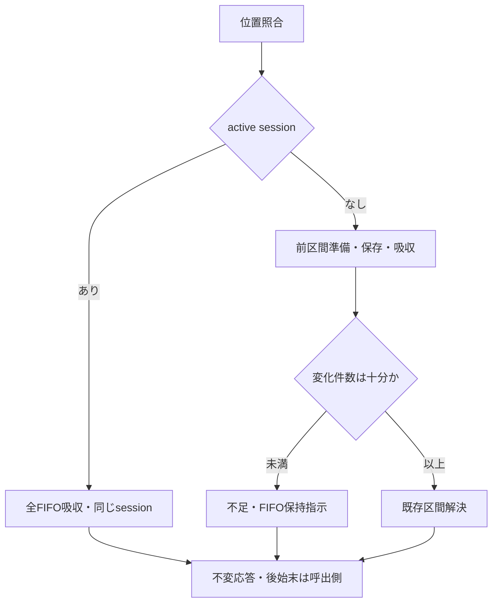

# 警報時の保留標本への応答 — 設計 revision2

## 1. Boundary Commitments

- runtimeの`respond_to_alarm_with_buffered_samples`が、active session優先、不在時の準備→最小件数→解決を組み立てる。独自の再利用評価・学習・保存規則を作らない。
- 結果`AlarmBufferResponse`も同runtime moduleへ配置する。既存session/resolutionはruntime定義なので、methodsからruntimeへ逆依存するrecordを追加しない。
- 状態所有者はすべて既存公開API。本処理はsessionの保存先やイベント台帳を持たない。

## 2. Out of Boundary

実際のFIFO消費・検出器reset・イベントと通知・切替位置/再利用計数台帳・session保持・episode許可・設定宣言への登録・計算量診断・新client/全体run。旧の不足時FIFO保持は修正しない。全体rollback・並行変更は保証しない。

## 3. 契約と処理順

入力は、既存`resolve_alarm_change_interval`の引数のうち区間training/concept列を除いた全設定/owner/metadataと、active_validation_session、位置付き観測tuple、FIFO、推定span、最小件数、評価store、明示Random。所有者bundleや可変dictを公開APIへ持ち込まない。

1. active sessionはNoneまたはexact PostAlarmCandidateValidationSession。FIFO owner・tuple・位置付きrecord・builtin非負int位置・FIFO snapshotとの位置列完全一致を更新前に検査。現在の帰属ownerはexact型。概念ID/payloadと他ownerの検査は既存公開APIへ委譲する。
2. activeあり: 全保留recordのtraining/concept列を公開吸収へ渡す。空tupleも既存吸収のowner検査後no-op。同じsessionを返す。span・minimum・評価store・Random・候補設定/metadataは読まない。
3. activeなし: 最小件数はboolを含まないbuiltin intかつ1以上、準備前に検査。公開prepareへ全保留列を渡す（span型/正値は同APIが更新前に検査）。
4. 準備の変化区間件数<minimumなら不足結果。これでも前区間の保存・吸収は完了している。変化区間の分類器依存検査やresolver入力は使用しない。
5. 十分なら準備済み変化区間のtraining/concept tupleを公開resolverへ渡す。proposal_sample_index、estimated_change_point_sample_index、detection_episode_id、detector_nameは元のmetadataをそのまま渡す（FIFO切詰め後開始位置で上書きしない）。結果と開始sessionを返す。

型不正はTypeError、値/対応不正はValueError、未保有は既存LookupError系列。所有する初期構造検査は全更新前。準備後のresolver拒否/実行失敗では、前区間の保存・吸収が残る。この境界をtestで明示し、全設定を使わないactive/不足経路へ過剰な候補検査を加えない。

## 4. 結果

frozen/kw_onlyの`AlarmBufferResponse`はresponse_outcome、prepared_alarm_training_intervals、change_interval_resolution、active_validation_sessionを持つ。sessionは既存の可変内部ownerを含む借用参照で、結果frozenはsessionの深い不変性を保証しない。

| response_outcome | prepared / resolution / session | 旧action | 後のFIFO消費指示 |
| --- | --- | --- | --- |
| alarm_during_candidate_validation | None / None / 入力と同じsession | forward_validation_pending | True |
| alarm_change_interval_too_short | 準備結果 / None / None | insufficient_data | False |
| alarm_interval_held_model_reused | 準備結果 / 解決結果 / None | reuse | True |
| alarm_interval_current_model_maintained | 準備結果 / 解決結果 / None | maintain | True |
| alarm_interval_candidate_validation_started | 準備結果 / 解決結果 / 開始session | create_pending | True |

readonly property `pending_assignment_buffer_should_be_cleared`は不足以外True。正式な5値とfieldの組をconstructorで検査する（解決のoutcomeとsession参照も一致必須）。本処理はFIFOをdrainせず、結果から呼出側が旧順序のevent→reset→drainを実装する。

表の「準備結果」はexact `PreparedAlarmTrainingIntervals`、「解決結果」はexact `AlarmChangeIntervalResolution`、「session」はexact `PostAlarmCandidateValidationSession`である。activeでは準備/解決は必ずNone、sessionは必須。不足では準備だけ必須、解決/sessionは必ずNone。3解決結果では準備/解決が必須で、`response_outcome == change_interval_resolution.resolution_outcome`かつ`active_validation_session is change_interval_resolution.started_validation_session`が必須。field組合せ不正はValueError。正式値以外と非strもValueError。これらがconstructorの受理集合である。

## 5. Allowed Dependencies

新runtimeは標準dataclasses.dataclass/random.Random、既存設定・owner・位置/準備record・分類器型、公開prepare/absorb/resolve、既存AlarmChangeIntervalResolutionと結果定数、PostAlarmCandidateValidationSessionのみをimportする。各実symbolのexact一覧を命名表とAST guardへ固定する。旧/source-private/CLI/artifacts/evaluation判定部/wholemoduleは拒否する。initの再exportなし。旧importはoracle test内だけ。

## 6. Revalidation Triggers

準備/吸収の拒否契約、区間解決の結果名・session型・metadata、FIFOの位置列/容量、候補学習・参照固定のRNGが変わったら、その隣接specとこの接続testを再検証する。既存部品のsourceは今回変更しない。

## 7. File Structure Plan

- 新src: `src/federated_learning_experiments/runtime/alarm_buffer_response.py`（結果と分岐の組立）。
- 新test: `tests/refactoring/test_alarm_buffer_response.py`（実旧oracle/拒否/結果/順序/接続）。
- 変更test: `tests/refactoring/test_single_run_dependency_boundaries.py`（1module exact集合/両resolver/注入）。
- 新spec証拠: integration-validation.md（対象commit/hash・全回帰・最終判定）。

## 8. Testing Strategy / Requirements Traceability

| 要求 | 証拠 |
| --- | --- |
| 1.1, 2.3 | 実旧active分岐と全FIFO吸収を2/4class、正規/負ID、空/非空、概念IDなしで比較。候補/固定参照parameter・optimizer・損失履歴・保留検証標本は不変、同じsession参照 |
| 1.2, 1.3 | 実旧不足分岐、最小件数直前/ちょうど・長短span・空・容量+1。前区間更新は不足でも実行、変化区間は未吸収 |
| 1.4 | 実旧全3解決結果と前区間を含む最終状態、保存標本/Random、候補parameters/references/torch消費、元metadataを照合 |
| 2.1, 2.2 | frozen/kw_only・formal5値/field拒否・property、FIFO/最終位置不変と旧消費/保持の指示一致 |
| 3.1 | common位置/型とminimum/span拒否、全状態/乱数不変。activeで未使用入力を不正値にしても成功。prepare/resolverへの委譲と部分更新境界も検証 |
| 3.2 | 実旧メソッドの正常5経路、公開操作の記録wrapper、後続共同学習・候補観測、代表source変異、exact AST、新-only fresh CPU、旧11/最終3を含む全pytest、Ruff/Pyright |

旧oracleで推定span提供・event収集・reset記録を差し替える。吸収/保存/区間評価/候補学習/参照固定は実計算。FIFO後始末は実旧で行われた保持/消費と新のpropertyを比較、新FIFOは常に不変。event/reset/通知の新実装と新全体runの一致は未検証として残す。
