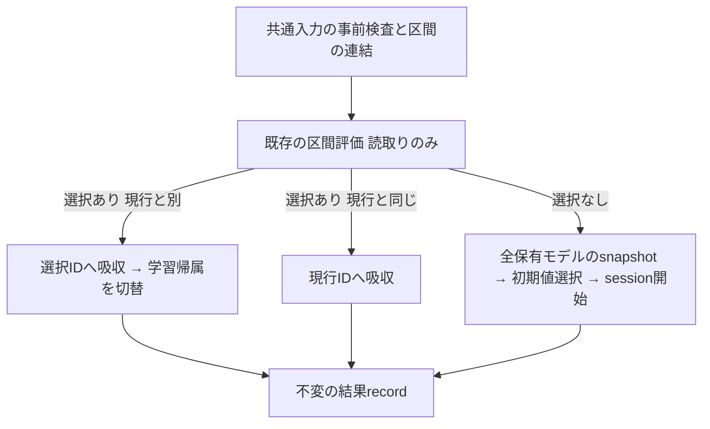

# 設計 revision3

## Overview

runtimeに1つのmoduleを追加する。既存の公開部品（区間評価、吸収、学習帰属、parameter snapshot、初期値選択、session開始）を順に呼び、結果を不変recordで返す。新しい数値処理は、区間の標本を1つのTensorへ連結することだけ。

## Boundary Commitments

### This Spec Owns

- 変化区間の標本列の検査と連結、分岐に依らない入力の事前検査。
- 区間評価→（再利用: 吸収→切替 / 維持: 吸収 / 適合なし: 全保有モデルのsnapshot→初期値選択→session開始）の組立。
- 結果種別の正式値と不変の結果record。

### Out of Boundary

FIFOの分割と消費、前区間の処理、最小区間件数、候補検証中の警報、検出器reset、イベント・切替位置・再利用計数の記録、通知、active sessionの保持、計算量診断（旧`compute_counters`のdetection/statistics等の計上。上流の区間評価・吸収と同じく未移植）、許容損失増加量の設定型への登録、旧/config/private import、alias、再export、既存公開APIの変更。旧の他の作成方針（immediate/validated）。

### Allowed Dependencies

runtime/alarm_change_interval_resolution.py: exact `dataclasses.dataclass`、`torch.Tensor`、`torch.cat`、`torch.float32`、`torch.strided`、公開の`ModelAndClassLossStatisticsStore`、`ResidualAdapterClassifier`、`snapshot_classifier_parameters`、`CandidateEpochTrainingSettings`、`CurrentTrainingModelAssignment`、`TrainingModelAssignmentChange`、`HeldModelTrainingStateRegistry`、`ModelTrainingAndAssignmentCountsStore`、`ObservedTrainingSample`、`ModelTrainingSampleStore`、`AdamParameterOptimizerSettings`、`SgdParameterOptimizerSettings`、`AlarmIntervalModelReuseAssessment`、`CandidateModelTrainingAndAcceptanceSettings`、`select_candidate_initial_parameter_snapshot`、`CandidateParameterInitializationSettings`、`evaluate_held_models_for_alarm_interval_reuse`、`absorb_assigned_training_samples_into_held_model`、`PostAlarmCandidateValidationSession`、`start_post_alarm_candidate_validation_session`のみ。定義moduleからの直接from import。module丸ごと・再export・子module・privateは不可。testでだけ旧oracleを参照する。

### Revalidation Triggers

分岐条件、吸収と切替の順序、連結の方法、初期値選択へ渡す候補列、session開始へ渡す引数、結果種別・record fields、事前検査の範囲を変えたら、実旧対照を再検証する。命名・責務の変更は承認を解除する。上流部品の契約変更時も再検証する。

## Architecture / System Flow

## File Structure Plan

| 操作 | ファイル | 責務 |
| --- | --- | --- |
| 作成 | src/federated_learning_experiments/runtime/alarm_change_interval_resolution.py | 結果種別、結果record、事前検査、組立 |
| 作成 | tests/refactoring/test_alarm_change_interval_resolution.py | 実旧対照、record、拒否、呼出し順、後続学習 |
| 変更 | tests/refactoring/test_single_run_dependency_boundaries.py | exact guard、両resolver、注入契約 |
| 更新 | 本specの正本/証拠、steering resume/roadmap | 承認/完了/再開 |

## Components & Interfaces / Contract

`ALARM_CHANGE_INTERVAL_RESOLUTION_OUTCOMES: tuple[str, ...]` = (`"alarm_interval_held_model_reused"`, `"alarm_interval_current_model_maintained"`, `"alarm_interval_candidate_validation_started"`)。旧のaction reuse / maintain / create_pending、戻り値1 / 0 / 0に対応する（対応はtest内だけで使う）。候補検証の確定処理の結果種別（held_reference_model_reused、current_model_maintained等）と値だけで区別できるよう、3値とも警報区間の結果であることを接頭辞で示す。

`AlarmChangeIntervalResolution`: frozen/kw_only、全必須。`resolution_outcome: str`、`alarm_interval_reuse_assessment: AlarmIntervalModelReuseAssessment`、`assigned_model_id: int | None`、`training_model_assignment_change: TrainingModelAssignmentChange | None`、`started_validation_session: PostAlarmCandidateValidationSession | None`。`__post_init__`は結果種別が正式値であることだけを検査する（既存の確定recordと同じ方針。field間の整合は内部producerを信頼する）。

`resolve_alarm_change_interval`: 全keyword必須。

- 区間: `change_interval_training_samples: tuple[ObservedTrainingSample, ...]`、`change_interval_sample_concept_ids: tuple[int | None, ...]`
- 判定: `maximum_alarm_interval_mean_loss_increase: float`
- 所有者: `held_model_training_state_registry`、`loss_statistics_store`、`training_sample_store`、`model_training_and_assignment_counts_store`、`current_training_model_assignment`
- 候補検証の開始だけに使う入力: `candidate_parameter_initialization_settings: CandidateParameterInitializationSettings`、`architecture_reference_classifier: ResidualAdapterClassifier`、`parameter_optimizer_settings: AdamParameterOptimizerSettings | SgdParameterOptimizerSettings`、`candidate_epoch_training_settings: CandidateEpochTrainingSettings`、`candidate_model_training_and_acceptance_settings: CandidateModelTrainingAndAcceptanceSettings`、`proposal_sample_index: int`、`estimated_change_point_sample_index: int | None`、`detection_episode_id: int | None`、`detector_name: str`
- 戻り値: `AlarmChangeIntervalResolution`

処理:

1. 事前検査（状態変更・乱数消費・分類器の評価より前）。5つの所有者のexact型。標本列はexact tupleで非空、各要素はexact `ObservedTrainingSample`、特徴とラベルはexact `Tensor`（`type(...) is Tensor`。派生型はTypeError。既存のsession開始の保留標本検査と同じ条件にし、派生型の標本が再利用・維持では通り候補検証開始でだけ拒否されるという分岐依存をなくす）でCPU float32 strided、特徴はshape[1, F]でFは先頭の標本と同じ、ラベルはshape[1, 1]。概念ID列はexact tuple、標本列と同じ長さ、各要素はNoneまたはbool以外のbuiltin int。保有モデルが1件以上あり、現在の学習帰属IDが保有モデルに含まれる。型はTypeError、値・形状・長さはValueError、保有なしと帰属が保有外はLookupError。値の有限性・ラベル範囲・許容損失増加量は次の区間評価が検査する。
2. 区間の連結。`cat`で特徴とラベルをそれぞれ標本順に連結する（旧のbx/byと同じ値）。
3. 既存の区間評価を1回呼ぶ（読取りのみ）。ここでの拒否は状態を変えない。
4. 選択IDがある場合。既存の吸収をそのIDへ1回呼ぶ（全標本の検証と損失評価の後に更新するので、拒否時は状態を変えない）。その後`assign_model_for_training`をそのIDで呼ぶ。変更記録が返れば結果種別は`alarm_interval_held_model_reused`、Noneなら`alarm_interval_current_model_maintained`。`assigned_model_id`は選択ID。初期値選択とsession開始は呼ばない。吸収→切替の順は既存の確定処理と同じ（旧との等価性は下の「吸収と切替の順序」）。
5. 選択IDがない場合。保有順に全モデルの`snapshot_classifier_parameters`を取り、既存の初期値選択へ`evaluated_mean_losses_by_model_id=評価情報のbaseline_supported_interval_mean_losses_by_model_id`、`current_training_model_id=現在の学習帰属ID`で渡す。得た初期値、連結した特徴とラベル、標本列（保留標本）、その他の入力をそのまま既存のsession開始へ渡す。結果種別は`alarm_interval_candidate_validation_started`、`assigned_model_id`と変更記録はNone。吸収と切替は呼ばない。開始だけに使う入力の検査は初期値選択とsession開始が行い、どちらも状態変更と乱数消費の前に拒否する。
6. 結果recordを返す。計数・イベント・通知は行わない。

概念ID列は開始したsessionへ渡さない（既存のsessionは保持しない）。呼出側が保持し、終端回収や確定で渡す。

### 拒否時の状態保持の根拠

保証の対象は、本処理の事前検査または既存部品の入力検査で拒否される不正入力。検査を通過した後の更新途中の失敗（OOM等）は保証外で、原子性は設けない。

| 手順 | 拒否が起きる場所 | その時点までに行った処理 | 状態・乱数 |
| --- | --- | --- | --- |
| 1 | 本処理の事前検査 | 型・形状の読取りだけ | 不変 |
| 2 | 起きない（手順1で形状・dtype・device・layoutを検査済み） | `cat`で新しいTensorを作る。入力Tensorと乱数は変えない | 不変 |
| 3 | 既存の区間評価（owner型、許容損失増加量、保有なし、特徴/ラベルの値・範囲） | no_gradのforwardと統計の読取り。前specで、成功時・拒否時とも全parameter/grad/optimizer/統計/保有順/3乱数が不変であることを実旧対照つきで検証済み | 不変 |
| 4 | 既存の吸収の入力検査（`_validate_absorption_inputs`）と、更新前に行う全標本の損失評価 | 手順1〜3だけ。吸収は検査と全標本の損失評価を終えてから標本→割当概念計数→損失統計を更新する（assigned-training-sample-absorptionのtestで、拒否時に全状態が不変であることを検証済み） | 不変 |
| 4（切替） | 起きない。IDは評価情報が返した保有モデルのbuiltin intで、`assign_model_for_training`は型だけを検査する | — | — |
| 5（snapshot） | `snapshot_classifier_parameters`の検査（分類器の型、parameterのCPU float32 strided、有限値） | no_gradで各parameterをdetach・cloneするだけ。モデル・grad・乱数を変えない | 不変 |
| 5（初期値選択） | `select_candidate_initial_parameter_snapshot`の検査（設定の型と値、snapshot、現行ID、候補列） | 全入力検査の後に、選んだsnapshotのcopyまたは平均を新しいTensorとして作る。no_gradで、入力と乱数を変えない | 不変 |
| 5（session開始） | `_validate_post_alarm_candidate_validation_start_inputs`（位置情報、検出器名、学習設定、採否設定、owner、構造参照、区間、保留標本、grad有効）と、続く候補生成API内の初期値・optimizer設定の検査 | 候補分類器の生成（最初の乱数消費）より前に、これらの検査がすべて完了する（post-alarm-candidate-validation-session-startのtestで、拒否時に乱数消費と借用状態の変更がないことを検証済み） | 不変 |

手順5で開始だけに使う入力が不正な場合、拒否までに全保有モデルのsnapshotと初期値選択（どちらも新しいTensorを作るだけ）が実行済みになることがある。これらは保有状態・統計・標本・計数・帰属・乱数を変えないので、拒否時の不変は成り立つ。事前検査を本処理へ重複させない。

### 吸収と切替の順序

旧は`_set_local_current_model`（切替）→`_absorb_into_store(self.current_model_id, drift_data)`（吸収）。新は吸収→切替。

- 旧の切替の副作用は、現行IDの変更と`_on_local_model_change`の呼出しの2つだけ（`clients/fedsda.py`の`_set_local_current_model`）。`_on_local_model_change`は最終構成では予測重みの再始動（`restart_for_concept`）で、保有モデルと処理済み標本数を読むが、標本・割当概念計数・損失統計を読まない。本specはこの通知を行わず、呼出側が返された変更記録を見て行う（範囲外）。
- 旧の吸収は、引数のモデルIDのモデルを読み、その標本・割当概念計数・損失統計を更新する。ほかに書くのは計算量診断のcounter（`_record_model_compute("statistics", ...)`）だけで、これは範囲外。現行IDや通知先の状態は読まない（`clients/base.py`の`_absorb_into_store`）。
- したがって、本specが所有・更新する状態（標本、割当概念計数、損失統計、現行ID）は、どちらの順でも同じ最終値になる。順序の差が現れるのは通知の時点だけで、新では通知は本処理の完了後になる。旧では通知が吸収より前だが、通知は吸収が更新する状態を読まないので結果は変わらない。testは、実旧（切替→吸収、通知は記録だけ）の最終状態と新の最終状態を照合する。

## Testing Strategy / Traceability

| 要求 | 部品/flow | 証拠（testで比較するもの） |
| --- | --- | --- |
| 1.1 | flow 2〜5 | 区間評価が1回だけ、連結した特徴・ラベル（実旧のbx/byと同じ値）で呼ばれること。分岐ごとに、吸収・帰属切替・初期値選択・session開始のうち該当する操作だけが、設計の順に呼ばれること |
| 1.2 | flow 4 | 実旧_resolve_driftの再利用分岐と、吸収先ID・現行ID・変更記録（旧の変更前後ID）を照合。現行が適合しても別モデルが選ばれる場合、同率（保有順の先）、負ID |
| 1.3 | flow 4 | 実旧の維持分岐と、吸収先ID＝現行ID、変更記録なし、現行ID不変を照合 |
| 1.4 | flow 5 | 実旧の候補検証開始と、開始sessionの候補parameter・optimizer・参照分類器・履歴平均・学習量（epoch数、延べ標本数、更新回数、検証評価数）・保留標本・位置情報を照合。3初期化方式、基準を使えないモデルの区間平均が最小の場合、現行へのfallback。標本・計数・統計・現行IDが不変 |
| 2.1 | record | frozen/kw_only、正式値以外の結果種別の拒否、分岐ごとの5 fieldの値（Noneであるべきfieldを含む） |
| 2.2 | flow 4 | 標本（同じTensor objectを保有順・標本順に追加）、割当概念計数（概念IDなしは加えない）、損失統計（全体とクラス別の件数・平均・偏差平方和）を実旧と照合。全parameter/grad、optimizer state、学習mode、吸収先以外のモデルの標本と統計、3乱数（torch/Python/NumPy）が不変 |
| 2.3 | flow 5 | 保有順・owner同一性、全parameter/grad、optimizer state、統計、標本、計数、現行IDが不変。処理後のtorch乱数状態が実旧の処理後と一致、Python/NumPy乱数は不変 |
| 3.1 | flow 1, 3, 4 | 共通入力の拒否matrix（例外型を含む。Tensor派生型の標本を含む）ごとに、保有順・owner同一性、全parameter/grad、optimizer state、学習mode、統計、標本、計数、現行ID、3乱数が不変。所有者・標本列・概念ID列・保有なし・帰属が保有外の拒否では、分類器の評価が0回 |
| 3.2 | flow 5 | 再利用先がない条件で、開始だけの入力の不正ごとに上と同じ全状態・3乱数が不変。再利用・維持の条件では、同じ不正入力でも成功し、結果と最終状態が正常入力の場合と同じ |
| 3.3 | 全flow | 上記の実旧対照。解決後の共同学習2回の損失・全parameter/grad/optimizer・乱数が実旧と一致。実source変異の検出と元byteの復元。fresh新CPUで3分岐 |

全体完了ゲートはbriefに従う。
