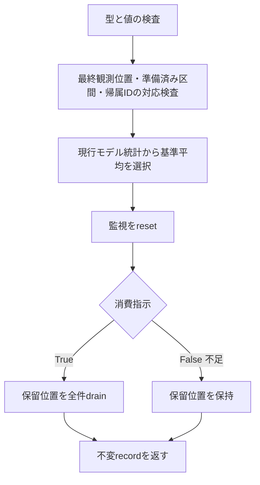

# 警報応答の完了処理 — 設計 revision2

## 1. Boundary Commitments

- runtimeの`complete_alarm_buffer_response`が、完了した`AlarmBufferResponse`に対して、基準平均の選択→監視のreset→保留位置のdrain（不足ではdrainしない）を行い、不変record `AlarmResponseCompletion`を返す。
- recordも同じruntime moduleへ置く。`AlarmBufferResponse`がruntime定義なので、methodsからruntimeへ逆依存するrecordを作らない。
- 更新するownerは既存の`OverallAndTrueClassLossMonitor`と`PendingTrainingAssignmentBuffer`だけ。読むownerは`CurrentTrainingModelAssignment`と`ModelAndClassLossStatisticsStore`。新しい状態ownerを作らない。

## 2. Out of Boundary

応答の実行（`respond_to_alarm_with_buffered_samples`の呼出し）。適応イベント一覧・切替位置一覧・再利用計数・検出episodeのownerと更新。学習帰属変更の通知。候補検証sessionの保持と解除。保留位置に対応するpayloadの破棄。同一episode内の追加検出（旧`_resolve_episode_duplicate`、最終構成ではepisode無効）。設定登録、計算量診断、新client・全体run。旧の不足時FIFO保持（LEGACY-002）の修正。

## 3. 旧処理との対応

旧`_resolve_drift`の各分岐は、標本処理の後に次を行う（`federated_drift_experiment/clients/fedsda.py`）。

| 旧の処理 | 本specでの扱い |
| --- | --- |
| `_record_adaptation_event(position, detector, action, old_model_id, new_model_id, estimated_change_point, episode_id)` | 一覧へは記録しない。recordのfieldとして position=`alarm_sample_index`、old/new=`previous_training_model_id`/`current_training_model_id`、estimated_change_point=`estimated_change_point_sample_index`、episode_id=`detection_episode_id`を返す。actionは元の応答の`response_outcome`と一対一（下表）。detectorは呼出側が持つ検出器名で、本処理は扱わない |
| `_reset_drift_detectors()`（最終構成では全体e-SRを現行モデルの基準でreset、class別検出器と位置を破棄） | `loss_change_monitor.reset(baseline_loss_mean=...)`。基準は旧`_e_detector_baseline`と同じ規則の既存`select_loss_monitoring_baseline_mean_loss`で、応答後の現行モデルの全体統計から選ぶ |
| `buffer.clear()`（insufficient_dataでは実行しない） | `pending_training_assignment_buffer.drain_pending_sample_indices()`。応答の`pending_assignment_buffer_should_be_cleared`がFalseなら呼ばない |
| `local_switch_positions.append(sample_idx)`（reuseだけ） | property `training_model_switch_sample_index` |
| `reuse_selection_counts[...] += 1`（reuseはalternative_fit、maintainはcurrent_fit） | 元の応答の`response_outcome`から呼出側が数える。本処理は数えない |
| 戻り値（reuseは1、その他は0）と呼出側の`mark_operation` | property `detection_episode_operation_required` |
| `_set_local_current_model`内の`_on_local_model_change` | 呼出側。変更前後のIDはrecordにある |

| response_outcome | 旧action | 帰属IDの変更 | drain |
| --- | --- | --- | --- |
| alarm_during_candidate_validation | forward_validation_pending | なし | する |
| alarm_change_interval_too_short | insufficient_data | なし | しない |
| alarm_interval_held_model_reused | reuse | あり | する |
| alarm_interval_current_model_maintained | maintain | なし | する |
| alarm_interval_candidate_validation_started | create_pending | なし | する |

旧はイベント記録→reset→clearの順。イベントは不変の値で、resetとclearの影響を受けない。新は検査と値の読取りを先に行い、reset→drainの順に更新し、最後にrecordを組み立てる。resetが使う基準は吸収後の統計で、旧と同じ時点の値である。

## 4. 契約と処理順

`complete_alarm_buffer_response(*, alarm_buffer_response, alarm_sample_index, estimated_change_point_sample_index, detection_episode_id, current_training_model_assignment, loss_statistics_store, loss_change_monitor, pending_training_assignment_buffer) -> AlarmResponseCompletion`

1. 型検査（更新前）: 応答はexact `AlarmBufferResponse`、4つのownerは各exact型。`alarm_sample_index`はboolを除くbuiltin intで0以上。`estimated_change_point_sample_index`と`detection_episode_id`はNoneまたはboolを除くbuiltin intで0以上。型不正はTypeError、値不正はValueError。
2. 対応検査（更新前、ValueError）:
   - 保留FIFOの最終観測位置がNoneでなければ`alarm_sample_index`と等しいこと（旧は警報標本をFIFOへ追加してから警報処理を行う）。
   - 応答が準備済み区間を持つなら、前区間と変化区間の観測位置を連結した列が現在の保留位置列と等しいこと（応答は保留位置を変更しないので、完了処理の前は必ず一致する。1件以上を消費した後の再適用や別の応答は不一致になる）。
   - 応答の区間解決が帰属変更を記録しているなら、その変更後IDが現在の学習帰属IDと等しいこと。このとき変更前IDを`previous_training_model_id`とする。記録がなければ変更前後とも現在のID。
3. 読取り: 現行モデルの統計（なければNone）の全体集計から`select_loss_monitoring_baseline_mean_loss`で基準平均を得る。
4. 更新: `loss_change_monitor.reset(baseline_loss_mean=基準平均)`、続いて消費指示がTrueなら`drain_pending_sample_indices()`、Falseなら空tuple。
5. recordを返す。

基準選択の戻り値は常に0.01以上1-1e-6以下で、resetの入力検査を満たす。drainは入力を取らず、契約上の拒否条件を持たない。したがって、検査を通過した後に公開APIの契約上の拒否によって片方だけ更新されることはない。メモリ不足などの実行環境の失敗（drainが保留位置をtupleへ複製する際の失敗を含む）は保証外で、その場合はreset済み・未消費の状態が残りうる。

### record

frozen/kw_onlyの`AlarmResponseCompletion`: `alarm_buffer_response`、`alarm_sample_index`、`previous_training_model_id`、`current_training_model_id`、`estimated_change_point_sample_index`、`detection_episode_id`、`loss_monitoring_baseline_mean_loss`、`drained_pending_sample_indices`。

constructorの受理集合: 応答はexact型。警報位置はbuiltin intで0以上。2つのIDはbuiltin int（負の一時IDを含む）。推定変化点とepisode IDはNoneまたは0以上のbuiltin int。基準平均はbuiltin floatで0より大きく1未満（NaNは拒否）。消費位置はexact tupleで要素は0以上のbuiltin int（保留FIFOの位置と同じ制約。負はValueError）。帰属IDが異なるのは応答が`alarm_interval_held_model_reused`のとき、かつそのときに限る。消費指示がFalseの応答では消費位置は空。型不正はTypeError、値・組合せ不正はValueError。

property: `training_model_switch_sample_index`（IDが異なれば警報位置、同じならNone）、`detection_episode_operation_required`（IDが異なればTrue）。既存`PostAlarmCandidateValidationCompletion`の同名propertyと同じ読み方にする。応答が持つsessionは借用参照で、recordのfrozenはsessionの深い不変性を保証しない。

## 5. Allowed Dependencies

新runtimeは`dataclasses.dataclass`、`ModelAndClassLossStatisticsStore`、`CurrentTrainingModelAssignment`、`OverallAndTrueClassLossMonitor`、`select_loss_monitoring_baseline_mean_loss`、`PendingTrainingAssignmentBuffer`、`AlarmBufferResponse`の7 symbolだけをimportする。exact集合を命名表とAST guardへ固定し、両resolverへ登録する。旧実装・private・module全体・star・子module・上位packageのimportは拒否する。`__init__`の再exportなし。旧importはoracle test内だけ。

## 6. Revalidation Triggers

`AlarmBufferResponse`のfield・結果値・消費指示、準備済み区間のfield、監視のreset契約と基準選択の規則、FIFOのdrain契約、帰属変更recordのfieldが変わったら、本specの対照testを再検証する。既存部品のsourceは変更しない。

## 7. File Structure Plan

- 新src: `src/federated_learning_experiments/runtime/alarm_response_completion.py`。
- 新test: `tests/refactoring/test_alarm_response_completion.py`。
- 変更test: `tests/refactoring/test_single_run_dependency_boundaries.py`（1 moduleのexact集合、両resolver、注入契約test）。
- spec証拠: integration-validation.md。

## 8. Testing Strategy / Requirements Traceability

oracleは実旧`_resolve_drift`。既存`build_buffer_response_oracle`の実旧client（`SharedBackboneClassConditionalESRFedSDAClient`）へ実`BoundedMeanEDetector`とclass別検出状態を与え、上流oracleが差し替えたイベント記録と検出器resetを実メソッドへ戻す。差し替えるのは推定区間長の供給だけ（上流oracleの区間設計に合わせるため）。吸収・評価保存・区間評価・候補学習・イベント記録・reset・FIFO clearは実処理。新側は`respond_to_alarm_with_buffered_samples`と本処理を続けて呼ぶ。実行可能性は設計時に確認した（research.md）。

| 要求 | 証拠 |
| --- | --- |
| 1.1 | 実旧resetの後の全体・class別検出器の全状態と基準を照合。現行モデルの統計なし・0件・下限未満・中間・上限の5条件。再利用では切替後のモデルの吸収後統計から選ぶことを呼出し記録で確認 |
| 1.2, 1.3 | 2/4class×3解決条件×区間長・最小件数4組（再利用・維持・候補検証開始・不足を含む）と、候補検証中の2回目の警報（保留0件/3件）で、実旧FIFOの保持・消費と新の保留位置・消費結果・最終観測位置を照合 |
| 1.4 | reset→drainの呼出し順の記録。完了処理の前後でtorch・Python（明示とglobal）・NumPyの乱数が不変。標本・統計・帰属・保有モデルは既存`assert_buffer_response_matches_legacy`で完了処理の後に実旧と照合 |
| 2.1, 2.2 | 実旧`AdaptationEvent`の全field、`local_switch_positions`、戻り値と、recordのfield・propertyを照合。recordのfrozen/kw_only・受理集合の拒否 |
| 2.3 | 完了処理が更新するのは監視と保留位置だけであることを、sessionの参照一致と状態照合、依存のexact集合（一覧owner・通知をimportしない）で確認。再利用計数は応答結果からの対応表で実旧と照合 |
| 3.1, 3.2 | 型・値・対応の全拒否条件で、監視・保留位置・統計・帰属・乱数が不変。消費済みの応答への再適用の拒否 |
| 3.3 | 上記の実旧対照に加え、完了後に同じ損失列を新旧の監視へ与え、各観測のe値・警報・推定区間長・全状態を照合。代表的なsource変異の検出、exact AST、新実装だけのfresh CPU、旧11・最終3goldenを含む全pytest、Ruff・Pyright |

適応イベント一覧・通知・session保持の新実装と、新全体runの一致は未検証として残す。
