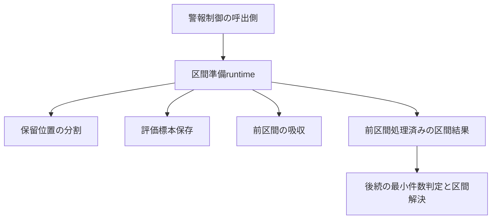

# 警報時の学習区間の準備 — 設計 revision1

## Overview

対象は既存公開部品の接続。状態なしruntime関数と位置付き入力record、準備結果recordを加える。新しい標本所有者・client・callback抽象・設定を作らない。新外部依存なし。既存CPU float32分類器と明示Python Randomを使う。

## Boundary Commitments

- 保留位置のsnapshotと位置付き入力を完全照合し、既存分割に従って前/変化区間を取り出す。
- 前区間全件を事前検査し、評価保存→吸収を組み立ててから区間結果を返す。
- 位置付きrecordとtuple構造は不変。Tensorは借用し、deep copyや内容凍結は行わない。
- FIFO、帰属ID、モデル/optimizerは読取り専用。他の可変状態はそれぞれ既存ownerが所有する。

## Out of Boundary

active session確認・最小件数中止・変化区間解決・検出器操作・FIFO消費・通知・記録・計算量診断・全体run。真の概念IDは診断用計数へだけ渡す。spanを概念IDから推定しない。LEGACYと改善候補は変更しない。

## Allowed Dependencies

- 位置付き入力record: `dataclasses.dataclass`、`learning/training/model_training_sample_records.ObservedTrainingSample`のみ。
- 結果record: `dataclasses.dataclass`、位置付き入力recordのみ。
- runtime: `random.Random`、`torch.Tensor`、上の2record、`CurrentTrainingModelAssignment`、`PendingTrainingAssignmentBuffer`、`ModelEvaluationSampleStore`、`ObservedEvaluationSample`、`ObservedTrainingSample`、`HeldModelTrainingStateRegistry`、`ModelTrainingSampleStore`、`ModelTrainingAndAssignmentCountsStore`、`ModelAndClassLossStatisticsStore`、公開`evaluate_classifier_per_sample_bounded_losses`と`absorb_assigned_training_samples_into_held_model`のみ。参照は各定義leaf moduleから。分割返却値は戻り値から使い別import不要。
- 新sourceは旧実装、global config、CLI、保存、描画、テスト、private helperをimportしない。他runtimeを一括importしない。oracleの旧importはtestだけ。

## Revalidation Triggers

位置付き入力、結果の形、分割/保存/吸収の契約、評価の乱数・モデル状態更新、拒否タイミング、評価容量規則が変われば、本specと後続警報制御を再検証する。

## Architecture

## Data Modelsと公開契約

### IndexedObservedTrainingSample

`frozen=True, kw_only=True` record。`sample_index: int`、`training_sample: ObservedTrainingSample`、`observed_concept_id: int | None`。コンストラクタは検査せずruntime境界で検査する。概念IDは診断だけに使用。位置とpayloadの意味上の対応は供給側が保証。

### PreparedAlarmTrainingIntervals

`frozen=True, kw_only=True` record。`earlier_observations: tuple[IndexedObservedTrainingSample, ...]`、`change_interval_observations: tuple[IndexedObservedTrainingSample, ...]`、`change_interval_start_sample_index: int | None`、`earlier_interval_absorbed_model_id: int | None`。前区間空では吸収先None。処理完了の結果であり、未処理区間の単なるpartitionとは区別する。

### prepare_alarm_training_intervals

keyword-only入力: `pending_training_assignment_buffer`、`pending_sample_observations: tuple[IndexedObservedTrainingSample, ...]`、`estimated_change_span_sample_count: int`、`current_training_model_assignment`、`model_evaluation_sample_store`、`python_random_generator: Random`、`held_model_training_state_registry`、`training_sample_store`、`model_training_and_assignment_counts_store`、`loss_statistics_store`。owner型は既存exact型。返却型は`PreparedAlarmTrainingIntervals`。

同期呼出し1回。再実行は前区間を再吸収する（idempotentではない）。呼出側は成功後に同一警報を再適用しない。前区間空でも引数/owner/現行保有は検査する。空FIFOは正のspanで正常な空結果。

## 処理順と拒否契約

1. 引数のexact型、正のbuiltin int span、各record/標本/概念ID/位置を検査。boolはintとして受理しない。位置は非負。概念IDはNoneまたはbuiltin int（負も既存吸収と同じく許す）。payloadはTensor、1標本の特徴shape[1,F]とラベルshape[1,1]を全件検査する。変化区間のCPU/dtype/有限性/クラス範囲/特徴数の分類器依存検査は後続へ残す。
2. snapshotの保留位置列と供給recordの位置列のexact一致を検査。欠落/余分/重複/逆順を拒否。現在帰属IDを読取り、実保有モデルを公開取得する。FIFOのcapacity解放・drainはしない。
3. 公開分割を要求し、返された位置列の長さで入力tupleを分割する。実位置の連続性を独自推定しない。
4. 前区間全件について公開損失評価を呼び、既存吸収が要求するCPU/dtype/有限値/クラス範囲/特徴数/分類器出力と1損失契約を検査する。全前区間の検査完了まで保存ownerもRandomも変更しない。この事前評価は損失を再利用するための新吸収APIを追加せず、既存の吸収が後でもう一度評価する。現在の分類器では評価がモデルと乱数を変更しないため値は同じ。追加forwardは移植時の検査コストとして明示し、将来計算量診断の接続前に判断する。
5. 前区間が非空なら各標本のTensorを借用する`ObservedEvaluationSample`列を作り、既存評価storeを呼ぶ。一時IDは同APIの契約に従い保存/RNG消費なし。正規IDで追加件数0なら既存と同じ空collection初出の挙動も維持する。
6. 前区間のtraining record列/概念ID列を公開吸収へ渡す。完了後に結果を返す。前区間空なら4〜6を省略。

型不正はTypeError、値/形状/対応不正はValueError、未保有は既存registryのLookupError系列。入力起因の拒否は保存/吸収/乱数更新より前。検査後のOOM、非公開改変、並行変更のrollbackを保証しない。損失評価の中で現行分類器の例外を握りつぶさない。

## Requirements Traceability

| 要求 | 設計・証拠 |
| --- | --- |
| 1.1, 1.2 | 位置付き入力と既存分割、長い/等しい/短いspanの対照 |
| 1.3 | 空FIFOの検査後no-op |
| 1.4 | frozen/tuple、借用、snapshot維持、capacity+1 |
| 2.1, 2.2 | 保存→公開吸収、正規/負ID、保存容量と明示Random |
| 2.3 | 前区間空のno-op |
| 2.4 | 吸収の既存公開契約、他状態不変 |
| 2.5 | 吸収後返却、実区間評価まで接続、最小件数前後 |
| 3.1 | exact位置列照合と拒否state比較 |
| 3.2 | 全前区間公開損失事前評価とowner/record検査 |
| 3.3 | 実旧警報oracle、Python最終state、torch/NumPy不変 |

## File Structure Plan

パスのrootは`src/federated_learning_experiments/`。

| 新規/変更 | パス | 責務 |
| --- | --- | --- |
| 新規 | learning/training/indexed_observed_training_sample.py | 観測位置と標本/診断概念IDを結び付ける入力record |
| 新規 | methods/fedsda/training_data_assignment/prepared_alarm_training_intervals.py | 準備済み結果record |
| 新規 | runtime/alarm_training_interval_preparation.py | 事前検査と区間分割/保存/吸収の接続 |
| 新規 | tests/refactoring/test_alarm_training_interval_preparation.py（worktree root） | 実旧対照・拒否・更新順・接続・乱数・変異検出 |
| 変更 | tests/refactoring/test_single_run_dependency_boundaries.py（worktree root） | exact import guardと許可/拒否注入 |
| 新規 | 対象spec/integration-validation.md | 対象commitと全回帰/品質/独立レビュー証拠 |

既存の吸収、分類器、FIFO、評価store、旧source/goldenを変更しない。initの再exportなし。

## Testing Strategy

- 実旧`_resolve_drift`の前区間処理を通す。最小件数未満経路では旧処理全体の終了時を、新準備の終了時と対照できる（新準備は検出器をresetしない点を別扱い）。十分経路では記録wrapperが実区間評価へ入る直前の状態を捕捉し、吸収後統計を照合する。旧吸収/保存をstubしない。
- 分割: 空、1件、span< / = / >保留件数、capacity+1、前区間空、最小件数直前/ちょうど。元位置とpayload identity、概念ID None/あり、正規/一時ID。
- 保存: 追加件数0/全数/部分抽出、容量超過、事前保存あり。Python global stateを退避して新明示Randomと同じstateから旧を実行し、必ず復元する。標本順と最終stateをexact比較。
- 拒否: owner/Random/tuple/record型、bool/span値、位置列欠落/重複/順序/件数、未保有、前区間の先頭/後半に不正shape/dtype/device/有限値/ラベル/特徴数。後半不正でも評価store/全Randomが不変。
- 2/4classの実NNで準備→既存変化区間解決→共同更新へ接続し、旧との全パラメータ/grad/optimizer/損失統計/計数/標本/評価保存/帰属/session/乱数を照合する。分岐は再利用・維持・候補開始を含む。
- 保存と吸収の逆転、区間の逆転、検査前保存、Python抽出回数増加、FIFO消費、concept診断の誤使用を代表変異で検出する。
- AST guardは新3moduleの許可leaf集合に一致し、全module/禁止上位/private/reexport/相対経路逸脱を拒否する。新だけのfresh CPU smoke、Ruff/Pyright/pip、全pytest/旧11・最終3golden、固定旧差分、source hash/JUnitを記録する。全pytestは主担当実測＋JUnitの既存合意を使う。

testのhelper・局所名はtask作成前に外部下書きのASTで洗い出して追加命名レビューする。初期命名承認だけで未列挙のtest名を実装しない。
