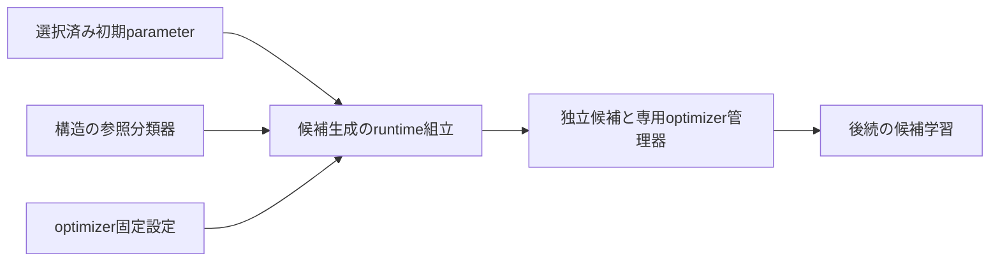

# 候補分類器と学習状態の生成 — 設計 revision2

## Overview

学習前の候補生成をruntimeの一つの組立関数にする。既存のモデル構造・snapshot・optimizer管理器を再利用し、学習方式へ生成手順を埋め込まない。

## Boundary Commitments

### This Spec Owns

独立候補と二つのoptimizer管理器の生成・返却、生成前の入力検査、正常生成の旧経路対照。

### Out of Boundary

初期parameterの選択、候補の反復学習・early stopping、保有登録とID、共有部の外部接続、参照固定、session開始、通信・計算量診断。非公開状態改変・並行変更・メモリ不足・生成後の内部故障は原子的拒否の保証外。

### Allowed Dependencies

新runtime/candidate_classifier_construction.pyはdataclasses.dataclass、torchのTensor/float32/isfinite/strided、モデル層ResidualAdapterClassifier・snapshot_classifier_parameters、学習層AdamParameterOptimizerSettings・SgdParameterOptimizerSettings・ParameterOptimizerStateだけをimportする。旧実装・上位runtime・候補採否・登録・乱数API・広いtorch/module importは禁止する。依存境界testのexact guardを汎用runtime許可より先に置く。

### Revalidation Triggers

分類器構造/parameter名順/生成時乱数消費、optimizer方式・parameter順、返却record変更時は候補学習・session開始を再検証する。

## Architecture

## File Structure Plan

| ファイル | 責務 |
| --- | --- |
| src/federated_learning_experiments/runtime/candidate_classifier_construction.py | 生成・検査・返却record |
| tests/refactoring/test_candidate_classifier_construction.py | 実旧生成と学習接続・拒否・独立性 |
| tests/refactoring/test_single_run_dependency_boundaries.py | exact import guardと注入契約 |

## Components and Interfaces

`create_independent_candidate_training_state(*, architecture_reference_classifier: ResidualAdapterClassifier, initial_candidate_parameter_snapshot: dict[str, Tensor], parameter_optimizer_settings: AdamParameterOptimizerSettings | SgdParameterOptimizerSettings) -> IndependentCandidateTrainingState`

返却recordはfrozen/kw_onlyで、`candidate_classifier`、`candidate_shared_parameter_optimizer_state`、`candidate_concept_specific_parameter_optimizer_state`を持つ。recordはbinding変更を禁止するが、分類器・optimizerは後続学習で更新する借用参照。外部共有部を受け取らず、候補自身の共有部を所有する。

### 入力契約と順序

1. 参照分類器はexact型。snapshot_classifier_parametersで参照のCPU float32 strided/有限値を検査し、期待キー・shapeを取得する（乱数不消費）。参照構造は既存分類器の公開構造を使う。feature_extractor.parameters()が空なら候補生成前にValueErrorで拒否する。モデル層自体は空隠れ層を許可するが、必須の共有optimizerを作れないため本生成の受理範囲外とする。既知LEGACY-010の上流空parameter制約を迂回せず、生成側の事前条件として明示する。
2. 初期snapshotはexact dict、キーはexact strで期待集合と一致。各値はexact Tensor、CPU float32 strided、非nested、有限値で期待shapeと一致。キーの順は問わない。入力は読込みだけで、候補へaliasしない。
3. optimizer設定はexact Adam/SGD型で、同型コンストラクタへ全fieldを渡して再検査する。その他はTypeError、設定値不正は既存設定型のValueError。
4. 参照と同じ構造のResidualAdapterClassifierを外部共有部なしで一つ生成し、初期snapshotをstrict load_state_dictで読込む。
5. 候補自身のfeature_extractor parameter順で共有optimizer管理器を生成し、adapter→classification_layerの順で概念固有optimizer管理器を生成して返す。

入力型違反はTypeError、キー/shape/dtype/device/値違反はValueError。型・snapshot・設定の通常契約違反は候補生成前に拒否する。非公開属性改変は保証外だが、既存constructorの構造検査を省略しない。

旧はconstructor内とresetでoptimizerを二回作るが、乱数も学習状態も変わらないため新は最後に必要な一組だけを生成する。生成する分類器は一つ、torch RNG順・全parameter値・初期optimizer状態を旧と比較する。

## Requirements Traceability

| 要求 | 契約/証拠 |
| --- | --- |
| 1.1, 1.2 | 生成record、値/全storage/grad/入力不変対照 |
| 1.3 | 同じ乱数状態から実旧生成と新生成、終端RNG一致と実消費 |
| 2.1, 2.2 | 二つの専用optimizer、parameter同一参照順・空state・全defaults |
| 3.1 | 型/値/キー/shape/設定拒否とRNG・参照不変 |
| 3.2 | exact import guard、未登録/IDなし/更新なし |
| 3.3 | 単回学習の旧update対照・fresh新CPU・全suite・旧固定差分なし |

## Testing Strategy

二値/4クラス×Adam標準/AMSGrad/SGD、初期値を非zeroにして実旧_new_model/set_params/reset_optimizerへ対照する。候補を二回生成し互いのstorage/optimizer非共有も確認する。旧生成oracleをtest準備として実行できることを確認してからREDを記録する。

単回学習は既存perform_joint_model_parameter_updateへ単一候補を渡し、実旧candidate.updateへ3batchを逐次対照（後続epoch学習は未実装）。全loss/parameter/grad/optimizer state/RNGを比較する。二値/4クラス×3optimizer方式の6条件。拒否入力は型・欠落/余剰key・shape・dtype・非有限・sparse・nested・optimizer設定を含む。

対象testのRED→実装→GREEN、stub/初期読込み省略/parameter順誤りの検出と復元、AST注入のRED→exact guard→GREEN。全pytestの判定は共通引継ぎ手順どおり主担当実測とJUnit照合。旧golden成功は部品の新旧一致とは別証拠。新client/runの完了を主張しない。
