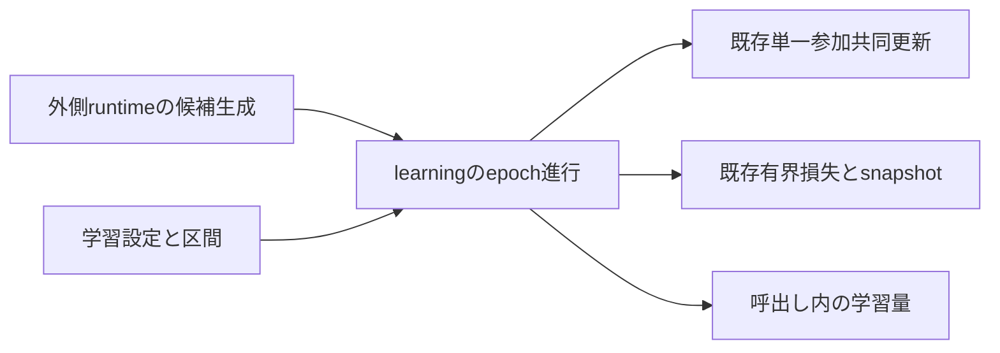

# 候補のエポック学習 — 設計 revision1

## Overview

learning/trainingの反復学習関数へ、生成済み候補と専用optimizer、区間、設定を明示的に渡す。既存の単一参加共同更新、有界損失、snapshotを再利用する。採否・session状態は持たない。

## Boundary Commitments

### This Spec Owns

方式別のepoch進行、区間分割、batch順、検証と停止、parameterのみの復元、呼出し内の学習量。設定をfrozen/kw_only型で宣言し検査する。

### Out of Boundary

候補生成・初期値選択・client登録/ID・session開始・参照固定・外部共有接続・通信・外部診断owner。既存RunSettingsへの統合はsession組立時に必要項目を解決して行う。非公開状態改変/並行更新/OOM/途中の内部故障や数値overflowは原子的拒否保証外。optimizer履歴の非公開改変は保証しない。

### Allowed Dependencies

設定module: dataclasses.dataclass/field、core.settings_field_validation.validate_settings_field_valuesのみ。
学習module: dataclasses.dataclass、math.inf、torch.Tensor/float32/strided/isfinite/is_grad_enabled/randperm、torch.utils.data.DataLoader/TensorDataset、torch.optim.Adam/SGD、既存ResidualAdapterClassifier/snapshot_classifier_parameters/evaluate_classifier_per_sample_bounded_losses/ParameterOptimizerState/ParticipatingModelTrainingBatch/LocalTrainingSettings/perform_joint_model_parameter_update、同spec設定型のみ。旧実装・runtime・methods・config・I/O・seed/RNG復元・独自shuffleは禁止。AST exact guardを汎用許可より先に置く。

### Revalidation Triggers

DataLoader/torch版、分割丸め、loss評価、単回更新の演算順、snapshot/optimizerbinding、復元契約、計数単位の変更時は生成から学習と後続sessionのRNG/全数値を再照合する。

## Architecture

## File Structure Plan

| ファイル | 責務 |
| --- | --- |
| src/federated_learning_experiments/learning/training/candidate_epoch_training_settings.py | 方式と6fieldの固定条件 |
| src/federated_learning_experiments/learning/training/candidate_epoch_training.py | 入力検査、batch/epoch進行、停止、復元、量record |
| tests/refactoring/test_candidate_epoch_training.py | 実旧oracle・方式/境界/拒否・生成と学習接続 |
| tests/refactoring/test_single_run_dependency_boundaries.py | 2moduleのexact guardと注入契約 |

## Components and Interfaces

`train_candidate_classifier_epochs(*, candidate_classifier: ResidualAdapterClassifier, candidate_shared_parameter_optimizer_state: ParameterOptimizerState, candidate_concept_specific_parameter_optimizer_state: ParameterOptimizerState, input_features: Tensor, observed_class_labels: Tensor, candidate_epoch_training_settings: CandidateEpochTrainingSettings) -> CandidateEpochTrainingResult`

設定は全6field必須。方式fixed_epoch_training/validation_loss_early_stopping/skip_training、maximum_epoch_countはbuiltin int>=0、maximum_batch_sample_countはbuiltin int>=1、validation_sample_fractionはbuiltin int/floatで0<f<1、consecutive_non_improving_epoch_limitはbuiltin int>=1、minimum_validation_loss_decreaseはbuiltin int/floatで有限>=0。bool/文字列/非有限を拒否し、既存metadata検査へ委譲する。学習率は既存optimizer設定へ一度だけ指定する。

結果はfrozen/kw_onlyでcompleted_epoch_count、candidate_trained_sample_count、candidate_parameter_update_step_count、validation_evaluated_sample_count（全てint）。更新した候補は入力ownerに残り、結果へ重複所有しない。

### 事前条件

exact設定を同型constructorへ全field渡し再検査。snapshot_classifier_parametersでexact分類器/CPU float32/有限parameterを検査する。非空共有部と全parameter requires_grad=True、exact専用ParameterOptimizerState、exact Adam/SGDとparam_groupsのflatten列が候補共有部native順/adapter→分類層順と同一参照か検査する。二つのoptimizerを同じ物にしない。学習履歴がある正しいownerは受理しリセットしない。

区間はTensor、CPU float32 strided非nested、有限[N,F]/[N,1]でN>=1、Fは分類器に一致。観測クラスは整数0<=y<class_count（二値も0/1）とする。skipまたはepoch=0以外はgrad有効を要求する。これらをrandperm/loader反復/更新前に全て検査する。型違反TypeError、shape/値/binding/grad違反ValueError、設定値不正は既存RunSettingsValidationError（ValueError派生）。入力tensorをcopyせず借用し書換えない。

### 方式と順序

- skipは量0を返し、loaderを作らずRNG不消費。
- fixedは区間全体のTensorDatasetとbatch_size=min(上限,N)、shuffle=True、その他DataLoader既定（worker0、generator指定なし、drop_last=False）のloaderを一つ作り、指定epoch回反復する。
- earlyはvalidation_count=max(1,int(round(N*f)))、Pythonのround（偶数丸め）を維持。N-validation_count<1ならfixed。通常はrandperm一回、先頭検証/残り学習。best_loss=inf、初期snapshotを保持、非改善0。
- 毎epoch、同じ学習datasetからloaderを一つ作って1epoch学習し、既存有界loss評価のmean.item()をfloatにする。loss<best_loss-min_deltaのときだけsnapshotとbest_loss更新/非改善0、それ以外は非改善加算、limitで停止。
- 最後にstrict load_state_dictで採用snapshotだけを復元。optimizer/grad/乱数/計数は復元しない。最大0epochでもearly通常分割はrandpermを消費し初期snapshotを再loadする。fixed0はloader構築のみでRNG不消費、fallback0も同じ。
- batch更新は既存LocalTrainingSettingsのjoint_backbone_adapter_and_head_training/sample_weighted_mean_per_concept_gradientsと単一ParticipatingModelTrainingBatch、update_shared_features=True。標本加重式を新実装へ複製しない。
- helper `_train_candidate_dataset_epochs`が実施量を返す。epoch数、len(batch)加算、batch数を数え、early側はhelper量と検証件数を加算する。time/外部診断を数えない。

## Requirements Traceability

| 条件 | 契約/証拠 |
| --- | --- |
| 1.1, 1.3 | loader構築数/末尾batch、fixed/fallback実旧対照 |
| 1.2, 2.2 | 丸め/厳密閾値/patience/snapshotのみ復元/0epoch |
| 1.4 | skip全値/grad/optimizer/RNG不変と量0 |
| 2.1, 2.3 | class2/4×3optimizer、全状態/RNG/実旧counters/epoch数 |
| 3.1 | 設定/区間/owner/binding/grad事前拒否と全状態不変 |
| 3.2 | exact guardと無登録/無採番/無runtime依存 |
| 3.3 | 生成→学習→続きの更新、fresh新CPU、全suite、固定旧差分なし |

## Testing Strategy

実旧BaseClient._train_new_modelを直接実行し、旧configはtest内monkeypatchで対応づける。既存build_candidate_construction_oracle/create_legacy_candidateを使って同値候補を作る。2/4クラス×標準Adam/AMSGrad/SGD×方式・区間件数・epoch0/1/複数を対照。非改善閾値を大きくした場合の初回採用→停止、閾値ちょうど、端数batch/丸め、小区間fallbackを含める。旧epoch実行をwrapperで記録してdataset標本順・batch経路・実施epoch数を観測し、式をtestへ複製してoracleにしない。

最良値への復元後に単回更新を続けてoptimizer/grad保持を確認。拒否はepoch学習で状態を作った候補にも適用し、全値/grad/state_dict/入力/RNG不変。test先行RED、stub/復元省略/optimizerリセット/loader乱数変更の差し替え検出後に復元hashを照合する。AST注入RED→guardGREEN。全回帰は主担当実測＋JUnit照合、feature GOは別Lunaセッション。
