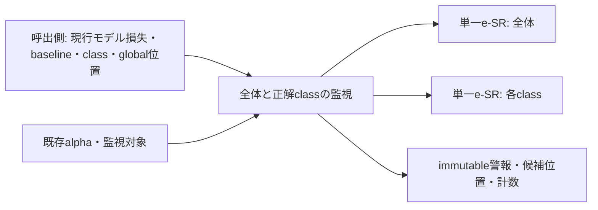

# 設計: 全体・正解クラス別損失監視

## Overview

正常な損失系列の旧ClassESR数値・警報・候補開始位置を独立検証する。単一e-SR数値状態と、全体/クラス混合・global位置対応を分ける。モデルやclientを持たず、baselineを明示入力にする。

### Goals

全20条件の旧oracle照合・不正入力の状態不変・診断copy・public入力接続を実装する。

### Non-Goals

モデル統計/baseline推定・forward・学習・FIFO・候補/警報後操作・記録蓄積・custom component重み・新全体run。

## Boundary Commitments

### This Spec Owns

- 単一損失系列の候補×賭け率capital・候補時刻・対数e値・reset。
- 全体/正解class成分の固定混合・class初出baseline・保持global位置・観測結果。
- 同機能内のimmutable結果と診断snapshot。alphaは既存設定から受ける。

### Out of Boundary

外部統計やモデルの参照、履歴collector、警報後のデータ帰属・候補処理。既存LossChangeDetectionSettingsや汎用core schemaを今回変更しない。重みcontroller private stateへ依存しない。

### Allowed Dependencies

単一数値moduleはstdlibとNumPyのみ。混合monitorはstdlib・同機能の単一数値module・既存LossChangeDetectionSettingsのみ。NumPyはexact単一moduleだけをAST例外にする。torchと旧moduleはテスト内のoracle/損失接続だけで使用する。

### Revalidation Triggers

baselineの取得時機・入力域・演算/dtype/反復順・候補番号/global位置・reset・返却形・計算件数・設定所有者を変更したとき、後続client進行/FIFO/診断との接続を再検証する。

## Architecture

既存NumPyによる数値kernelを式・順序を保って移植する。一般factoryやabstract interfaceは不要。結果/状態型は各所有moduleに置く。snapshotは明示取得時だけcapitalをtupleへコピーし、毎観測の結果には巨大配列を含めない。

## File Structure Plan

機能ルートはsrc/federated_learning_experiments/methods/fedsda/loss_change_detection/。

- 新規bounded_loss_e_sr_detection.py: BoundedLossESRDetectorと同所有の結果/診断state、入力検証、NumPy kernel。
- 新規overall_and_true_class_loss_monitoring.py: OverallAndTrueClassLossMonitorと混合結果/診断state、class/global位置、原子的入力検証。
- 新規tests/refactoring/test_loss_change_monitoring.py: 単一/旧ClassESRのdirect oracleと新損失接続、入力拒否・snapshot/RNG。
- 変更tests/refactoring/test_single_run_dependency_boundaries.py: exact NumPy例外、同機能内部依存と設定だけの許可・注入拒否。
- 変更.kiro/steering/roadmap.md: 部分完成の範囲と次責務を記録。

## Requirements Traceability

| 条件 | 実装と証拠 |
|---|---|
| 1.1, 1.2, 1.3, 1.4 | 単一kernel、reset、候補同率・上限・端点のdirect oracle |
| 2.1, 2.2, 2.3, 2.4 | 混合monitor、遅延baseline、未観測class・固定配分・閾値 |
| 3.1, 3.2, 3.3, 3.4 | 混合結果・旧成分順・class位置deque・overall候補・非自動reset |
| 4.1, 4.2, 4.3, 4.4 | 明示条件、更新前validation、独立状態・frozen tuple snapshot |
| 5.1, 5.2, 5.3, 5.4 | 旧単体/client oracle、現行モデル損失接続、AST/全golden/smokeと部分範囲 |

## Components and Interfaces

### 単一e-SR数値状態

BoundedLossESRDetectorはkeyword-only constructorでbaseline_loss_mean、false_alarm_control_alpha、maximum_retained_candidate_count、betting_fractionsを受け取る。observe_loss(*, observed_loss)はBoundedLossESRObservationを返す。reset(*, baseline_loss_mean)はNone。readonly last_observationは初期値も持つ。get_state_snapshot()はBoundedLossESRStateを返す。

結果にはobserved_loss_count、log_e_value、drift_detected、candidate_start_observation_number、oldest_retained_candidate_observation_number、estimated_change_span_sample_count、evaluated_candidate_bet_countを含める。診断stateはbaseline_loss_mean、last_observation、candidate_start_observation_numbers、candidate_log_capitalsをfrozen tupleで保持する。

baselineはfinite builtin int/float、0～1を検証後[1e-6,1−1e-6]へ制限。alphaはfinite builtin int/float、0<alpha<1。上限はbuiltin int≥1、betting_fractionsはexact tuple、各finite builtin int/float、0<value<1、重複と順序保持。bool不可。

candidate arrays=int64、capital/bets=float64。時刻++→zero行追加→log増分加算→古い候補drop→行混合→候補合計→最初のargmax→幅→>=閾値という旧順序を維持する。log(max(1+lambda*(loss/baseline−1),tiny))。log賭け率重み=−log(件数)、閾値=log(1/alpha)。候補合計は平均にしない。空初期結果は0件、−inf、False、候補None、幅/評価件数0。alarmでも自動resetしない。

### 全体・正解classの混合/位置状態

OverallAndTrueClassLossMonitorのconstructorはloss_change_detection_settings、class_count、initial_baseline_loss_mean、maximum_retained_candidate_count、betting_fractionsをkeyword-onlyで受け取る。設定はexact型確認と__post_init__で再検証する。

observe_loss_after_label_observation(*, observed_loss, observed_class_id, sample_index, current_model_baseline_loss_mean)→LossMonitoringObservation。reset(*, baseline_loss_mean)→None。readonly last_observationは未観測時None。get_state_snapshot()→OverallAndTrueClassLossMonitoringState。

入力を全て検証してからoverallと該当classだけを更新する。同spec内のkernelの_validate_bounded_numberをmonitorでも再利用する。classは初出時にその回のbaselineで生成する。毎回のbaseline指定も有限・域を検査するが、既存成分では値を使わない。位置はepisode内で連続、reset後は任意非負から再開始できる。baseline推定は呼出側の責務。

overall_weight=1/(K+1)、class_weight=(1−overall_weight)/K。component辞書はoverall→今回class→他class初出順。各log-e＋log(weight)のfinite値をPython sum(exp(...))で旧順混合し、combined>=log(1/alpha)でalarm。alarmでない/overall勝者ならoverall幅からsample_index−width+1。class勝者ならsplit−oldest番号を保持global位置へ対応し旧clipを行う。返却位置はFIFO切詰め前。

LossMonitoringObservationはfrozenでsample_index、log_e_value、drift_detected、detector_candidate_start_sample_index、estimated_change_span_sample_count、component_update_count、evaluated_candidate_bet_countを持つ。件数は今回deltaのみ（更新成分=2）、履歴/counter蓄積は呼出側。状態snapshotにはoverall_esr_state、class_esr_states_by_class_id（初出順tupleペア）、class_sample_indices_by_class_id（tupleペア）、last_sample_index、last_observationを持つ。取得時コピーで内部参照を渡さない。

## Error Handling

TypeError/ValueErrorで項目と理由を伝える。loss/class/index/baselineを全検証してから状態更新し、不正入力は結果・位置・両成分を変更しない。resource exhaustionを入力例外へ誤って変換しない。警報・reset・snapshotは他実体や乱数を変更しない。

## Testing Strategy

単一旧検出器と各観測後にcapital・開始番号・log-e・警報・幅・保持開始・計数を完全一致で比較。candidate同率・上限1/小容量/1000・baseline端点・alpha・bet列・resetを含める。
旧ClassESRをtest専用__new__fixtureで生成し、必要stateを準備、configはmonkeypatchで復元する。class2/3/10、遅延baseline・未観測class・class局所上昇・非連続位置/切捨て・reset後global位置・成分同率（必要なら旧/新両者へ同じe-SR結果をtest monkeypatch）を照合する。
不正入力はsnapshot完全不変、copyはfrozen、別実体独立、Python/NumPy/torch RNG不変。既存のモデル別平均損失public APIから指定現行モデルの損失を取り出す接続をtestだけで検証する。全AST・全refactoring・schema/旧golden/最終goldenを含む全tests・独立smokeをgateとする。torchを監視productionへimportしない。
