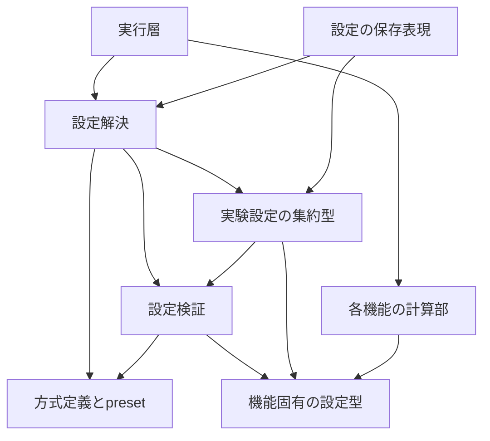

# 設計: 設定・選択肢管理の基盤

## Overview

研究者が実験条件を理解し、明示指定の誤りを実行前に発見できる設定基盤を設ける。
機能別の不変設定と、外側の設定解決・検証を分ける。既存の計算処理は変更しない。
要求と命名revision 2は承認済み。本設計とレビューを反映した追加命名revision 4は2026-10-03に人間が承認した。

### Goals

- 選択方式に適用する条件だけを検証・確定し、同じ条件を保存・復元できる。
- 選択肢追加・削除で必要な変更先を明示し、未使用指定や参照漏れを検出する。
- 初回は最終構成に必要な設定・検証から始め、小規模実行の移植へ接続する。

### Non-Goals

手法の計算・学習、stream実行、CLI、掃引、ファイル保存、描画、旧形式変換は別specが担当する。
旧全方式の再実装や、全実験条件の初回一括移植は含めない。

## Boundary Commitments

### This Spec Owns

- 入力の項目・型・値・適用条件の検証と、解決済み条件の生成。
- 方式の説明・専用パラメータ・能力・組合せ制約と、presetの定義。
- 新設定schemaの辞書表現、version検証、復元。

### Out of Boundary

- 学習済み重み、optimizer、router重み、FIFO内容、検出器状態を所有しない。
- 実装の生成対応はruntimeが持つ。設定定義に生成関数や具体クラスのimportを入れない。
- goldenや研究成果物の変更、旧名の読込みは行わない。

### Allowed Dependencies

- Python標準ライブラリと、同じ新パッケージ内の機能固有の設定型・基礎例外型・基礎層のフィールド値検証だけを参照する。
- NumPy・PyTorch、旧パッケージ、グローバルconfig、CLI、runtime、成果物I/Oをimportしない。
- runtimeから設定基盤・機能実装を参照する。機能の計算部は自分に必要な設定型だけを参照する。

### Revalidation Triggers

設定名・型・単位・既定値・方式の削除、能力や適用条件、保存形式versionの変更時は、
preset・掃引・runtime組立・成果物条件・対象goldenの対応を再確認する。

## Architecture

### Existing Architecture Analysis

既存の`ExperimentConfiguration`は実行時にグローバルconfigを変更する。
新実装では設定値を明示的に渡す。既存の宣言的制約の考え方を活用し、互換対応表は本体へ持ち込まない。
調査の根拠と代替案は[research.md](research.md)に記録した。

### Architecture Pattern & Boundary Map

次の矢印はimportの方向を示す。

型は機能の近くへ置き、値検証の宣言を付ける。設定基盤へ全機能の詳細フィールドを集めない。
データの値域・単位の宣言は設定項目の定義に集約し、resolverとserializerへ別々に実装しない。
初回から各dataclassフィールドのmetadataへ単位・値域を宣言し、型自身の検証で使う。
後続の項目定義は同じ宣言を読み出して構築する。型は項目カタログをimportしない。
型注釈が数値種別、フィールド既定値が既定値の正本であり、必須入力には既定値なしと明示する。
初回には一覧APIを提供しない。要求1.3の説明取得は後続のカタログ追加時に完了する。
単純な処理は関数と値型で表し、DI frameworkやplugin探索は追加しない。

### Technology Stack

| 対象 | 採用 | 用途 |
|---|---|---|
| 設定型 | Python 3.13.15、標準dataclasses | frozen・keyword-onlyの値型。型注釈だけで入力検証済みとしない |
| 定義集合 | 標準tuple・frozenset、必要なmappingはコピーして読取り専用化 | 元の入力から切り離す |
| 値検証 | 標準math・型検査と宣言的制約 | NaN・無限大・非適用項目を拒否 |
| 将来の検証 | 保存済みWindows CPU環境のpytest | 設定契約と旧goldenの維持を確認 |

新たなpip依存は追加しない。

## File Structure Plan

基底パスは`src/federated_learning_experiments/`。以下は新規作成予定であり、まだコードは作成しない。

| コンポーネント | ファイル | 担当と段階 |
|---|---|---|
| 実験設定の集約 | `configuration/run_settings.py` | 初回は`ValidatedExperimentRunSettingsSubset`。全run条件が揃った後に`ResolvedExperimentRunSettings`を追加 |
| 単独の実験条件 | `configuration/experiment_run_conditions.py` | `ExperimentRunConditions`。自身のフィールド値検証だけを呼び、集約型・組合せ検証へ依存しない |
| モデル構造設定 | `learning/models/model_architecture_settings.py` | `ModelArchitectureSettings`。初回 |
| 学習設定 | `learning/training/local_training_settings.py` | `LocalTrainingSettings`。初回 |
| 監視設定 | `methods/fedsda/detection/drift_monitoring_settings.py` | `DriftMonitoringSettings`。初回 |
| 予測設定 | `methods/fedsda/routing/prediction_routing_settings.py` | `PredictionRoutingSettings`。初回 |
| 帰属保留設定 | `methods/fedsda/assignment/data_assignment_settings.py` | `DataAssignmentSettings`。初回。FIFO容量の所属先を追加 |
| 候補設定 | `methods/fedsda/model_creation/candidate_model_creation_settings.py` | `CandidateModelCreationSettings`。初回 |
| 統合設定 | `methods/fedsda/consolidation/model_consolidation_settings.py` | `ModelConsolidationSettings`。初回 |
| 値・組合せ検証 | `configuration/run_settings_validation.py` | 初回は最終構成の設定。後続で全登録方式に対応 |
| 方式・項目定義 | `configuration/component_option_definitions.py` | 定義集合と一覧取得。後続 |
| preset定義 | `configuration/experiment_presets.py` | 最終・比較構成。後続 |
| 解決処理 | `configuration/run_settings_resolution.py` | preset・明示変更・検証・確定。後続 |
| 辞書表現 | `configuration/run_settings_serialization.py` | version付き保存表現と復元。後続 |
| 基礎例外型 | `core/configuration_errors.py` | 設定入力の例外を初回、定義側の例外を後続に追加。機能固有型をimportしない |

機能固有型は基礎例外型と`core/settings_field_validation.py`の共通値検証だけを参照し、外側の集約型・組合せ検証へ依存しない。
共通値検証は標準dataclassの型注釈とmetadataを読み、機能型・集約型・カタログをimportしない。
これは2026-10-03の命名revision 6レビューで具体化した実装上の分離であり、組合せ検証の担当は変更しない。
自身の値域は各機能の設定フィールドに宣言し、型構築と後続の項目一覧で同じ宣言を用いる。
`__init__.py`はパッケージ境界だけを表し、旧import窓口や全型の再exportを追加しない。
新テストは`tests/refactoring/test_run_settings_validation.py`、後続は同ディレクトリの
`test_component_option_definitions.py`、`test_run_settings_resolution.py`、`test_run_settings_serialization.py`へ置く。
src配置を使うimport環境の用意は初回taskに含める。旧スクリプトのimport経路は変更しない。

## System Flows

設定解決は以下の順序で行い、各段階でエラーなら実効設定を返さない。

1. 使用する定義集合・presetの参照整合性を検査する。
2. preset値をコピーし、明示された変更を反映する。
3. 変更後の方式に適用する項目を決定する。
4. 明示した未知・非適用項目は拒否し、非適用となったpreset由来の専用値は除く。
5. 必須項目、値域、能力、組合せを検査する。
6. 呼出し元と可変値を共有しない不変設定を返す。

## Requirements Traceability

| Requirement | Summary | Components | Interfaces | 段階 |
|---|---|---|---|---|
| 1.1 | 方式と適用条件の一覧 | 方式・項目定義 | `list_component_option_definitions` | 後続 |
| 1.2 | 追加・削除の反映 | 方式・項目定義 | `ComponentOptionCatalog` | 後続 |
| 1.3 | 型・単位・範囲・既定値の説明取得 | 方式・項目定義 | `ConfigurationParameterDefinition` | 後続 |
| 2.1 | preset後に明示変更 | 解決処理、preset定義 | `merge_explicit_run_settings_overrides` | 後続 |
| 2.2 | 最終構成に一致 | preset定義 | `ExperimentPresetDefinition` | 後続 |
| 2.3 | 未登録presetの拒否 | 解決処理 | `get_experiment_preset_settings` | 後続 |
| 3.1 | 未知項目・方式の拒否 | 値・組合せ検証、方式・項目定義 | `validate_experiment_run_settings` | 初回・後続 |
| 3.2 | 型・範囲の拒否 | 値・組合せ検証 | `validate_experiment_run_settings` | 初回 |
| 3.3 | 明示した非適用値の拒否 | 解決処理、値・組合せ検証 | `resolve_and_validate_experiment_run_settings` | 後続 |
| 3.4 | 能力・組合せ検査 | 値・組合せ検証、方式・項目定義 | `validate_experiment_run_settings` | 初回・後続 |
| 3.5 | 旧名の拒否 | 値・組合せ検証、解決処理 | 未知項目として拒否 | 初回・後続 |
| 4.1 | 適用する値だけ返す | 実験設定の集約、解決処理 | `ResolvedExperimentRunSettings` | 後続 |
| 4.2 | versionと条件の保存表現 | 辞書表現 | `serialize_resolved_run_settings_to_mapping` | 後続 |
| 4.3 | 条件の復元 | 辞書表現、解決処理 | `restore_and_validate_run_settings_from_mapping` | 後続 |
| 4.4 | 未対応versionの拒否 | 辞書表現 | 復元時のversion検査 | 後続 |
| 4.5 | 入力・presetを変更しない | 解決処理、辞書表現 | コピーと不変値型 | 初回・後続 |
| 5.1 | preset参照漏れ | preset定義、方式・項目定義 | `validate_configuration_definitions` | 後続 |
| 5.2 | 正式名の重複 | 方式・項目定義 | `validate_configuration_definitions` | 後続 |
| 5.3 | 既定値の不整合 | 方式・項目定義、値・組合せ検証 | `validate_configuration_definitions` | 後続 |

## Components and Interfaces

### 機能固有の設定型と実験設定の集約

- 契約: 値と型。保持するのは固定条件のみ。実行層からの入力を受ける。
- 依存: 標準dataclassesと担当機能の設定型がP0。旧configへの依存は禁止。
- 各型の公開フィールド、配置、単位は[naming.md](naming.md)の追加表に定義する。
- 初回のスコープは同表の初回フィールド。候補optimizer・データ生成・事前学習等の詳細は、実行層の移植前に追加する。
- 初回段階の成功は全条件が揃った実験を実行できることを意味しない。実行層は必要な全設定を揃えるまで接続しない。
- 初回の`ValidatedExperimentRunSettingsSubset`は設定の一部の値・組合せを検証した内部型で、実行・設定保存APIの入力にしない。
- `ResolvedExperimentRunSettings`は全run条件と方式の解決・検証が揃った段階で作り、部分型のaliasや自動昇格にしない。
- 両集約型の`__post_init__`は、自身の公開フィールドをmappingにして同じ`validate_experiment_run_settings`を呼ぶ。
  各機能型は自分の数値・値域を検査し、集約型は必須機能・方式・機能間の条件を検査する。直接構築も迂回経路にしない。
- 検証モジュールは集約型をimport・生成しない。機能型とmappingだけを検査するため、集約型から呼んでも循環参照にならない。

### 値・組合せ検証

契約: `validate_experiment_run_settings(unvalidated_run_settings) -> None`。
初回は下記固定方式とフィールドを受け付ける。後続で定義集合も引数に加える場合は再度命名レビューする。
型・有限値・範囲・必須項目を検証し、変更しない。成功時の検査結果を返す可変状態は持たない。
初回入力は正式な集約フィールド名をキー、機能別の検証済み型を値とするmappingである。
未知キー、必須機能の欠落、値の型違い、最終方式以外の選択、機能間の不整合を拒否する。

| 値 | 初回の契約 |
|---|---|
| client数・標本数・集約間隔・要求rank・FIFO容量 | boolを除く正整数。集約間隔がstream長を超えても拒否しない |
| seed | boolを除く非負整数 |
| e-SR alpha | boolを除く有限実数、0より大きく1未満 |
| 候補検証件数 | boolを除く整数、2以上。奇数も許容し、方式の分割規則を維持する |
| Switchingのshare時間尺度 | boolを除く整数、2以上。最終方式ではFIFO容量と同値であることを検証する |
| 方式名 | 登録された正式名と一致する文字列。大小文字変換・旧名解釈なし |
| 非適用の値 | 実効型に持たせない。明示指定ならエラー |

数値文字列を自動変換しない。実数項目は整数入力も許容するが整数項目に実数を許容しない。
要求rankを設定段階で丸めない。実効rankはモデル構築後の記録が担当する。
`switching_share_horizon_samples`は予測設定に持ち、帰属保留容量とは意味を分ける。
旧実装では同じFIFO値を両方に使うため、今回の移植では独立した実験軸にしない。
初回の直接構築では同値を明示して渡す。後続の解決処理ではFIFO容量から導出し、異なる明示値は拒否する。
具体実装の生成時は、routingへ時間尺度、assignmentへ容量をそれぞれ渡す。

割当先変更時の正式方針は`restart_adahedge_preserve_switching`とする。
AdaHedge・クラス文脈・shadow routerと有効なactive-set制御をrestartする一方、SwitchingとMeta-switchingの状態はこのイベントでは保持する。
oracle概念別AdaHedgeは診断専用であり、このイベントでは保持する。全AdaHedge個体をresetする意味ではない。
集約後FIFO replayやexpert集合変更による状態更新は別イベントであり、この方針の保持と混同しない。

### 方式・項目定義とpreset

- 契約: `list_component_option_definitions(component_category, component_option_catalog)`は定義の不変tupleを返す。
- `get_component_option_definition`は未知の方式で`RunSettingsValidationError`を送出する。
- `validate_configuration_definitions`は重複、参照漏れ、既定値を検査し、定義の誤りを`ConfigurationDefinitionError`で返す。
- 定義には正式名、説明、使用項目、必要・提供能力、必要な機能選択を含める。制約はruntimeの分岐へ散在させない。
- 定義の集約前のtupleを検査し、辞書化による同名の上書きで重複を隠さない。
- presetは方式と固定値の宣言だけを持つ。最終構成の固定値は正本文書に一致させ、dataset・seed・規模はrun条件として明示する。
- golden固有の学習・生成条件を最終presetへ混入しない。必要な専用presetの名前は後続レビューで決める。

### 解決処理

契約: `resolve_and_validate_experiment_run_settings`はpreset名、変更mapping、定義集合を受け、
`ResolvedExperimentRunSettings`を返す。定義の不整合を検査した後、System Flowsの順序で解決する。
方式変更で非適用になる値と、ユーザーが明示指定した値を区別するため、入力mappingのキー集合を保持する。
実装や生成関数を返さない。乱数を消費せず、入力を変更しない。

### 辞書表現

契約: `serialize_resolved_run_settings_to_mapping`は新しい辞書を返し、
`restore_and_validate_run_settings_from_mapping`はversion・全キー・値を再検証して復元する。
外部のmappingは解決処理だけを通じて型へ変換し、不変型への直接コピーで検査を回避しない。
保存APIは完全な`ResolvedExperimentRunSettings`だけを受け取り、部分型を拒否する。
保存時のversionは1から始め、未知version・未知項目はエラーにする。旧schemaのversionが同じ1でも互換とは扱わない。

## Data Models

### Domain Model

解決済み設定は実験条件と機能別設定を束ねる。方式によって不要な機能設定は存在しない値として扱う。
方式ごとの専用型は、その方式を移植する時点で追加する。全方式の任意フィールドを一型へ積み重ねない。
入力mappingと型内部の値を共有しない。定義集合やpresetも入力側から変更できない。

### Data Contracts & Integration

新しい辞書表現は`run_settings_schema_version`、`experiment_run_conditions`と適用する機能設定を持つ。
型名やPythonのクラスを保存形式へ含めない。項目名は新しい正式名だけを使う。
環境・コードhash・結果の来歴は成果物I/O側が保存し、本specでは固定条件の表現だけを定義する。

## Error Handling

入力エラーは`RunSettingsValidationError`、定義の不整合は`ConfigurationDefinitionError`へ分ける。
各例外は日本語の説明と、対象項目・指定値・不適切な理由を保持する。
公開属性は`configuration_parameter_name`、`specified_parameter_value`、`validation_failure_reason`とする。
初回は一つのエラーで停止し、順序は宣言順で固定する。CLI用の終了コードやログは別層が決める。
欠落項目を既定値で黙って補完しない。既定値は登録済みの宣言からだけ補う。

## Testing Strategy

- 初回: 有効な最終構成の値、境界値、bool・数値文字列・NaN・無限大、未知項目、旧名、不変性を検証する（3.1, 3.2, 3.4, 3.5, 4.5）。
- 集約型の直接構築でも、各値は正しいが方式・能力・時間尺度と容量が不整合な条件を拒否する。検証関数を外から呼ぶ場合と同じ結果になる（3.4）。
- 後続: 明示した値が既定値と同じでも非適用なら拒否し、方式変更で非適用になったpreset値だけ除く（2.1, 3.3, 4.1）。
- 定義: 追加・削除、同名重複、削除先を参照するpreset、範囲外既定値を検査する（1.1, 1.2, 1.3, 5.1, 5.2, 5.3）。
- 保存: 有効条件の往復、未知version・未知項目、元mappingと保存結果の変更が型へ波及しないことを検査する（4.2, 4.3, 4.4, 4.5）。
- 部分型を実行・保存へ渡せないこと、構造の型名だけで完全設定として扱わないことを検証する。
- 統合: 最終presetを正本の固定値と照合する。小規模実行の移植後は旧goldenの数値・イベント列を比較する（2.2）。
- コード変更後は既存スキーマ整合性と旧・最終goldenを既定環境で実行する。今回の設計作成ではテスト実装・実験実行は行わない。

## Migration Strategy

初回の設定・検証→小規模実行の別spec→必要な方式定義・preset・保存表現の追加、の順に進める。
本specの未実装要求は未完了として残し、初回終了だけで本specを完了としない。
旧構成は比較対象として保持し、新パッケージから旧パッケージへimportしない。
全実装の移植後に新ブランチから旧構成を除く。移植中のgolden差は原因を調査し、数値を更新して隠さない。
小規模実行の次specでは、最終goldenのSINEケースを最初の対象とし、初期化・事前学習・
生成・予測・監視・候補検証・学習・同期・評価で読む全設定をコードとgoldenのdefinitionから棚卸しする。
全項目の所有者、新名、値・単位、goldenとの対応を確認してから実行層を実装する。
これを設定部分から小規模実行へ接続する出口条件とし、未確認のグローバル値を暗黙に使わない。

## 命名・役割レビュー

revision 2の承認履歴を維持し、追加案とレビューによる修正をrevision 4へ記録した。
本設計と追加命名の承認を受け、`kiro-spec-tasks`で具体タスクを生成する。
設計・taskの承認は本書の生成やエージェントの自己確認によって代替しない。
