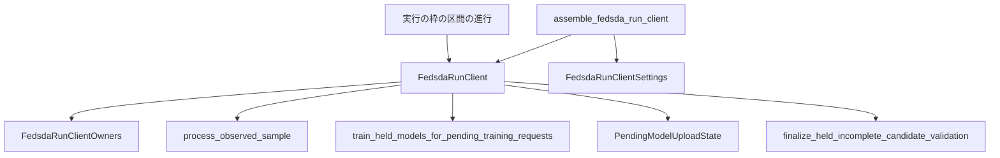

# Design Document: fedsda-run-client-assembly

## Overview

**Purpose**: 最終構成のFedSDAのclientを、初期モデル・初期の損失統計・設定から組み立て、単一runの実行の枠が求める5つの操作を提供する。

**Users**: リファクタリングを進める研究者が、サーバ側と準備の処理を接続する前提として使う。

**Impact**: 標本1件の処理が受け取るownerと値を、呼出し側が1つずつ作る必要がなくなる。既存のsourceは変更しない。

### Goals

- 生成直後から終端まで、実`__init__`で作った実旧のclient（サーバなし）と状態が一致する。
- 設定・閾値と、渡されたものどうしの不整合を、組立てのときに拒否する。
- 既存の実行の枠（参加者の検査と区間の進行）で、そのまま動く。

### Non-Goals

- 初期モデルの事前学習、全clientとサーバの準備、サーバ同期。
- 完全なrun設定（保存表現、preset、値の機能別の設定型への配置）。
- 真の概念IDを実行の枠からclientへ渡す配線。

## Boundary Commitments

### This Spec Owns

- clientの設定の束`FedsdaRunClientSettings`と、数値・文字列の値の型`FedsdaRunClientScalarSettings`、その検査。
- clientが持つownerの記録`FedsdaRunClientOwners`、client `FedsdaRunClient`（5つの操作）、組立ての関数`assemble_fedsda_run_client`。
- 観測標本から、標本1件の処理が受け取る形への変換。

### Out of Boundary

- 標本1件の処理、保留中の学習要求の学習、送信保留、未完了の候補検証の回収の、中の処理（変更しない）。
- 実行の枠（`execution/`、`runtime/single_run_execution.py`）。変更しない。
- 事前学習、`prepare_run`を持つfactory、サーバの操作、正式IDの確認、モデルの配布、集約後の再較正、サーバ評価。
- 束の値の、機能別の設定型への配置と、検証済みのrun設定の部分型の拡張。

### Allowed Dependencies

- runtimeの新moduleは、`copy`・`dataclasses`・`math`・`random`・`torch`、configuration以外の全層（core、data、evaluation、learning、methods/fedsda、runtimeの既存module）に依存する。
- executionの契約（`RunClientOperations`）はimportしない（構造的に満たす。満たすことは、実行の枠の検査を通すtestで確かめる）。旧実装をimportしない。

### Revalidation Triggers

- `process_observed_sample`の引数（ownerと値）の変更。
- `RunClientOperations`の操作の名前・引数の変更。
- 束のfieldの変更（完全なrun設定のspecが読む）。

## Architecture

### Existing Architecture Analysis

- 実行の枠は、factoryの`prepare_run`が返す`RunParticipants`（clientの操作のtupleと、サーバの操作）を検査し（操作が呼べること、`client_id`が0から昇順）、区間を進める。
- ownerは、それぞれ自分の入力を生成時に確かめる。標本1件の処理へ呼出しごとに渡す値（閾値、件数、表示名）は、使う段で初めて確かめられる（observed-sample-processingの設計4節「確かめないこと」）。

### Architecture Pattern & Boundary Map



- 組立ての関数が、検査と生成を行う。clientは、ownerの記録と設定を持ち、操作を既存の部品へ渡すだけにする（判断を持たない）。

### Technology Stack

| Layer | Choice / Version | Role in Feature | Notes |
|-------|------------------|-----------------|-------|
| 数値 | PyTorch（固定環境） | 初期モデルの写し、観測標本のtensor化 | 新しい依存はない |

## File Structure Plan

### Directory Structure

```
src/federated_learning_experiments/runtime/
├── fedsda_run_client_settings.py   # 新規: FedsdaRunClientScalarSettings、FedsdaRunClientSettings
└── fedsda_run_client.py            # 新規: FedsdaRunClientOwners、FedsdaRunClient、assemble_fedsda_run_client
tests/refactoring/
├── test_fedsda_run_client_settings.py       # 新規: 束の検査
├── test_fedsda_run_client.py                # 新規: 実旧clientとの対照、拒否、操作、実行の枠
├── test_single_run_dependency_boundaries.py # 変更: 新moduleの許可集合の登録
└── fresh_process_smoke.py                   # 変更: clientを組み立てて、実行の枠で進める流れを足す
```

### Modified Files

- `.kiro/steering/resume.md` — 完了時に現在地と次の候補を更新する。

## 旧処理との対応

| 旧 | 本spec |
| --- | --- |
| `copy.deepcopy(initial_models)`（モデルが持つ2つのoptimizerも写る） | 初期の分類器・概念固有部のoptimizerの状態・共有部のoptimizerの状態を、1回の`deepcopy`で写す |
| `copy.deepcopy(initial_stats)` | 初期の損失統計（不変の値）を、損失統計のownerへ渡す |
| `current_model_id = 0`、`next_temp_id = -100 − client_id` | `CurrentTrainingModelAssignment(initial_model_id=…)`、`TemporaryModelIdAllocator(client_id=…)` |
| `fifo_size`、`deque()` | `PendingTrainingAssignmentBuffer`、`PendingSampleObservationStore` |
| 検出器の生成（基準は初期統計から） | `OverallAndTrueClassLossMonitor`（基準は`select_loss_monitoring_baseline_mean_loss`） |
| `expert_router`、`oracle_concept_expert_routers`、`switching_expert_router` | `AdaHedgeDiagnosticEvidenceCollection`、`FixedSharePredictionWeightController` |
| 各種の空の列・辞書・計数 | 各記録のowner、学習データ・計数・評価標本のowner |
| `pending_model_*`、`_pending_upload_rounds` | `PendingModelUploadState` |
| `_pending_updates`、`batch_size`、`updates_per_sample` | `LocalTrainingRequestSchedule`、束の値 |
| `process_one_step(x, y, concept_id)`（1次元を2次元へ直す） | `FedsdaRunClient.process_observed_sample`（観測標本を1行のtensorへ変換して、標本1件の処理を呼ぶ） |
| `flush_pending_updates()` | `flush_pending_local_updates` |
| `has_pending_model()` | `has_model_ready_for_server_registration` |
| `promote_pending_to_ready()` | `advance_new_model_upload_wait_after_synchronization` |
| `finalize_incomplete_forward_validation()`（回収の位置は`processed_samples`から） | `finalize_incomplete_candidate_validation`（処理した標本数は、保留位置のownerの最終観測位置＋1） |

旧と違う点:

- **設定の受け取り方**: 旧は、module全体の`config`を生成時と実行時に読む。新は、不変の束を生成時に受け取り、生成時に全部を確かめる。
- **検査**: 旧の`__init__`が確かめるのは、候補検証の標本数と待ちラウンド数だけである。新は、束の全部の値と、初期モデルの3つの対応を確かめる。
- **乱数**: 旧はmodule全体の`random`を使う。新は、渡された`Random`を使う（既存の部品の契約）。
- **真の概念ID**: 旧は必ず受け取る。新は任意で、なければ概念別の診断と割当概念の計数を行わない。
- **ラウンドの番号**: 旧の境界の操作は受け取らない。新は契約に合わせて受け取り、型と範囲だけを確かめて、処理には使わない。
- 計算量・所要時間、標本ごとの結果種別の列、検出episode、Cached用のパラメータの控え、最終構成で使わないルータは、持たない。
- 最終構成で旧が更新するが、新のclientが持たない診断: 候補検証の判定記録の一覧（旧`provisional_model_decisions`。再開案内の「次の候補」2）、共有部の勾配の診断（旧`backbone_gradient_diagnostics`。held-model-training-request-handlingで範囲外とした）、モデル別の除外寄与の診断（同「次の候補」1）。

## Requirements Traceability

| Requirement | Summary | Components |
|-------------|---------|------------|
| 1.1 | ownerの生成 | `assemble_fedsda_run_client`、`FedsdaRunClientOwners` |
| 1.2 | 初期モデルの独立した写し | `assemble_fedsda_run_client` |
| 1.3 | 生成直後の状態が実旧と一致 | `assemble_fedsda_run_client`（対照test） |
| 1.4 | 乱数を消費しない | `assemble_fedsda_run_client` |
| 2.1〜2.3 | 標本の処理と変換、拒否 | `FedsdaRunClient.process_observed_sample` |
| 3.1〜3.5 | 境界と終端の操作 | `FedsdaRunClient`の4操作 |
| 4.1, 4.2 | 実旧との一致と、通る経路 | 全体（対照test） |
| 5.1〜5.3 | 束の検査 | `FedsdaRunClientScalarSettings`、`FedsdaRunClientSettings` |
| 5.4, 5.5 | 整合の検査と不変 | `assemble_fedsda_run_client` |
| 5.6 | 並行 | `FedsdaRunClient` |
| 6.1 | 実行の枠 | `FedsdaRunClient`（testで、参加者の検査と区間の進行を通す） |
| 6.2 | fresh process | 共用script |
| 6.3 | 依存の登録 | 依存境界test |

## Components and Interfaces

### runtime: fedsda_run_client_settings

#### FedsdaRunClientScalarSettings

数値と文字列の値。既存の検査の仕組み（fieldのmetadataと`validate_settings_field_values`）で、生成時に確かめる。

| field | 型・範囲 | 渡す先 | 旧 |
| --- | --- | --- | --- |
| `maximum_tolerated_mean_loss_increase` | float、0以上 | 標本1件の処理の`maximum_reference_mean_loss_increase`と`maximum_alarm_interval_mean_loss_increase` | `distance_threshold` |
| `minimum_candidate_mean_loss_improvement` | float、0以上 | 同`minimum_candidate_mean_loss_improvement` | `NEW_MODEL_EARLY_STOPPING_MIN_DELTA` |
| `new_model_upload_delay_round_count` | int、1以上 | 同`upload_delay_round_count` | `FEDSDA_MODEL_UPLOAD_DELAY_ROUNDS` |
| `minimum_change_interval_sample_count` | int、1以上 | 同名 | `MIN_DRIFT_DATA` |
| `local_training_batch_sample_count` | int、1以上 | 同`batch_sample_count`、境界の学習 | `CLIENT_BATCH_SIZE` |
| `maximum_stored_evaluation_sample_count_per_model` | int、1以上 | `ModelEvaluationSampleStore` | `STORED_DATA_LIMIT` |
| `added_evaluation_batch_sample_count` | int、0以上 | 同上 | `EVAL_STORE_SAMPLE_SIZE` |
| `loss_monitor_maximum_retained_candidate_count` | int、1以上 | `OverallAndTrueClassLossMonitor` | `ADWIN_MAX_WINDOW` |
| `detector_name` | str、空白でない | 標本1件の処理の`detector_name` | `_detector_label()` |

- 範囲は、値を使う部品の検査と同じにする。既存の仕組みは、floatのfieldに整数も受け入れる（使う部品も、整数と実数を受け入れる）。
- 表示名が空白だけでないことは、metadataで表せないので、`__post_init__`で追加して確かめる（`RunSettingsValidationError`）。

#### FedsdaRunClientSettings

```python
@dataclass(frozen=True, kw_only=True)
class FedsdaRunClientSettings:
    loss_change_detection_settings: LossChangeDetectionSettings
    prediction_combination_settings: PredictionCombinationSettings
    local_training_settings: LocalTrainingSettings
    local_training_schedule_settings: LocalTrainingScheduleSettings
    training_data_assignment_settings: TrainingDataAssignmentSettings
    candidate_model_training_and_acceptance_settings: CandidateModelTrainingAndAcceptanceSettings
    candidate_parameter_initialization_settings: CandidateParameterInitializationSettings
    candidate_epoch_training_settings: CandidateEpochTrainingSettings
    parameter_optimizer_settings: AdamParameterOptimizerSettings | SgdParameterOptimizerSettings
    scalar_settings: FedsdaRunClientScalarSettings
    loss_monitor_betting_fractions: tuple[float, ...]
```

- `__post_init__`の検査（宣言順。不正は`RunSettingsValidationError`で、項目名・値・理由を持つ）:
  1. 各fieldが、宣言したexact型である。機能別の設定と値の型は、それぞれの`__post_init__`をもう一度呼ぶ（frozenを回避して組み立てた値も拒否する）。
  2. 賭け率が、空でないexact tupleで、各要素がbuiltin floatで0より大きく1未満。
  3. `prediction_combination_settings.fixed_share_weight_redistribution_time_scale_samples`が、`training_data_assignment_settings.pending_assignment_buffer_capacity_samples`と同じ。
  4. `scalar_settings.minimum_candidate_mean_loss_improvement`が、`candidate_epoch_training_settings.minimum_validation_loss_decrease`と同じ。
  5. `scalar_settings.local_training_batch_sample_count`が、`candidate_epoch_training_settings.maximum_batch_sample_count`と同じ（旧は、どちらも`CLIENT_BATCH_SIZE`）。

### runtime: fedsda_run_client

#### FedsdaRunClientOwners

clientが持つownerの、不変の記録（fieldはownerへの参照）。標本1件の処理が受け取る18個のownerと、共有部のoptimizerの状態（`ParameterOptimizerState`）を持つ。field名は、標本1件の処理の引数名と同じにし、共有部は`shared_parameter_optimizer_state`とする。評価・保存・testが、ここからownerを読む。

#### assemble_fedsda_run_client

```python
def assemble_fedsda_run_client(
    *,
    client_id: int,
    initial_model_id: int,
    initial_classifier: ResidualAdapterClassifier,
    initial_concept_specific_parameter_optimizer_state: ParameterOptimizerState,
    initial_shared_parameter_optimizer_state: ParameterOptimizerState,
    initial_loss_statistics: ModelAndClassLossStatistics,
    run_client_settings: FedsdaRunClientSettings,
    python_random_generator: Random,
) -> FedsdaRunClient: ...
```

検査（すべて、何かを作る前。順に）:

| 検査（例外） | 値の出所 |
| --- | --- |
| `run_client_settings`がexact `FedsdaRunClientSettings`（TypeError）。その`__post_init__`をもう一度呼ぶ | 引数 |
| `client_id`と`initial_model_id`がbuiltin intで0以上（TypeError／ValueError）。負のモデルIDは一時IDの領域で、評価標本の保持など、負のIDを対象外にする部品がある | 引数 |
| `python_random_generator`がexact `random.Random`（TypeError） | 引数 |
| `initial_classifier`がexact `ResidualAdapterClassifier`、2つのoptimizerの状態がexact `ParameterOptimizerState`、`initial_loss_statistics`がexact `ModelAndClassLossStatistics`（TypeError） | 引数 |
| 分類器の入力の特徴数が2（ValueError） | 観測標本の特徴数 |
| 概念固有部のoptimizerのパラメータが、分類器のアダプタと分類層のパラメータと同一で同じ順。共有部のoptimizerのパラメータが、分類器の共有特徴抽出部のパラメータと同一で同じ順（ValueError） | 3つの引数の対応 |

生成（検査の後）:

1. 分類器と2つのoptimizerの状態を、1つのtupleにして`deepcopy`する。
2. ownerを作る: 保有モデルのregistry（写しを`initial_model_id`で登録）、損失統計（初期統計を`initial_model_id`で）、現在の学習帰属、一時IDの採番、損失の監視（クラス数は分類器から、基準は初期統計から）、保留位置、保留標本、学習データ、計数、評価標本、送信保留、学習要求の件数管理、候補検証の保持、適応記録、警報の記録、診断証拠、Fixed-Shareの重み、予測の記録。
3. `FedsdaRunClient`を返す。

- ownerの生成が拒否するのは、束の検査を通らない値だけである（束の範囲は、ownerの検査と同じ）。分類器のクラス数は、分類器の生成時に2以上と確かめられている。
- 例外: 分類器のパラメータの置き場所と型（CPUのfloat32の通常のtensor）は、保有モデルの登録が、写しに対して確かめる（上の表の検査より後、ownerの生成の最初）。拒否されるのは写しで、渡された初期モデルは変わらない（要求5.5）。
- 初期の損失統計のクラスIDが、分類器のクラス数の範囲にあることは確かめない（統計は、基準の選択と、損失統計のownerへの登録に使うだけである）。
- 乱数生成器は借りる（写さない）。乱数は使わない。

#### FedsdaRunClient

```python
class FedsdaRunClient:
    client_id: int            # 読取り専用
    owners: FedsdaRunClientOwners  # 読取り専用
    def process_observed_sample(self, *, observed_sample: ObservedSample, sample_index: int,
                                evaluation_concept_id: int | None = None) -> ObservedSampleProcessing: ...
    def flush_pending_local_updates(self, *, round_index: int) -> tuple[float, ...]: ...
    def has_model_ready_for_server_registration(self) -> bool: ...
    def advance_new_model_upload_wait_after_synchronization(self, *, round_index: int) -> None: ...
    def finalize_incomplete_candidate_validation(self) -> HeldIncompleteCandidateValidationFinalization | None: ...
```

- 生成は、組立ての関数だけが行う（`__init__`は、ownerの記録・束・client ID・乱数生成器・候補の構造の参照にする分類器を受け取って持つだけで、検査しない）。
- `process_observed_sample`: `observed_sample`がexact `ObservedSample`（TypeError）であることを確かめ、特徴を`[[f0, f1]]`、ラベルを`[[float(label)]]`のfloat32のtensorにして、`IndexedObservedTrainingSample`を作り、標本1件の処理を呼ぶ。位置と概念IDの型、位置の連続は、標本1件の処理が、どの更新より前に確かめる。共有部のoptimizerは、呼出しのたびに、状態のownerから現在のものを読む。候補の構造の参照には、初期モデルの写しの分類器を渡す。
- `flush_pending_local_updates`・`advance_new_model_upload_wait_after_synchronization`: `round_index`がbuiltin intで0以上（TypeError／ValueError）を確かめてから、部品を呼ぶ。完了した共同更新の損失を返す（契約は戻り値を使わない）。
- `finalize_incomplete_candidate_validation`: 候補検証を保持していなければ、Noneを返す。保持しているのに概念IDを保持していなければ、何も変えずに拒否する（ValueError）。保持していれば、処理した標本数（保留位置のownerの最終観測位置＋1）と、保持している概念IDを渡して回収し、その後で概念IDの保持を外す。
- どの操作も、部品が途中で失敗したら、例外をそのまま伝える（巻戻しなし）。

## Error Handling

- 束の不正は`RunSettingsValidationError`（項目名・値・理由）。組立ての引数の不正は`TypeError`／`ValueError`。どちらも、何も作る前に拒否する。
- 操作の途中の失敗は、既存の部品の契約のとおり（済んだ段は残る）。

## Testing Strategy

実旧をoracleにする。式をtestへ複製しない。

### Unit Tests

- 束（5.1〜5.3）: 数値・文字列の各fieldの、型と範囲の境界（受け入れる最小の値と、その外）。機能別の設定の別の型。賭け率の不正（空、list、範囲外、整数）。2組の等値の違反。frozenを回避して不正にした設定の拒否。
- 組立ての拒否（5.4, 5.5）: 各引数の別の型・派生型・範囲外、特徴数が2でない分類器、別の分類器のパラメータを指すoptimizerの状態、順が違う場合。拒否の後、渡した初期モデルのパラメータ・optimizerの状態・乱数の状態が同じであること。
- 写しの独立（1.2, 1.4）: 同じ初期モデルから2つのclientを組み立て、片方だけ標本を処理して、もう片方と元の初期モデルが変わらないこと。組立ての前後で乱数の状態が同じであること。
- 操作の入力（2.3, 3.5）: 観測標本の別の型、位置・概念ID・ラウンドの番号の不正で、全ownerの状態が変わらないこと。
- 概念IDなし（2.2）: 契約どおり2引数で呼ぶと、概念別の証拠が作られず、予測の記録の概念IDがNoneであること。

### Integration Tests

- 実旧clientとの対照（1.3, 4.1, 4.2）: 旧の設定を小さい値へ差し替え、実`_pretrain_initial_model`で初期モデルと統計を作り、実`__init__`で実旧の最終構成のclientを作る。新側は、同じ値の分類器と、同じ状態のoptimizerから組み立てる。生成直後、標本ごと、ラウンド境界（学習→登録できるモデルの有無→待ちの進行）ごと、終端の回収の後に、既存の照合（保有モデルとoptimizer、学習データ、計数、損失統計、保留、監視、適応記録、予測の記録と重み、診断証拠）と、警報の記録、送信保留（保留の有無、送信できるか、残りの待ち）、学習要求、乱数を照合する。2値・多クラス、概念が切り替わる標本列を複数。全条件を通して、要求4.2の経路を通ったことを確かめる。
- 実行の枠（6.1）: 組み立てたclientを2つと、何もしないサーバの代役で`RunParticipants`を作り、`validate_prepared_run_participants`と`run_stream_protocol_intervals`を実行する。実行の記録の段の列が契約の順であること、各clientの予測の記録の件数が処理した標本数と同じであること。

### fresh process・依存

- 共用script（6.2）: 旧実装とtestのmoduleなしで、clientを組み立て、実行の枠の区間の進行で標本列を最後まで進める流れを足す。
- 依存境界（6.3）: 新しい2 moduleの許可集合を、既存と同じ形で登録する。
