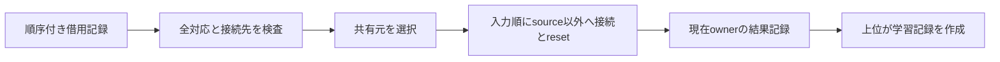

# 設計: 保有モデル全体の共有特徴抽出部への再接続

## Overview / Boundary Commitments
入力は保有モデルID・分類器・共有/個別optimizer管理器の順序付き借用記録列。
本操作は共有元選択、全入力の対応検証、共有元以外の再接続/個別reset、現在ownerの結果記録作成を所有する。
上位が一覧・所有者の生成/保存と新学習record作成を所有する。同期load/候補/統計/帰属/学習/全体runは含めない。
Allowed Dependencies: dataclasses、Torch公開型/属性、既存classifier/shared extractor/ParameterOptimizerState。上位・設定解決・学習計算/旧packageへ依存しない。
Revalidation Triggers: ID選択基準、順序、source skip、record lifetime、optimizer交換時機の変更。

## API / Data Model
同じmoduleにfrozen/kw_only dataclass HeldModelOptimizerBindingを置く。
model_id: int、classifier: ResidualAdapterClassifier、shared_parameter_optimizer_state: ParameterOptimizerState、concept_specific_parameter_optimizer_state: ParameterOptimizerStateを借用する。
record生成自体は副作用/検査なし、公開操作で毎回全体検証する。bindingは所有者を作らず、IDと各ownerの対応を表す。
reconnect_held_models_to_shared_feature_extractor(*, held_model_optimizer_bindings: tuple[HeldModelOptimizerBinding,...]) -> tuple[HeldModelOptimizerBinding,...]。

## Contracts / State Transition
1. exact tuple/record/int（bool/派生不可）、重複ID/同一classifier参照/概念固有parameter重複、exact classifier/ownerを検査する。
2. 各共有部は既存validate_structureでCPU32/構造検証。共有/個別parameter列とowner現在optimizerのgroupsがidentity/順序対応し、全parameterがCPU32 strided/notnestedであることを検査する。空の共有parameter列は対応する有効ownerを用意できないので対象外。
3. 最小非負ID、なければ先着を選び、共有元を全モデルへ接続できるか既存validate_structureで確認する。この段階まで副作用なし。
4. 入力順でsourceは接続/resetをskip。その他はattach_shared_feature_extractor、concept_specific_parameter_optimizer_state.reset_parameter_optimizerの順。
5. source bindingは同じ参照、他のbindingは同じ分類器/個別ownerとsource共有ownerで新frozen recordを返す。全結果は入力ID順。
接続でparameter値/grad/RNGを変更しない。個別ownerの現在optimizerは交換されるが、交換前のoptimizer自体/stateは保持。
旧入力bindingの分類器はlive借用参照のため接続を反映するが、共有owner欄は旧ownerのまま。成功返却列だけを現在の対応として学習準備に使う。
通常モデルと公開owner契約を前提とする。private/frozen回避・概念層構造の外側改変・並行操作は通常契約外。
途中例外は伝播し、prefixの接続/resetと失敗モデルの接続を保持。reset自身の成功後交換保証は前specに従う。

## File Structure Plan
|パス|変更|責務|
|---|---|---|
|src/federated_learning_experiments/learning/training/held_model_shared_feature_reconnection.py|新規|借用対応記録と保有モデル再接続|
|tests/refactoring/test_held_model_shared_feature_reconnection.py|新規|旧共有元選択/状態/拒否と共同学習対照|
|tests/refactoring/test_single_run_dependency_boundaries.py|変更|新module exact依存guard|
|.kiro/specs/held-model-shared-feature-reconnection/*|新規|仕様/承認/実測|
|.kiro/steering/roadmap.md|変更|進捗|

## Requirements Traceability / Testing Strategy
|要件|証拠|
|---|---|
|1.1–1.3|空/単独/混合ID/全負/非昇順/極大ID、実旧共有元参照の対照|
|1.4/2.1/2.2|先行step後、source保持/non-source reset/既に共有済み、概念/双方値grad/順序/RNGの対照|
|2.3/2.4|source owner全結果へ対応、旧shared owner/旧optimizer state保持、返却列から新学習binding|
|3.1|型/ID/参照/owner対応/寸法/構造/dtype/device不正を末尾にも配置し、全入力保持|
|3.2|途中reset例外を注入しprefix/現在接続/未処理suffixを確認|
|3.3|値grad/RNG保持、AST禁止/許可/fresh新CPU/全回帰gate|
class2/4×optimizer3×初期共有有無2=12実NN条件で、実旧_share_model_backbones後の3共同stepを全loss/値/grad/stateへexact照合する。
新module import未存在の実RED後に実装。ASTは新module禁止/許可ケースを先行RED→guard GREEN。
全pytest（旧11/最終3golden）、Ruff/format/Pyright/pip、fresh新CPU再接続/共同学習、旧748c3aa固定差分と現在sourcehashを記録する。
