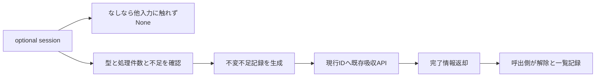

# 終端の未完了候補検証の確定 — 設計 revision1

## Overview

研究者の終端記録を再現するため、件数不足のsessionの保留標本を現行モデルへ回収する。既存の吸収APIを組み立て、比較未成立を表す不変recordと呼出側向け完了情報を返す。新しい外部依存はない。Python/torch/pytestは固定Windows CPU基準環境を継続する。

### Goals / Non-Goals

正常成功時の標本・統計・計数・記録・乱数を実旧と照合する。全体client、一覧・通知・episode操作、通常採否評価、旧修正は扱わない。

## Boundary Commitments

本specは不足用の記録型と終端回収runtimeだけを所有する。sessionは借用しbinding/collectionを変更しない。runtimeは呼出側のactive sessionや記録一覧を保持しない。出力は回収成功後だけ返す。呼出側は返却後にsessionを解除し、再投入による二重吸収を防ぐ。本関数は自動exactly-once/rollback/retryを提供しない。

### Out of Boundary

候補生成/学習、参照固定、損失観測/再評価、採番/登録/送信、帰属変更、切替位置、検出解決通知、予測重み、episode owner、旧例外時の途中記録残存、新client/全体run、旧/config/private import、alias、I/O。

### Allowed Dependencies

不足recordのexact許可: `dataclasses.dataclass`だけ。

runtimeのexact許可: `dataclasses.dataclass`、公開`ModelAndClassLossStatisticsStore`、`HeldModelTrainingStateRegistry`、`ModelTrainingAndAssignmentCountsStore`、`ModelTrainingSampleStore`、`CurrentTrainingModelAssignment`、`IncompletePostAlarmCandidateValidationDecisionRecord`、`PostAlarmCandidateValidationSession`、`absorb_assigned_training_samples_into_held_model`。これらの定義moduleからの直接importだけ。stdlib/Tensor/private/module/reexport/childへの許可拡張はしない。methodsはruntimeへ依存しない。

### Revalidation Triggers

sessionのmetadata/binding/保留標本、公開collection snapshotの件数、吸収の拒否/順序/損失演算、現在ID owner、旧基準/環境、記録fieldsを変更したら該当対照を再検証する。後続clientは返却後解除・記録の順と二重吸収防止を検証する。新規名/役割は命名承認を解除して再レビューする。

## Architecture / System Flow

## File Structure Plan

| 操作 | ファイル | 責務 |
| --- | --- | --- |
| 作成 | src/federated_learning_experiments/methods/fedsda/candidate_model_selection/incomplete_post_alarm_candidate_validation_decision_record.py | 不足による棄却の不変情報 |
| 作成 | src/federated_learning_experiments/runtime/incomplete_post_alarm_candidate_validation_finalization.py | optional sessionの終端回収組立 |
| 作成 | tests/refactoring/test_incomplete_post_alarm_candidate_validation_finalization.py | 記録・実旧回収・拒否・実学習接続 |
| 変更 | tests/refactoring/test_single_run_dependency_boundaries.py | 2moduleのexact guard/両resolver/注入 |
| 更新 | 本spec正本/証拠とsteering resume/roadmap/agent-handoff | 承認・検証・再開とpush方針 |

## Components & Interfaces / Data Models

`IncompletePostAlarmCandidateValidationDecisionRecord`: frozen/kw_only、全fields必須: `proposal_sample_index:int`, `finalization_sample_index:int`, `detector_name:str`, `candidate_training_interval_sample_count:int`, `validation_sample_count:int`。property `finalization_delay_sample_count`は確定−提案。型自体が件数不足の棄却・参照/比較平均なし・警報後検証を表す。成功後の診断出力として構築し、constructorの入力検査APIは設けない。通常recordのevaluationを無効値で生成しない。

`IncompletePostAlarmCandidateValidationFinalization`: frozen/kw_only、全必須fields `decision_record:IncompletePostAlarmCandidateValidationDecisionRecord`, `current_training_model_id:int`, `estimated_change_point_sample_index:int|None`, `detection_episode_id:int|None`。同じ現行IDが旧eventの変更前後IDを表す。帰属変化・切替位置・通知/episode flagsは不要（常になし）。

`finalize_incomplete_post_alarm_candidate_validation`、全keyword必須: `validation_session:PostAlarmCandidateValidationSession|None`, `processed_sample_count:int`, `pending_assignment_sample_concept_ids:tuple[int|None,...]`, `held_model_training_state_registry:HeldModelTrainingStateRegistry`, `loss_statistics_store:ModelAndClassLossStatisticsStore`, `training_sample_store:ModelTrainingSampleStore`, `model_training_and_assignment_counts_store:ModelTrainingAndAssignmentCountsStore`, `current_training_model_assignment:CurrentTrainingModelAssignment`。返却は`IncompletePostAlarmCandidateValidationFinalization|None`。

## Contract / Error Handling

1. session Noneなら他入力にアクセスせずNone（1.1）。
2. exact session/current assignmentを検査、processed_sample_countはbool除外builtin intかつ非負。公開collection snapshotから同じvalidation_sample_countを不足判定と出力へ使い、required以上ならValueError。helper `_validate_incomplete_validation_finalization_inputs`はこれだけを検査する。
3. 処理末尾=processed_sample_count−1、確定位置=max(proposal,処理末尾)、学習区間件数=len(training_input_features)。現在IDは現在帰属ownerから取得。出力recordを構築し、吸収前に外部一覧へ追加しない（1.3,2.1,2.2）。
4. 既存absorbへ現行ID・session保留標本・概念ID列・4ownersを渡す。exact owners/標本/概念列、shape[1,F]/label[1,1]/型/値、保有ID欠落は既存契約で全更新前に検査される。TypeError/ValueError/KeyErrorをそのまま伝える。不正後はcollection/owners/model/parameter/grad/optimizer/RNG不変（3.1）。非公開改変、同時更新、OOM/overflowは契約外。空保留でも現行保有状態の存在は必要。
5. 吸収成功後、session metadataと同じ現行IDで完了情報を返す。session/collection、候補/参照、学習状態と帰属は変えない（1.2,2.2）。呼出側が解除し一覧記録する。戻り値を無視して同sessionを再投入すれば再吸収となるため後続clientで防ぐ。

旧対応はtestだけで明示する: position/resolution_position/detector、interval_count/training_countとも同じ区間件数、validation_countは公開収集実件数、accepted=False、reason=insufficient_forward_data、reference_model_id=None、4平均と3比較導出値は旧NaN（新ではfield自体なし）、validation_source=forward、resolution_delayは位置差。適応eventはcreate_rejected/確定位置/同じ現行ID/metadata。旧文字列をsource aliasとして保持しない。

## Testing Strategy / Requirements Traceability

| 要求 | 証拠 |
| --- | --- |
| 1.1 | no-sessionに他入力sentinelを渡しNone・全owner/RNG不変 |
| 1.2, 1.3, 2.1, 2.2, 3.2 | 実旧finalize_incomplete_forward_validationを呼ぶ2/4class×収集0/1/3（要求4）×保留0/3、処理件数0/位置前/位置後、metadata None、現行ID変更。全record/event/owners/parameter/grad/optimizer/RNG照合 |
| 3.1 | exact型/件数/要求到達/概念型長さ/後半不正標本shape値/ID欠落を拒否し全状態不変。frozen/kw_only、後半不正で先行標本も追加されないこと |
| 3.2 | 実NN2/4class×3optimizerで開始→規定未満の観測→終端回収→2回共同更新。実旧への全損失・state・RNG照合、空保留/metadataなしも追加 |
| 3.3 | exact AST注入RED→guard両resolver→GREEN、旧importなしfresh新CPU起動、代表変異検出とbyte復元、全pytest/JUnit旧11/最終3golden、Ruff/Pyright/pip、748c3aa固定差分、対象commit/sourceと承認hash、別fresh feature GO |

上流testの開始/観測/旧oracle/状態照合helperを同義で再利用する。制御lossの経路testと実学習testを区別。全suiteはユーザー決定に従い主担当実測/JUnit照合、独立全suite再現は必須にしない。各task終了の通常pushは1回のみ。
