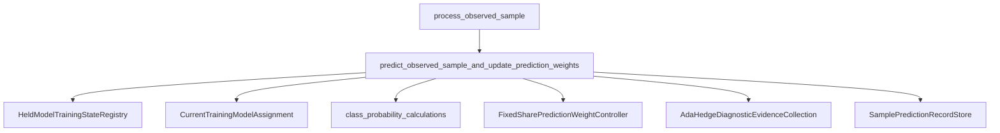
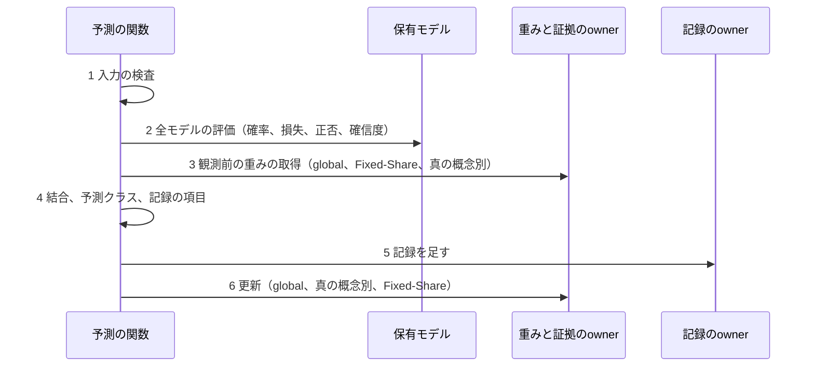

# Design Document: observed-sample-prediction

## Overview

**Purpose**: 観測した標本1件について、旧の最終構成と同じ重み付き予測・記録・ラベル観測後の更新を行い、標本1件の処理の先頭へつなぐ。

**Users**: リファクタリングを進める研究者が、新clientの組立ての前提として使う。

**Impact**: `process_observed_sample`が、旧`process_one_step`の全体（計算量と所要時間の記録、モデル別の除外寄与の診断を除く）に対応するようになる。引数が2つ、結果のfieldが1つ増える。

### Goals

- 旧`_record_prediction`の最終構成の分岐と、標本ごとに同じ数値・同じ状態になる。
- 不正な入力を、どの状態も変える前に拒否する。
- 旧の標本ごとの列と集計の計数を、記録から導ける。

### Non-Goals

- 回復期だけの有効化と警報側の通知（UNPORTED-003）、最終構成で使わない予測方式。
- モデル別の除外寄与の診断、計算量と所要時間、集約後の再較正、保存。

## Boundary Commitments

### This Spec Owns

- 関数`predict_observed_sample_and_update_prediction_weights`と結果`ObservedSamplePrediction`（runtime）。
- 標本ごとの予測の記録`SamplePredictionRecord`と、そのowner `SamplePredictionRecordStore`（evaluation）。
- `process_observed_sample`の最初の段としての予測の呼出しと、結果への追加。

### Out of Boundary

- 既存の予測の部品（`class_probability_calculations`、`FixedSharePredictionWeightController`、`AdaHedgeDiagnosticEvidence`・`AdaHedgeDiagnosticEvidenceCollection`）の中の処理。変更しない。
- 学習帰属の変更でのglobalの診断証拠の再始動（既存の`notify_diagnostics_of_training_assignment_change`）。
- 予測重みのownerと記録のownerの生成、Fixed-Shareの時間尺度の設定（新clientの組立て）。
- モデル別の除外寄与の診断、計算量、集約後の再較正、記録の保存と集計値の出力。

### Allowed Dependencies

- runtimeの新moduleは、`torch`、`dataclasses`、evaluation（診断証拠の保持集合、記録のowner）、learning（確率の計算、保有モデルの学習状態、現在の学習帰属、標本の型）、methods/fedsda（Fixed-Shareの予測重み）に依存する。
- evaluationの新moduleは、標準libraryだけに依存する。
- 依存の向きは、既存と同じ（runtime → methods・evaluation・learning）。旧実装をimportしない。

### Revalidation Triggers

- `ObservedSamplePrediction`・`SamplePredictionRecord`のfieldの変更（除外寄与の診断と保存のspecが読む）。
- `process_observed_sample`の引数・段の順序の変更（新clientの組立てが呼ぶ）。
- 既存の予測の部品の契約（重みの総和の許容差、モデル集合の同期）の変更。

## Architecture

### Existing Architecture Analysis

- `process_observed_sample`は、ownerを引数で受け取り、最初に全ownerの型と標本を検査してから、段を順に呼ぶ。本specも同じ形にする。
- 記録のownerは、`LossChangeAlarmRecordStore`と同じく、足す操作と、tupleの写しを返す操作だけを持つ。
- 保有モデルは`HeldModelTrainingStateRegistry`が持ち、全モデルが1つの共有特徴抽出部を参照する。

### Architecture Pattern & Boundary Map



- 関数が順序を持ち、各ownerが自分の状態だけを持つ（structure.mdの「状態所有者を一つ決める」）。
- 新しい部品は、記録のownerと、つなぐ関数の2つだけ。

### Technology Stack

| Layer | Choice / Version | Role in Feature | Notes |
|-------|------------------|-----------------|-------|
| 数値 | PyTorch（固定環境）、Python標準の`math` | モデルの評価と確率、重みの計算 | 新しい依存はない |

## File Structure Plan

### Directory Structure

```
src/federated_learning_experiments/
├── evaluation/
│   └── sample_prediction_record_store.py   # 新規: SamplePredictionRecord、SamplePredictionRecordStore
└── runtime/
    ├── observed_sample_prediction.py        # 新規: ObservedSamplePrediction、predict_observed_sample_and_update_prediction_weights
    └── observed_sample_processing.py        # 変更: 最初の段として予測を呼ぶ
tests/refactoring/
├── test_sample_prediction_record_store.py   # 新規: 記録のownerの単独のtest
├── test_observed_sample_prediction.py       # 新規: 実旧_record_predictionとの対照、拒否、順序
├── test_observed_sample_processing.py       # 変更: oracleを最終構成の実旧clientにし、予測を照合する
├── test_single_run_dependency_boundaries.py # 変更: 新moduleの許可集合の登録
└── fresh_process_smoke.py                   # 変更: 予測のownerを足す
docs/research/implementation-findings/
└── unported-003-drift-recovery-prediction-mixture-activation.md  # 新規
```

### Modified Files

- `runtime/observed_sample_processing.py` — 引数`fixed_share_prediction_weight_controller`・`sample_prediction_record_store`を足し、入力の検査の後に予測を呼び、結果へ`observed_sample_prediction`を足す。
- `docs/research/implementation-findings/README.md` — UNPORTED-003の行。
- `.kiro/steering/resume.md`・`roadmap.md` — 完了時に現在地と次の候補を更新する。

## System Flows

予測の段の順序（番号は下の「処理順」と同じ）:



最初の状態更新は3（モデル集合が変わっていれば、重みと証拠が初期化される）。1と2は状態を変えない。

## 旧処理との対応（`clients/fedsda.py::_record_prediction`、最終構成の分岐）

| 旧 | 本spec |
| --- | --- |
| `sample_index = max(0, self.processed_samples - 1)` | 標本の位置（`IndexedObservedTrainingSample.sample_index`） |
| `_use_soft_routing`、`soft_routing_activation.record_prediction`、`history_routing_soft_active` | なし（常時有効。記録の件数から導く） |
| `repository_model_ids = tuple(sorted(self.models))`、`routing_active_set is None` | 保有モデルのIDの昇順。全モデルを評価する |
| `expert_router.probabilities`→`_restrict_routing_probabilities` | globalの診断証拠の観測前の重み→`normalize_model_prediction_weights` |
| `_routing_scores`（共有部の版）、多クラスは`softmax` | ID昇順で最初のモデルで共有特徴を1回計算→各モデルの`forward_from_shared_features`→`convert_model_outputs_to_prediction_probabilities` |
| モデル別の`losses`・`model_prediction`・`model_confidences` | `compute_model_mean_bounded_losses_after_label_observation`、`predict_class_labels_from_prediction_scores`、確信度（本specで書く） |
| `_weighted_routing_scores`（3回） | `combine_model_prediction_probabilities`（3回） |
| `switching_expert_router.probabilities`→正規化 | `get_prediction_weights_before_label_observation`→正規化 |
| `oracle_concept_expert_routers[int(concept_id)]`の重み→正規化 | `get_true_concept_diagnostic_evidence`の観測前の重み→正規化（真の概念IDがなければ行わない） |
| `_routing_correct`、`_routing_leader`、`effective_expert_count` | クラスの決定と観測ラベルの比較、`select_maximum_weight_model_id`（現在の学習帰属を優先）、実効モデル数 |
| `routing_leave_one_out_diagnostics.observe` | 範囲外（後続のspec。入力は結果に含める） |
| 集計の計数と標本ごとの列 | 記録1件（research.mdの対応表） |
| `expert_router.update(losses, 正規化後)`、`oracle_concept_router.update(losses, 正規化前)`、`switching_expert_router.update(losses, 正規化後)` | 同じ重みで、同じ順に更新する |
| `_record_model_compute("prediction", …)` | 範囲外（計算量は未移植） |

旧と違う点:

- **数値の計算の位置**: 旧は、重みの取得の後でモデルを評価する。新は、モデルの評価（2）を重みの取得（3）より前に行う。評価は重みを読まず、重みの取得はモデルを読まないので、成功時の値は変わらない。
- **真の概念IDがない標本**: 旧は例外になる。新は、概念別の証拠を作らず、記録の該当項目をNoneにする。
- **集計の計数**: 旧は予測のたびに計数を足す。新は記録だけを持ち、計数は記録から導く。
- **混合予測の有効・無効**: 新は常時有効の1経路だけを持つ。
- **重みの総和が0以下のときの均等割り**: 旧の`_restrict_routing_probabilities`にある分岐は、新にはない（既存の正規化の部品は、総和が1との差1e-12以内の重みだけを受け取る。3つの重みは、それぞれの部品が総和ほぼ1で返す）。
- 計算量の記録と、モデル別の除外寄与の診断は行わない。

## Requirements Traceability

| Requirement | Summary | Components | Flows |
|-------------|---------|------------|-------|
| 1.1 | 全モデルの確率、共有特徴は1回 | 予測の関数 | 2 |
| 1.2 | Fixed-Shareの重みで結合、予測クラス | 予測の関数 | 3, 4 |
| 1.3 | ラベルと概念IDに依存しない | 予測の関数（結果のfield） | 2〜4 |
| 1.4 | 最大重みのモデルの選び方 | 予測の関数 | 4 |
| 1.5 | モデルと乱数を変えない | 予測の関数 | 2 |
| 2.1〜2.4 | 3つのownerの更新 | 予測の関数 | 6 |
| 2.5 | 更新は記録の後 | 予測の関数 | 5, 6 |
| 3.1, 3.2 | 記録の項目、確信度が最大のモデル | 予測の関数、`SamplePredictionRecord` | 4 |
| 3.3, 3.4 | 記録の保持と拒否 | `SamplePredictionRecordStore` | 5 |
| 3.5 | 旧の列と計数を導ける | `SamplePredictionRecord`（testの対応づけ） | — |
| 4.1, 4.2 | 標本1件の処理の最初の段、結果 | `process_observed_sample` | — |
| 4.3 | 実旧との一致 | 全体（対照test） | — |
| 5.1〜5.3 | 更新前の拒否 | 予測の関数 | 1, 2 |
| 5.4 | 標本1件の処理での拒否 | `process_observed_sample` | — |
| 5.5, 5.6 | 途中の失敗、並行 | 予測の関数 | 3〜6 |
| 6.1 | fresh process | 共用script | — |
| 6.2 | 依存の登録 | 依存境界test | — |

## Components and Interfaces

| Component | Layer | Intent | Req Coverage | Key Dependencies | Contracts |
|-----------|-------|--------|--------------|------------------|-----------|
| `SamplePredictionRecordStore` | evaluation | 標本ごとの予測の記録を観測順に持つ | 3.3, 3.4, 3.5 | なし | State |
| `predict_observed_sample_and_update_prediction_weights` | runtime | 予測→記録→更新をつなぐ | 1.x, 2.x, 3.1, 3.2, 5.x | 既存の予測の部品（P0） | Service |
| `process_observed_sample`（変更） | runtime | 予測を最初の段として呼ぶ | 4.x, 5.4 | 予測の関数（P0） | Service |

### evaluation

#### SamplePredictionRecord / SamplePredictionRecordStore

**Responsibilities & Constraints**

- `SamplePredictionRecord`（frozen、keyword専用）のfield:

| field | 型 | 意味 |
| --- | --- | --- |
| `sample_index` | int | 標本の位置 |
| `observed_concept_id` | int \| None | 真の概念ID（診断用） |
| `observed_class_id` | int | 観測クラス |
| `combined_prediction_is_correct` | bool | Fixed-Shareの重みで結合した予測が正しいか |
| `maximum_weight_model_id` | int | 予測重みが最大のモデル |
| `maximum_prediction_weight` | float | その重み |
| `effective_model_count` | float | 予測重みの二乗和の逆数 |
| `any_model_or_combined_prediction_is_correct` | bool | 結合した予測またはいずれかのモデルの予測が正しいか |
| `maximum_weight_model_prediction_is_correct` | bool | 予測重みが最大のモデルの予測が正しいか |
| `global_diagnostic_prediction_is_correct` | bool | globalの診断重みで結合した予測が正しいか |
| `true_concept_diagnostic_prediction_is_correct` | bool \| None | 真の概念別の診断重みで結合した予測が正しいか |
| `highest_confidence_model_prediction_is_correct` | bool | 確信度が最大のモデルの予測が正しいか |

- ownerは記録のlistだけを持つ。予測や判断をしない。

##### State Management

```python
class SamplePredictionRecordStore:
    def __init__(self) -> None: ...
    @property
    def last_recorded_sample_index(self) -> int | None: ...
    def append_sample_prediction_record(self, *, sample_prediction_record: SamplePredictionRecord) -> None: ...
    def snapshot_sample_prediction_records(self) -> tuple[SamplePredictionRecord, ...]: ...
```

- Preconditions（`append`。満たさなければ何も変えずに拒否）: 記録がexact `SamplePredictionRecord`（TypeError）。`sample_index`・`observed_class_id`・`maximum_weight_model_id`がbuiltin int、`observed_concept_id`がbuiltin intまたはNone、正否のfieldがbuiltin bool（`true_concept_diagnostic_prediction_is_correct`はboolまたはNone）、`maximum_prediction_weight`・`effective_model_count`がbuiltin float（TypeError）。`sample_index`と`observed_class_id`が非負、重みが0より大きく1以下、実効モデル数が有限で1以上（1との差1e-9までの丸めを許す）、`observed_concept_id`がNoneであることと`true_concept_diagnostic_prediction_is_correct`がNoneであることが一致、保持している記録があれば`sample_index`が最後の位置の次（ValueError）。
- Postconditions: 記録が末尾へ足される。`snapshot`は、足した順のtupleを返す（記録はfrozen）。
- 正否のfieldどうしの関係（結合が正しければ「いずれかが正しい」も真、など）は確かめない（値は予測の関数が作る）。

### runtime

#### predict_observed_sample_and_update_prediction_weights

##### Service Interface

```python
@dataclass(frozen=True, kw_only=True)
class ObservedSamplePrediction:
    sample_prediction_record: SamplePredictionRecord
    predicted_class_labels: Tensor                          # 形[1, 1]、float32
    combined_prediction_probabilities: Tensor               # 2値[1, 1]、多クラス[1, K]
    prediction_probabilities_by_model_id: dict[int, Tensor] # ID昇順
    prediction_weights_by_model_id: dict[int, float]        # 正規化後のFixed-Shareの重み
    global_diagnostic_weights_by_model_id: dict[int, float] # 正規化後
    observed_losses_by_model_id: dict[int, float]

def predict_observed_sample_and_update_prediction_weights(
    *,
    indexed_observation: IndexedObservedTrainingSample,
    fixed_share_prediction_weight_controller: FixedSharePredictionWeightController,
    diagnostic_evidence_collection: AdaHedgeDiagnosticEvidenceCollection,
    sample_prediction_record_store: SamplePredictionRecordStore,
    held_model_training_state_registry: HeldModelTrainingStateRegistry,
    current_training_model_assignment: CurrentTrainingModelAssignment,
) -> ObservedSamplePrediction: ...
```

##### 検査と処理順

| 段 | 内容 | 状態の更新 |
| --- | --- | --- |
| 1 | 入力の検査（下の表） | なし |
| 2 | `torch.no_grad`の中で、ID昇順で最初のモデルで共有特徴を1回計算し、各モデルの出力→確率→有界損失、モデル別の予測クラスと正否、確信度を求める | なし |
| 3 | 観測前の重みを、global→Fixed-Share→真の概念別（概念IDがあるとき）の順に取得し、それぞれ正規化する | モデル集合が変わっていれば、それぞれのownerが初期化する。真の概念別の証拠は、初めての概念IDなら作られる |
| 4 | 3つの重みで確率を結合し、予測クラスと正否を求める。最大重みのモデル、最大の重み、実効モデル数、確信度が最大のモデルを求め、記録を作る | なし |
| 5 | 記録を足す | 記録のowner |
| 6 | global（正規化後の重み）→真の概念別（正規化前の重み）→Fixed-Share（正規化後の重み）の順に、同じ損失で更新する | 3つのowner |

| 検査（例外） | 段 | 値の出所 |
| --- | --- | --- |
| 5つのownerがexact型（TypeError） | 1 | 引数 |
| 標本がexact `IndexedObservedTrainingSample`、位置がbuiltin int、概念IDがbuiltin intまたはNone、`training_sample`がexact `ObservedTrainingSample`、特徴とラベルがexact `torch.Tensor`（TypeError）。位置が非負、特徴が1行の2次元、ラベルが1行1列（ValueError） | 1 | 引数。標本1件の処理と同じ検査（単独でも呼べる関数なので、ここでも確かめる） |
| 特徴が有限。ラベルがCPUのfloat32の通常のtensor（ValueError） | 1 | 引数。標本1件の処理の後の段（損失の監視、候補検証）だけが確かめる条件なので、予測の更新の前に確かめる。負の無限大の特徴は、ReLUの後で有限の出力になりうるので、出力の検査では拒否できない |
| 位置が、記録のownerの最後の位置の次（ValueError。記録がなければ問わない） | 1 | 引数とownerの状態。5で拒否されると3の更新が残るので、先に確かめる |
| 保有モデルが1つ以上、現在の学習帰属のモデルを保有している（ValueError） | 1 | 2つのownerの状態 |
| 標本の中身（特徴の数・dtype、ラベルの範囲・整数値・有限）、モデルの出力（形、有限、2値は0〜1） | 2 | 共有特徴抽出部と、確率・損失の部品の契約 |
| 重みの総和（1との差1e-12以内）と、IDの集合の一致 | 3, 4, 6 | 既存の部品の契約。3つの重みは、それぞれの部品が同じモデル集合に対して返す値なので、到達しない |

- 確信度: 2値は`abs(確率 − 0.5)`、多クラスは最大のクラス確率（1標本なので、旧の平均は値そのもの）。確信度が最大のモデルは、同率の中から（予測重み、現在の学習帰属であること、IDの小ささ）の順で選ぶ。
- 実効モデル数: 正規化後のFixed-Shareの重みの二乗和（ID昇順に、旧と同じ組み込みの`sum`で求める）の逆数。
- 3より後の失敗では、済んだ段は残る（要求5.5）。3の同期は、同じモデル集合で繰り返しても状態を変えないので、4で失敗した場合も、次の予測は、失敗がなかった場合と同じ重みから始まる。
- モデルの訓練・評価の別は変えない。乱数は使わない。

**Implementation Notes**

- 3つの重みによる「結合→クラスの決定→観測ラベルとの比較」は、module内の非公開の補助1つにまとめる。
- 結果の辞書とtensorは、ownerの内部と結合しない値（部品が返す新しい辞書・tensor）をそのまま入れる。

#### process_observed_sample（変更）

- 引数`fixed_share_prediction_weight_controller`・`sample_prediction_record_store`を足し、exact型の検査の表へ足す。
- 処理順: (0)既存の入力の検査、(0.5)予測の関数、(1)以降は変更なし。予測の関数が拒否した場合、(0.5)の中の1・2での拒否なら、どの状態も変わらない（要求5.4）。
- `ObservedSampleProcessing`へ`observed_sample_prediction: ObservedSamplePrediction`を足す。
- 標本の中身（特徴の数、ラベルの範囲）の拒否は、予測の段2が最初に行うようになる（これまでは候補検証の観測、または現在のモデルの損失の評価）。どの更新より前であることは変わらない。

## Error Handling

- 不正な入力は`TypeError`（型）または`ValueError`（値・状態）で拒否する。巻戻しと再試行は行わない（旧も、例外は標本処理の外まで伝わる）。
- 設定の不正（Fixed-Shareの時間尺度など）は、ownerの生成時に確かめられている（本specでは扱わない）。

## Testing Strategy

実旧をoracleにする。式をtestへ複製しない。

### Unit Tests

- 記録のowner（3.3, 3.4）: 足した順に返すこと、写しが後の追加で変わらないこと、各fieldの不正な型・値、概念IDと概念別の項目の不対応、位置の不連続で、拒否して何も変わらないこと。
- 拒否（5.1〜5.3）: 各不正入力（ownerの別の型・派生型、標本の型・形・位置・概念ID、記録の最後の位置との不連続、保有モデルなし、現在の学習帰属を保有していない、特徴の数、ラベルの範囲、非有限の出力）で、3つのowner・記録・モデルのパラメータ・乱数が変わらず、拒否の後に正しい標本を予測できること。
- ラベルと概念IDへの非依存（1.3）: 同じ状態の写しへ、ラベルと概念IDだけを変えた標本を与え、確率・重み・結合・予測クラスが同じであること。
- 概念IDなし（2.4）: 概念別の証拠が作られず、記録の2項目がNoneで、ほかの項目と2つのownerの状態が、概念IDがある場合と同じであること。
- 順序（2.5, 5.5）: 記録の追加を失敗させると、3つのownerが更新されていないこと。更新の1つを失敗させると、記録は残り、後の更新へ進まないこと。
- モデルと乱数（1.5）: 予測の前後で、全モデルのパラメータ・訓練の別・torchとPythonの乱数の状態が同じであること。共有特徴抽出部のforwardが1回であること（1.1）。

### Integration Tests

- 予測の関数と実旧`_record_prediction`の対照（1.1, 1.2, 1.4, 2.1〜2.3, 3.1, 3.2, 3.5）: 標本処理のoracleの状態（保有モデル3つ、一時IDを含む）から、実旧の最終構成のクラスの`_record_prediction`と新の関数を、同じ標本列で交互に呼ぶ。2値・多クラス。途中で、モデルIDの付け替え（モデル集合の変更）と、学習帰属の変更（globalの再始動）を両方へ行う。標本ごとに、Fixed-Shareの重み・分散・計数、globalと真の概念別の証拠、記録と旧の列・計数（research.mdの対応表）を照合する。保有モデルが1つの場合と、重みが同率の最初の標本（現在の学習帰属の優先）を含める。
- 標本1件の処理と実旧`process_one_step`の対照（4.1, 4.3）: 既存の軌跡の対照（2値・多クラス、最初の警報の結果、標本列、履歴統計、採否の余裕）のoracleを、最終構成の実旧clientにし、予測を止めずに実行する。既存の全項目に加えて、上と同じ予測の項目を標本ごとに照合する。候補の採用（モデル集合が増える）と学習帰属の変更を含む条件を通ることを確かめる。
- 標本1件の処理の順序と拒否（4.1, 4.2, 5.4）: 予測が候補検証の進行より前に呼ばれること、結果に予測が入ること、予測の段での拒否で全状態が変わらないこと、追加した2つのownerの別の型で拒否すること。

### fresh process・依存

- 共用script（6.1）: Fixed-Shareのownerと記録のownerを足し、標本ごとに記録が1件増えること、重みの総和が1であること、保有モデルが複数の状態で実行されたことを確かめる。
- 依存境界（6.2）: 新しい2 moduleの許可集合と、`observed_sample_processing.py`の追加分を、既存と同じ形で登録する。
