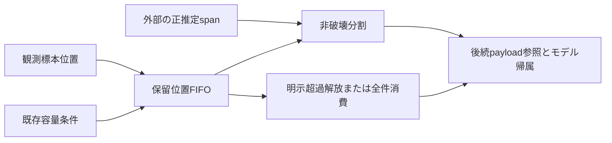

# 設計: 保留学習データの位置・FIFO管理

## Overview

FIFOに入った観測位置の追加・解放・区間参照・消費を分離し、旧の順序を保持する。payloadは上位が位置で参照し、モデル帰属/学習は後続の所有者が行う。全14条件を旧deque/clientへ直接照合する。

## Boundary Commitments

### This Spec Owns

- sample_indexだけを保持するFIFOの順序・最後の追加位置。
- 明示容量超過解放、正spanによる非破壊分割、明示全件消費。
- 変更不能な分割結果と診断copy、入力契約。

### Out of Boundary

payload、modelIDへの割当、統計/学習、候補/episode/controller、警報後client進行、終端flushの採用。既存固定条件/coreの変更、LEGACY-002/003修正は含めない。

### Allowed Dependencies

stdlibと同機能TrainingDataAssignmentSettingsのみ。dequeにmaxlenを使わず、追加時に自動切捨てしない。torch/NumPy/旧client/監視/上位runtimeはproductionの依存にしない。

### Revalidation Triggers

追加/解放/分割/消費順、位置連続性、容量の適用時機、span切詰め、copy/結果形を変えたとき、監視との位置対応・後続clientの各警報分岐・終端方針を再検証する。

## Architecture

一つの位置FIFOと同所有のfrozen結果型。payload用の汎用型・factory・独自ID型は不要。既存dequeを利用し外部依存を増やさない。

## File Structure Plan

- 新規src/federated_learning_experiments/methods/fedsda/training_data_assignment/pending_training_assignment_buffer.py: FIFOと入力検査、同所有の状態copy/分割型。
- 新規tests/refactoring/test_pending_training_assignment_buffer.py: 旧平時処理/旧警報分岐、位置/順序/copy/不正入力、public監視接続。
- 変更tests/refactoring/test_single_run_dependency_boundaries.py: 同機能設定だけのexact許可・禁止注入。
- 変更docs/research/implementation-findings/LEGACY-002個別記録: 再現テストと旧扱いの証拠を追記。
- 変更.kiro/steering/roadmap.md: 部分完成と後続責務。

## Requirements Traceability

| 条件 | 実装と証拠 |
|---|---|
| 1.1, 1.2, 1.3 | FIFO constructor/append/release、旧平時processing stub比較、C+1警報境界 |
| 2.1, 2.2, 2.3 | 正span分割、旧global開始位置、insufficient branch保持 |
| 3.1, 3.2, 3.3 | 明示drain、非自動消費、frozen state/partition/別実体/RNG |
| 4.1, 4.2, 4.3 | 原子的入力拒否、旧client各分岐、public監視span接続 |
| 5.1, 5.2 | 全AST/全golden/smoke、共通発見記録とpartial scope |

## Components and Interfaces

PendingTrainingAssignmentBuffer(*, training_data_assignment_settings: TrainingDataAssignmentSettings)はexact設定型と__post_init__を確認して空dequeとlast Noneを作る。設定だけが容量を所有する。

- append_observed_sample_index(*, sample_index:int)->None: exact builtin int>=0（bool禁止）。初回任意非負、次回last+1。検査後appendとlast更新、容量による切捨てなし。
- release_sample_indices_exceeding_capacity()->tuple[int,...]: len>設定容量の間popleftし、その順に返す。last不変。
- get_change_interval_partition(*, estimated_change_span_sample_count:int)->BufferedChangeIntervalPartition: exact int>=1。n=min(len,span)、先頭len−n件と末尾n件、開始は末尾区間の最初ID、空None。状態非変更。
- drain_pending_sample_indices()->tuple[int,...]: 全件copyしてclearしlast維持。空も空tuple。勝手に終端や警報を推測しない。
- get_state_snapshot()->PendingTrainingAssignmentState: pending位置tupleとlastのfrozen診断copy。

PendingTrainingAssignmentState fields: pending_sample_indices、last_observed_sample_index。
BufferedChangeIntervalPartition fields: earlier_sample_indices、change_interval_sample_indices、change_interval_start_sample_index。
どちらもfrozen kw_only dataclass、内部dequeを外へ渡さない。payload/モデル参照は一切保持しない。

## Error Handling

TypeError/ValueErrorは項目名と理由を含む。入力検査を更新前に完了し、不正append/spanは全state不変。span0の旧sliceの特殊解釈は受理しない。IDはPythonintなので固定幅整数へ丸めない。

## Testing Strategy

task1は旧process_one_stepをtest-only model/learning/detection stubで直接呼び、観測位置を表す入力の解放順/保留を比較する。capacity1/3/30、連続位置とtransient C+1、繰返しrelease、clear後順序拒否を検証。
task2は旧_estimated_drift_start/_detector_candidate_start、旧_resolve_drift pending/insufficient、_resolve_episode_duplicateのunbound token oracleを呼び、同じ位置列と保持/全消費を比較する。分割参照と消費は独立に呼び、短い警報後の旧残留を修正しない。
task3はpublic LossMonitoringObservationの推定spanを同じ位置のFIFOへ渡し、FIFO前候補と切詰め開始、copy/instance/RNG/keyword、全AST禁止注入、全refactoring/全tests旧11+最終3golden、旧importなしsmokeを確認する。

