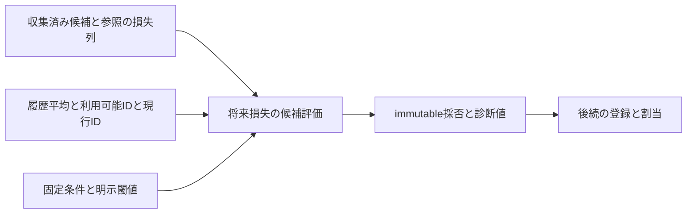

# 設計: 警報後の候補損失評価

## Overview

収集済み損失から最終方針の既存モデル適合性と候補採否を計算する。モデルを持たず、評価結果だけを返す。全15条件の正常入力を旧最終forward判定へ照合し、不正入力は新APIで明示拒否する。

## Boundary Commitments

### This Spec Owns

- 有界損失列の入力検証、利用可能な参照の履歴平均超過判定と現行優先選択。
- 比較対象選択、二分区間での候補採否、理由と平均損失のimmutable結果。
- 同機能の明示入力と読み取り専用の数値評価。実行間stateは所有しない。

### Out of Boundary

損失収集session、モデルforward・生成・再学習・パラメータ保持、baseline/履歴平均推定、FIFO、割当/登録/警報後操作。既存固定条件型・汎用coreの変更や代替policyは含めない。

### Allowed Dependencies

stdlib、torch、既存の同機能CandidateModelTrainingAndAcceptanceSettingsのみ。torchはexact評価moduleだけに許可し、他candidate moduleへ広げない。隣接予測/監視moduleと旧moduleは接続・oracleテストだけで使う。

### Revalidation Triggers

lossの型/dtype/集約順、閾値の演算順、比較対象の優先順、利用可能IDの扱い、split、理由・結果形、固定条件所有者を変える場合は、後続client/collector接続と隣接public損失接続を再検証する。

## Architecture

既存torchのCPU float32平均を保つstateless数値moduleを作る。helperと統合評価は同じ責務/入力検査を共有し、factoryやinterface階層は作らない。float32/deviceは明示し、torchの共有default dtype/deviceは読まない・変更しない。

## File Structure Plan

- 新規src/federated_learning_experiments/methods/fedsda/candidate_model_selection/post_alarm_candidate_loss_evaluation.py: 適合参照選択、統合採否、入力検査、同所有結果型。
- 新規tests/refactoring/test_post_alarm_candidate_loss_evaluation.py: 旧pure関数/旧finalize oracle、正常/不正/境界/public損失接続/独立性。
- 変更tests/refactoring/test_single_run_dependency_boundaries.py: exact torch例外＋同機能設定だけの内部依存と禁止注入。
- 変更.kiro/steering/roadmap.md: 部分完成と後続責務。

## Requirements Traceability

| 条件 | 部品と証拠 |
|---|---|
| 1.1, 1.2, 1.3 | 全入力validation、既存条件再検証、readonly入力、件数/ID/損失契約テスト |
| 2.1, 2.2, 2.3 | public適合参照選択、旧select_forward_fitting_reference照合 |
| 3.1, 3.2, 3.3, 3.4 | 統合評価、旧finalize decision capture、同率/split/閾値境界 |
| 4.1, 4.2 | frozen結果、明示float32/device、入力/RNG/default値不変と反復呼出 |
| 5.1, 5.2, 5.3 | direct oracle、public平均損失の接続、AST/全golden/smoke |

## Components and Interfaces

### 入力と適合参照選択

select_available_reference_within_historical_loss_tolerance(*, reference_losses_by_model_id: dict[int, tuple[float, ...]], reference_historical_mean_losses_by_model_id: dict[int, float], available_reference_model_ids: tuple[int, ...], current_training_model_id: int, maximum_reference_mean_loss_increase: float) -> int | None。
設定不要の部分計算で、非空参照・全列同長2以上・全入力型/値を検証する。閾値は有限非負builtin int/float、bool禁止。IDはexact int、利用可能列はexact tupleで重複禁止、dictはexact dict。損失列はexact tuple、値はfinite builtin int/float[0,1]。履歴値は同じ域、追加ID許可。
利用可能集合にも履歴にも含まれる参照だけを参照入力順に反復する。torch.tensor(losses,dtype=torch.float32,device="cpu")のmean.itemをPythonfloat化して履歴floatとの差<=閾値を計算する。現行が適合なら現行、他は(mean,id) tupleのmin、なければNone。損失/入力を変更しない。

### 完了済み候補の統合評価

evaluate_candidate_using_post_alarm_losses(*, candidate_model_training_and_acceptance_settings: CandidateModelTrainingAndAcceptanceSettings, candidate_losses: tuple[float,...], reference_losses_by_model_id, reference_historical_mean_losses_by_model_id, available_reference_model_ids, current_training_model_id, maximum_reference_mean_loss_increase, minimum_candidate_mean_loss_improvement: float) -> PostAlarmCandidateLossEvaluation。
exact既存条件型と__post_init__を確認し、全列同長かつ既存設定の検証件数以上。最低改善量はfinite非負。全入力検査後に評価する。
初期比較対象は全参照のPython sum最小、dict入力順のminで同率を保つ。利用可能参照を適合判定し、適合IDがあれば比較対象を置換して候補棄却。
適合なしはcandidate/refを明示CPU float32化しsplit=N//2。両区間についてfloat(candidate.mean().item()) < float(reference.mean().item()) - minimum_candidate_mean_loss_improvement。判定理由は各区間でfloat(reference.mean()-candidate.mean()) <= minimum_candidate_mean_loss_improvementを別計算し、旧float32境界の違いを保つ。採否と理由を同じ式へ統合しない。

### 結果型

frozen kw_only PostAlarmCandidateLossEvaluationのフィールドはcomparison_reference_model_id、reusable_reference_model_id、candidate_accepted、decision_reason、validation_sample_count、candidate_full_interval_mean_loss、reference_full_interval_mean_loss、candidate_second_segment_mean_loss、reference_second_segment_mean_loss、reference_historical_mean_loss（Optionalfloat、欠落None）。
理由はcurrent_reference_within_historical_loss_tolerance / alternative_reference_within_historical_loss_tolerance / first_segment_margin_failed / second_segment_margin_failed / both_segment_margins_failed / both_segment_margins_passed。
last reasonは診断marginの合格を表す。candidate_acceptedと独立であり、採否不合格の境界でも両marginが合格する旧演算の結果を保持できる。旧理由文字列のaliasは本体へ持たず、テスト側でだけ明示対応する。

## Error Handling

TypeError/ValueErrorは対象名と理由を含む。全入力検証を終えてから算術し、入力を不変に保つ。強制文字列変換・bool・NumPy scalar・Tensor入力は受理しない。巨大intの閾値はfloatへ表現不能ならValueError、lossは範囲検査を先に行う。

## Testing Strategy

task 1は旧select_forward_fitting_referenceのpure oracleへ、現行優先/代替/同率/負ID/履歴なし/消えたID/等号を直接照合。task 2はForwardValidationSessionへ損失を渡し、FedSDAClient._finalize_forward_validationをunboundで呼び、ProvisionalModelDecision appendをcaptureして専用test例外で止め、直後の操作副作用を実行しない。
旧policy/min_deltaはmonkeypatch、旧tensor既定dtypeはfloat32が前提。正常な奇数/偶数とloss境界、各棄却理由、Pythonsum同率と適合tuplemin同率を照合。診断平均も完全一致。
task 3はpublic損失の観測順収集→この評価へ接続し、入力/RNG/defaultdtype/device/反復呼出/frozen結果とkeyword契約、AST exact例外/禁止注入、全refactoringと全tests/golden、旧importなしsmokeを検証する。新全体runの完成を主張しない。
