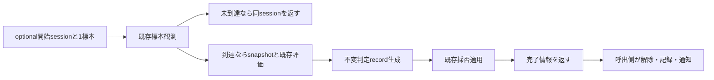

# 警報後の候補検証の進行 — 設計 revision2

## Overview / Boundary Commitments

状態なしruntime関数で既存の観測→評価→確定を接続し、継続sessionまたは完了情報を返す。methodsの不変判定recordはmetadataと既存評価recordだけを持ち、runtime/session/Tensorに依存しない。runtimeの完了recordは判定・適用結果・通知に必要な値をまとめる。汎用callback/ownerを作らず、呼出側がactive交換・一覧追加・予測通知・episode操作を行う。

正常成功時の数値/最終状態/記録情報を維持。旧の例外時判定記録残存は対象外。観測が成功し評価/適用が失敗した場合、collectionは到達済みになり得る。全操作のrollbackや自動retryは提供しない。呼出側が例外後sessionを再投入して自動再観測してはならず、回復方針は後続clientの責任。完了返却後は呼出側がsessionを解除し二重適用を避ける。

## API / Data Model

`methods/fedsda/candidate_model_selection/post_alarm_candidate_validation_decision_record.py`:

- frozen/kw_only `PostAlarmCandidateValidationDecisionRecord`: proposal_sample_index、resolution_sample_index、detector_name、candidate_training_interval_sample_count、post_alarm_candidate_loss_evaluation（既存不変PostAlarmCandidateLossEvaluation）。fieldsは全必須。出力recordとして生成し、独立した入力検証APIは作らない。
- properties: validation_completion_delay_sample_count＝確定−提案位置、full_validation_mean_loss_advantage＝参照全体−候補全体、second_segment_mean_loss_advantage＝参照後半−候補後半、reference_mean_loss_difference_from_history＝参照全体−履歴（履歴なしNone）。評価値を再集約しない。
- 旧14fields対応: position/resolution_position/detector←metadata、interval_count/training_count←同じ学習区間件数、残る数値と採否/理由/参照ID/件数←既存評価。validation_source="forward"は新recordの型が表す。理由対応とNone→旧NaNはtestのみで対応、旧文字列aliasなし。

`runtime/post_alarm_candidate_validation_progress.py`:

- frozen/kw_only `PostAlarmCandidateValidationCompletion`: decision_record、validation_resolution（既存PostAlarmCandidateValidationResolution）、previous_training_model_id（適用直前）、estimated_change_point_sample_index、detection_episode_id。properties training_model_switch_sample_index＝assignment_changeありの確定位置、それ以外None、detection_episode_operation_required＝同変更あり。適応eventのposition/detector/action/old/new/change/episodeはこの情報から導出する。旧action/戻り値の対応は既存resolution設計のtest表を利用する。
- frozen/kw_only `PostAlarmCandidateValidationProgress`: session_to_continue（既存sessionまたはNone）、completed_validation（完了recordまたはNone）。activeなしは両None、未到達は同session/None、完了はNone/完了record。構成は本関数だけで行い、公開constructorを入力APIとして検証する責務は持たない。
- `advance_post_alarm_candidate_validation`、全keyword必須: validation_session（session|None）、sample_index、input_features、observed_class_labels、candidate_model_training_and_acceptance_settings、maximum_reference_mean_loss_increase、minimum_candidate_mean_loss_improvement、pending_assignment_sample_concept_ids、temporary_model_id_allocator、upload_delay_round_count、held_model_training_state_registry、loss_statistics_store、training_sample_store、model_training_and_assignment_counts_store、current_training_model_assignment、pending_model_upload_state。候補/2optimizer/学習区間/2計数/保留標本はsessionからresolutionへ渡し、重複引数にしない。

## Contract / Sequence

1. session Noneなら他入力を読まず両Noneの進行を返す（1.1）。
2. session exact型、acceptance設定exact型と全field再検査、要求件数がsession公開snapshotのrequired件数と同じ、thresholdはbuiltin int/float（bool除外）有限非負、registry/current assignment exact型を観測前に検査する。helper `_validate_validation_progress_inputs` と `_validate_validation_progress_threshold`。不正時snapshot/候補/参照/owner/RNG不変（3.1）。開始API生成のsessionでmetadataと結合状態は正常であること、非公開改変は保証外。
3. 既存observeへ候補/参照/collectionと1標本を渡す。shape/値/位置/規定超過は既存観測/collectionで追加前拒否。未到達なら同sessionを返し、registry snapshotやevaluation/resolutionを呼ばない（1.2）。
4. 到達時に公開collection snapshotを取得。registry公開一覧からその時点の保有IDを得て、現在の帰属ID（開始時のinitial_training_model_idではない）と固定履歴平均・loss列・2閾値・設定を既存evaluateへ渡す。IDの可用性は評価の既存契約（1.3）。
5. 上記不変判定recordを生成、適用直前の現在IDを保持。sessionのcandidate_classifier/candidate_concept_specific_parameter_optimizer_state、training tensor/pending、epoch結果candidate_trained_sample_count/candidate_parameter_update_step_countと呼出側owners/concept_ids/delayを既存applyへ渡す。結果に依存して登録/採番/吸収等を繰り返さない（1.3）。
6. 完了recordを生成、継続sessionはNone。呼出側が返却後にactive解除、判定・適応event記録、assignment_changeに応じた予測通知/切替位置/episode操作、全完了時の検出処理通知を行う。通知タイミングは適用成功後であり、本関数で旧hookを呼ばない（2.1〜2.3）。

進行用preflightと標本観測だけが3.1の観測前拒否保証。concept ID列・upload delay・採番/送信/統計/標本owner等は採否適用の入力であり、選択分岐で既存resolutionが検査する。そこでの拒否は既に追加されたlossを戻さない。採用以外の入力未使用契約も既存resolutionに従う。候補学習/参照生成/RNG保存復元は行わない。

## Exact Dependencies / Files

判定recordの許可はdataclasses.dataclassとPostAlarmCandidateLossEvaluationだけ（math/torch/runtime/旧/private/module/reexport禁止）。進行の許可はdataclasses.dataclass、math.isfinite、torch.Tensor（注釈）、各公開型ModelAndClassLossStatisticsStore、HeldModelTrainingStateRegistry、CurrentTrainingModelAssignment、TemporaryModelIdAllocator、ModelTrainingSampleStore、ModelTrainingAndAssignmentCountsStore、PendingModelUploadState、CandidateModelTrainingAndAcceptanceSettings、PostAlarmCandidateValidationDecisionRecord、PostAlarmCandidateValidationSession、PostAlarmCandidateValidationResolution、evaluate_candidate_using_post_alarm_losses、observe_post_alarm_candidate_validation_sample、apply_post_alarm_candidate_validation_resolutionだけ。exact guardはgeneric許可より前、ImportFrom resolverとImport拒否の両一覧へ登録。

新testは`tests/refactoring/test_post_alarm_candidate_validation_progress.py`、既存依存境界testに2module注入契約追加。旧/config/private/I/O/学習/生成/参照固定/予測/episode/ID直接操作は禁止。

## File Structure Plan

| 操作 | ファイル | 役割 |
| --- | --- | --- |
| 作成 | methods/fedsda/candidate_model_selection/post_alarm_candidate_validation_decision_record.py（src package内） | 不変判定情報と導出値 |
| 作成 | runtime/post_alarm_candidate_validation_progress.py（src package内） | 通常進行と完了返却 |
| 作成 | tests/refactoring/test_post_alarm_candidate_validation_progress.py | 記録・進行・拒否・実NN接続 |
| 変更 | tests/refactoring/test_single_run_dependency_boundaries.py | 2module exact依存と注入 |
| 作成/更新 | 本spec正本・検証証拠、steering resume/roadmap | 承認と再開案内 |

## Out of Boundary

開始/候補生成/学習/採番/登録/吸収の実装変更、active session owner、判定/event一覧、具体通知hookと予測重みowner、episode更新、終端不足回収、検出/区間切出し、server通信、新client/全体run、旧production修正、旧名aliasは含めない。通常進行の適用自体は既存resolutionへ委譲する。

## Revalidation Triggers

上流session fields/borrow契約、collection位置/要求件数/snapshot、評価の理由・丸め・参照選択、resolutionの順序/結果/assignment_change、epoch計数、旧基準/基準環境の変更は本specの該当対照と接続を再検証する。具体通知ownerを接続する後続specは返却後通知という時点と、吸収→帰属変更という既承認差分を検証する。新出力fieldまたは正式名変更は命名承認を解除して再レビューする。

## Validation / Traceability

- 1.1〜1.3/2.1〜2.3/3.2: 実旧_observe→_finalizeを使う。上流build_resolution_oracleで2/4class×4分岐×保留0/3＝16条件、損失3件までのsessionを揃え最終1件で確定する。制御された損失fixtureは経路検証として区別。判定14fields/4properties、適応event/切替/通知用情報、全state/RNGを旧へ照合。activeなしと各未到達時はevaluation/resolutionが未呼出でcollectionだけ変わることを確認。
- 3.1: session/settings/count/threshold/owner型、標本shape/値/位置/到達後追加の拒否不変。frozen/kw_onlyと3返却形を確認。stub/readyを無視/開始時ID利用/旧理由alias/不要RNG/記録位置誤り等の代表変異を検出し元byteへ復元。
- 1.3/3.2: 2/4class×3optimizer＝6条件で実NN start→複数観測→確定→共同更新、学習後全parameter/grad/optimizer/state/RNGを実旧と照合。奇数件数/metadata None/履歴なし/確定時の可用性・現在ID変更/空保留も有限追加matrixで確認。testの理由とNone/NaN対応は既存helperを再利用。
- 3.3: exact AST注入RED→guard/両resolver登録→GREEN、fresh新CPUで旧importなし進行、基準venv全pytest/JUnitと旧11/最終3golden、Ruff/Pyright/pip、748c3aa固定旧差分、承認/source hash。全pytest独立再現は主担当実測/JUnit照合でよい。全task承認後、別fresh feature GO。
