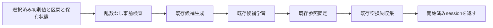

# 警報後の候補検証session開始 — 設計 revision2

## Overview / Boundary Commitments

runtimeに1moduleを追加し、既存の生成・学習・参照固定・損失収集を組み立て、frozen/kw_onlyのsession recordを返す。call側がactive sessionの所有と交換を担当する。recordはbindingのみ固定し、候補/optimizer/collectionはliveな部品として保持する。区間と保留標本はborrow、参照分類器と候補は独立copy、保留containerはexact tuple。

範囲外は検出/切出し/初期値選択/参照学習/採否/登録/ID/通信/診断/active session設定。既存設定のRunSettingsへの登録もclient組立時の後続作業。非公開改変/並行更新/OOM/途中故障/数値overflowは原子拒否保証外。旧概念ID付保留標本の概念計数（LEGACY-014）は変更しない。

## API / Data Model

`start_post_alarm_candidate_validation_session`は全keyword必須。既存生成のarchitecture_reference_classifier/initial_candidate_parameter_snapshot/parameter_optimizer_settings、既存epochのcandidate_epoch_training_settings、candidate_model_training_and_acceptance_settings、held_model_training_state_registry/loss_statistics_store/current_training_model_assignment、input_features/observed_class_labels/pending_assignment_training_samplesと4metadataを受ける。初期値選択を再実装しない。

`PostAlarmCandidateValidationSession`はproposal_sample_index、estimated_change_point_sample_index、detection_episode_id、detector_name、initial_training_model_id、candidate_training_state、candidate_epoch_training_result、training_input_features、training_observed_class_labels、pending_assignment_training_samples、fixed_reference_models、post_alarm_candidate_loss_collectionを保持。candidate_training_stateは既存IndependentCandidateTrainingState、学習量は既存CandidateEpochTrainingResultをそのまま保持。後続採用にはその2学習量fieldを渡せる。

## Preflight Contract

| 項目 | 生成前の検査 | 拒否時検証 |
| --- | --- | --- |
| metadata | builtin int（bool除外）、proposal>=0、change Noneまたは0<=change<=proposal、episode Noneまたは>=0、exact strでstrip非空 | RNG/保有/帰属/入力不変 |
| settings | exact epoch/acceptance型、各fieldをconstructorへ渡し再検査。acceptance件数builtin int>=2。optimizer/初期snapshotは既存生成public APIが生成前検査 | 同上 |
| owners | exact registry/store/assignment、registry非空、現在IDが保有一覧にある | 同上 |
| 保有分類器 | public snapshotでexact CPU float32有限parameterを確認、architecture参照と同じ入力幅/class数。共有部が空のarchitectureは既存生成が生成前拒否 | 同上 |
| 履歴統計 | storeのpublic get_model_loss_statisticsで取得/再検査、Noneは許可 | 同上 |
| 区間 | exact Tensor、CPU float32 strided/nonnested有限値、[N,F]/[N,1]、N>0、一致件数、整数ラベル0<=y<class_count | 同上 |
| 保留標本 | exact tuple（空可）、exact ObservedTrainingSample、各Tensorは同じ区間契約でN=1 | 同上 |
| grad条件 | skipまたはmaximum_epoch_count0以外はis_grad_enabled必須 | 同上 |

検査helperは乱数なし。snapshotやsettingsの計算を再実装せずpublic APIを利用する。Tensor組shape/値確認のみ本境界で行う。初期snapshotとoptimizerの拒否は最初の既存生成呼出し内で、候補生成前に実施される。正常時は候補生成→epoch→参照固定→collection生成を各1回呼び、RNG保存/復元や追加生成を行わない。sessionは現在IDの値を固定するがowner自体を保持/更新しない。

## Allowed Dependencies / Files

新sourceは`runtime/post_alarm_candidate_validation_session_start.py`のみ。dataclasses.dataclass、torch.Tensor/float32/strided/isfinite/is_grad_enabled、既存のsnapshot_classifier_parameters、ResidualAdapterClassifier、HeldModelTrainingStateRegistry、ModelAndClassLossStatisticsStore、CurrentTrainingModelAssignment、ObservedTrainingSample、Adam/SgdParameterOptimizerSettings、CandidateEpochTrainingSettings、CandidateEpochTrainingResult/train_candidate_classifier_epochs、CandidateModelTrainingAndAcceptanceSettings、PostAlarmCandidateLossCollection、IndependentCandidateTrainingState/create_independent_candidate_training_state、FixedPostAlarmReferenceModels/fix_reference_models_at_alarmだけをexact許可。旧/config/I/O/seed再設定/private/re-exportは禁止。methods/learningから新runtimeへの依存は追加しない。

新testはtests/refactoring/test_post_alarm_candidate_validation_session_start.py。既存依存境界testにexact guard/2resolver一覧への登録と注入ケースを追加。

## Validation / Traceability

正常対照: 2/4class×3optimizer×3方式（fixed/early/skip）×epoch0/3、計36条件。earlyはfraction.2/patience1/min_delta10、fixedbatch3、N11。実旧_begin_forward_validationの全候補parameter/grad/optimizer・固定参照順序/値・履歴平均・計数/RNG/metadataを照合（1.1〜1.3、2.1）。30epoch/patience3/min_delta1e-4の最終構成も2/4class×3optimizerの6条件で照合。履歴なし/単件/平均0、negative一時model ID、空保留も確認する。

拒否/接続: 各preflight項目の不正と拒否時RNG/借用値/保有parameter/grad/optimizer/統計/帰属不変、frozen binding、提案次位置から規定件数まで観測して実旧lossへ照合、候補継続更新でも参照不変（1.3、2.2、3.1）。stub/順序入替/学習省略/参照live借用を差替え検出し元byteへ復元する。

統合検証: exact AST注入RED→guard/resolver→GREEN、fresh新CPU（旧importなし）、実装commitで全pytest/JUnit・旧11/最終3golden・Ruff/Pyright/pip・748c3aa固定旧差分・承認/source hashを記録（3.2、3.3）。全task承認後は別fresh Luna feature GO。全pytest独立再現はユーザー決定どおり主担当実測/JUnit照合でよい。新全体runのgolden一致は未完成の別条件。

tasksの設計境界名は、開始runtime、開始runtimeと既存観測の接続、exact依存境界、基準環境の全回帰。正常対照はTask1、拒否はTask2、観測接続はTask3、AST/freshはTask4、全回帰はTask5へ分ける。
