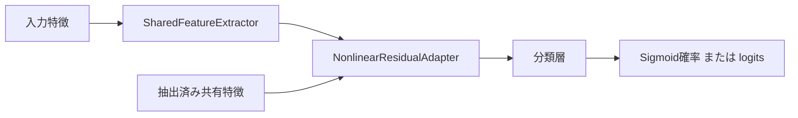

# 設計: Residual Adapterモデル構造

## Overview
共有特徴抽出・非線形残差変換・分類を三つのnn.Moduleに分ける。モデル構造だけを移植し、学習処理は後続の責務とする。
CPU float32の正常構築順と演算を旧ResidualAdapterMLPへ直接照合する。

## Boundary Commitments
### This Spec Owns
- 明示寸法と既存ModelArchitectureSettingsによる最終構成の生成、forward、抽出済み特徴からのforward。
- 共有抽出部の参照と独立adapter/分類層、構築前検査、勾配経路。
### Out of Boundary
- データセット名解決、optimizer/loss/学習、生成後の共有部付替え、候補進行、ID/通信、全体run。
- 独立MLPとadapterなしbaseline、旧名alias・旧state読込み。
### Allowed Dependencies
productionは次のexact module/public symbolに限定する（__future__.annotationsは共通許可）。
- 三ファイル: torch（Tensor,float32,device,strided）、torch.nn（Module,Sequential,Linear,ReLU,Sigmoid,Identity）、torch.nn.init（zeros_）。
- shared_feature_extractor: その他のproject importなし。
- nonlinear_residual_adapter: その他のproject importなし。
- residual_adapter_classifier: learning.models.model_architecture_settings.ModelArchitectureSettings、
  learning.models.shared_feature_extractor.SharedFeatureExtractor、
  learning.models.nonlinear_residual_adapter.NonlinearResidualAdapter。
torch.optimやrandom、NumPy、data、runtime、methods、prediction、legacyをproductionへimportしない。
### Revalidation Triggers
寸法/forward形状、state名、共有所有、dtype/device、初期化順変更は学習・候補生成・snapshot・確率変換との接続を再検証する。

## Architecture
PyTorchのnn.Module/Linear/Sequentialと標準state_dictを採用し、独自モデルprotocol・factory・state読込み層を作らない。
入力数/隠れ層幅/クラス数は上位から直接渡す。要求rankは既存設定が保持し、実効rankはモデル部品が計算する。


## File Structure Plan
基点はsrc/federated_learning_experiments/learning/models/。
| 新規ファイル | 一責務 |
|---|---|
| shared_feature_extractor.py | 線形/ReLU特徴抽出と公開寸法/構造検査 |
| nonlinear_residual_adapter.py | rank制限付き非線形残差変換 |
| residual_adapter_classifier.py | 最終モデルの構築と分類経路 |
| tests/refactoring/test_residual_adapter_model_architecture.py（repo基点） | 実旧oracleと境界・接続検証 |
変更はtests/refactoring/test_single_run_dependency_boundaries.pyのexact3module規則、.kiro/steering/roadmap.mdの進行、対象specの証拠のみ。
旧production/設定field/golden/旧回帰testは変更しない。

## Components and Interfaces
### SharedFeatureExtractor
```python
SharedFeatureExtractor(*, input_feature_count: int, hidden_layer_widths: tuple[int, ...])
SharedFeatureExtractor.validate_feature_dimensions(*, input_feature_count: int, hidden_layer_widths: tuple[int, ...]) -> None
extractor.validate_structure(*, input_feature_count: int, hidden_layer_widths: tuple[int, ...]) -> None
extractor.forward(input_features: torch.Tensor) -> torch.Tensor
```
寸法はexact int（bool拒否）正値、幅はexact tupleの正整数列。空列も可。
input_feature_count/hidden_layer_widths/output_feature_countを保持し、hidden_layersはLinear→ReLUのSequential。空ならidentity。
構造検査はexact SharedFeatureExtractor、宣言寸法とoutput寸法、exact Sequential、層数、各Linear/ReLU型・in/out寸法・bias存在・weight/bias形状・CPU float32 stridedを確認する。
既存共有部を拒否する前に新しい層を作らず、共有部を変更しない。任意forward monkeypatchの静的検出は対象外。
forward入力はCPU float32 strided Tensor（ParameterなどTensor派生も可）、rank1/2で末尾幅一致。空batch可。勾配をdetachしない。

### NonlinearResidualAdapter
```python
NonlinearResidualAdapter(*, feature_count: int, requested_rank: int)
adapter.forward(shared_features: torch.Tensor) -> torch.Tensor
```
両数はexact正整数。feature_count/requested_rank/effective_rank=minを保持。
feature_compression=Linear(feature_count,effective_rank)、activation=ReLU、feature_expansion=Linear(effective_rank,feature_count)。
全Linearはbiasあり、明示device=cpu,dtype=float32。展開層の通常初期化で乱数を消費した後、weight/biasをzeros_する。
forwardはshared_features + feature_expansion(activation(feature_compression(shared_features)))。入力契約は抽出部と同じ（幅feature_count）。
adapter自身の検査は簡単な同契約を持ち、汎用Tensor validator層を新設しない。

### ResidualAdapterClassifier
```python
ResidualAdapterClassifier(
    *, model_architecture_settings: ModelArchitectureSettings,
    input_feature_count: int, hidden_layer_widths: tuple[int, ...], class_count: int,
    shared_feature_extractor: SharedFeatureExtractor | None = None,
)
model.extract_shared_features(input_features: torch.Tensor) -> torch.Tensor
model.forward_from_shared_features(shared_features: torch.Tensor) -> torch.Tensor
model.forward(input_features: torch.Tensor) -> torch.Tensor
```
exact設定型の公開fieldを新しい設定へコピーして再検証する。class_countはexact int>=2。
全設定・寸法・共有部検査をLinear生成前に終える。引数/設定のTypeError/ValueErrorは項目を含むValueErrorとして報告する。
保持部品はfeature_extractor/residual_adapter/classification_layer/output_activation。共有部があればそのexact参照、なければ新規。
生成順は特徴抽出部→圧縮→展開→展開ゼロ化→分類層。共有部注入時はadapter→分類層だけを作る。
class_count=2ならclassification_output_count=1でSigmoid、それ以外はclass_countでIdentity。出力形状は単入力(出力数,)、batch(N,出力数)。
抽出済み入力はadapterの検査を経て同じ分類経路。無作為処理・optimizer・更新を追加しない。
PyTorchのparameters/state_dict/load_state_dictをそのまま用いる。snapshot適用はtest-only標準load_state_dictで検証しproduction APIは増やさない。

## Data Models・状態
全LinearはCPU float32のParameterを所有する。構築はCPU generatorだけを旧と同じ順で消費する。
構築/forwardはPython/NumPy RNG、既定dtype/device、grad有効設定を変更しない。forwardはCPU RNGも変更しない。
同じ抽出部を渡した分類器はfeature_extractorのobject/storageを共有し、残りは独立する。
生成後の外部層置換・.toによる契約外変更は対象外（注入時の構造検査は行う）。forwardは通常nn.Moduleのautogradを保つ。

## Requirements Traceability
| 条件 | 設計/検証 |
|---|---|
| 1.1 | extractor幅順/空列 |
| 1.2 | adapter式/実効rank/展開初期値 |
| 1.3 | classifier出力数/activation |
| 1.4 | forward_from_shared_features |
| 1.5 | 全state/forward旧oracle |
| 2.1 | 全生成前検査/共有structure/RNG不変 |
| 2.2 | CPU32/rank1,2/空batch/幅検査 |
| 2.3 | 生成順/RNG/default環境検証 |
| 3.1 | object/storage共有と独立 |
| 3.2 | native autograd/更新禁止 |
| 4.1 | 実旧state/RNG/forward/gradientと確率/snapshot接続 |
| 4.2 | exact依存/fresh boot/fullgolden/証拠 |

## Error Handling
不正構築はValueError（項目と理由）で層生成前に拒否。forwardの型/shape/dtype/device/layoutもValueErrorで演算前に拒否。
Tensor値の非有限拒否は本specの追加仕様にしない（旧正常計算を維持する）。入力を書き換えず、通常forwardも学習更新しない。

## Testing Strategy
- Task1: actual旧ResidualAdapterMLPをtest-only明示DatasetSpecとrankで構築。optimizer builderだけno-opに置換し、同初期RNGの全state・後RNG・binary/multiclass/空幅/rank超過/共有注入出力を直接比較。
- Task2: 不正寸法/forged設定/壊れた共有structureの事前拒否、wrongforward、空batch、storage共有/独立、ambient float64/metaでも明示CPU32構築と環境/RNG保持。
- autogradは旧比較する。展開zero時のcompression gradient=0は正常であり、非zero展開をtest-only設定した状態でも入力・全Parameter勾配を比較する。
- 新forward→既存class probability変換→旧と同じbounded lossを検証。既存candidate snapshot選択→独立新モデルload_state_dict→出力をtest-only接続する。
- Task3: exact module/symbol依存の禁止/許可注入RED→GREEN、新process CPU forward（旧importなし）、全tests（旧11/最終3golden含む）、UTF-8/diff/配置監査。
基準環境はdocs/experiments/refactoring-baseline.md。新全体FedSDA runの動作確認とは区別する。
