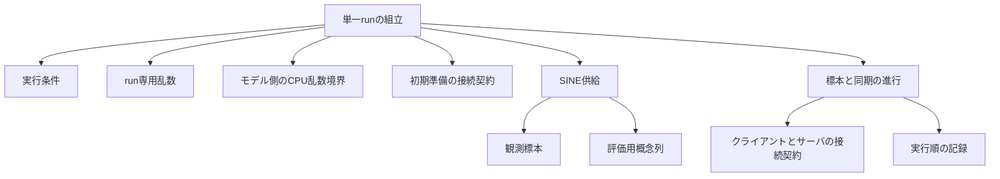

# 設計: 単一runの実行順序とSINE供給

## Overview

SINE標本の供給と標本位置・同期区間の進行を実装し、学習・判断処理は狭い接続契約へ委譲する。
この窓口の出力はデータと処理順の記録であり、最終FedSDAの研究結果ではない。
命名の正本はnaming.md。要件は承認済み、設計と命名はレビュー・承認状態をspec.jsonで確認する。

## Boundary Commitments

### This Spec Owns

- ランダム概念系列の固定条件、SINE標本、観測値と評価用真値の分離。
- 単一run専用の乱数源、初期準備から終端までの呼出順、成功記録と失敗位置。
- 初期準備・クライアント・サーバへのProtocol。接続先の具体的な判断・学習を所有しない。

### Out of Boundary

- モデル構造・学習・e-SR・予測混合・帰属・採否・同期内部・統合の計算と状態。
- 全条件が揃ったFedSDA設定、preset、CLI、保存形式、描画、研究指標。
- 旧import・旧名alias・旧コードを呼ぶproduction adapter、golden更新。

### Allowed Dependencies

- 設定型: 標準ライブラリ、既存coreの例外・値検証、ExperimentRunConditionsのみ。
- データ供給: 標準ライブラリ・NumPy・自分の設定とデータ型。torch・runtime・旧configを参照しない。
- 進行制御: 標準ライブラリ・データ供給・接続Protocol。具体FedSDA・CLI・保存層へ依存しない。
- 実行層の乱数源モジュールだけはNumPyのRandomStateを参照する。接続Protocolは同じ実行層のこの型を参照し、runtimeをimportしない。
- runtime: 上記とCPU用torch乱数境界を組み立てる。torchを直接参照するのはlearning/modelsの専用モジュールだけ。
- 接続する処理部はProtocolを実装し、自身の設定と状態を所有する。真の概念列は実処理の入力に渡さない。

### Revalidation Triggers

生成順・乱数方式・dtype、区間末の呼出順、終端フック、公開型・Protocol、設定条件を変えた場合、
データ照合・処理列・隣接設定テストを再実行する。手法を接続した後は対応goldenも再確認する。

## Architecture



既存Python 3.13.15、NumPy 2.4.6、torch 2.12.1+cpuを使い、新依存を追加しない。
PythonのRandomとNumPyのRandomStateをrunごとに作る。default_rngへ置換しない。
torchはCPU乱数状態の保存・seed設定・finallyでの復元を専用contextで行う。
同一プロセス内の並行runは対象外。呼出元のtorch thread数・dtypeは変更しない。

## File Structure Plan

全てsrc/federated_learning_experiments以下。新しいpackageの__init__.pyは境界だけを宣言し、再exportしない。

| ファイル | 唯一の責務 |
|---|---|
| data/concept_schedules/random_concept_schedule_settings.py | 系列方式・変更試行条件の不変設定 |
| data/concept_schedules/random_concept_schedule_generation.py | Python乱数による全clientの概念系列生成 |
| data/observed_streams.py | 不変の標本・観測stream・評価用概念列 |
| data/sine/sine_sample_generation.py | SINEの1標本生成とclient順stream構築 |
| execution/stream_protocol_execution_settings.py | 狭い実行条件の集約と事前検証 |
| execution/run_participant_contracts.py | 初期準備・client・serverのProtocolと参加者集合 |
| execution/run_execution_records.py | 不変イベントと成功結果 |
| execution/run_execution_errors.py | 段階・client・区間を保持する実行例外 |
| execution/stream_protocol_execution_loop.py | 標本処理・区間末・終端の呼出順 |
| execution/run_random_sources.py | Python・NumPyのrun専用乱数源生成 |
| learning/models/torch_random_state_scope.py | CPU torch乱数の保存・復元 |
| runtime/single_run_execution.py | 検証・初期準備・データ供給・進行の組立 |

既存設定型・旧実装は変更しない。新しい系列設定はその機能に所属させる。
configuration-foundationのpreset・完全型・保存契約を先取りしない。
テストはtests/refactoring/test_sine_stream_generation.pyとtest_single_run_execution.py。
既存のimport境界テストは「設定基盤」の対象に限定し、新しいデータ・モデル層の許可依存を同じ基準で禁止しない。
設定型の標準ライブラリ限定は維持し、新層の境界は別の依存テストで確認する。

## Components and Interfaces

### 1. 固定条件と事前検証

RandomConceptScheduleSettingsはfrozen/keyword-only、全フィールド必須。
方式はrandom_changes_after_minimum_index_gap、位置差は0以上の整数、変更確率は有限の実数[0,1]。
既存coreのmetadata検証を使う。位置差の判定は厳密な「>」で、100なら初回試行位置は101。

StreamProtocolExecutionSettingsもfrozen/keyword-onlyで、ExperimentRunConditions、系列設定、execution_strategyを必須とする。
方式はsample_index_then_client_order_with_interval_synchronizationのみ。datasetはsine2のみ。
seedは既存設定型の非負整数に加え、RandomStateが受理する0〜2**32-1をこの実行境界で要求する。剰余・丸めは行わない。
同期区間がstream長を超える条件と端数を許容する。
直接構築とruntimeの事前検証は同じvalidate_stream_protocol_execution_settingsを使う。
複合型の検証を既存coreへ押し込まず、この集約モジュールで型・方式・組合せを検査する。

### 2. データ供給

- ObservedSample: feature_valuesは長さ2のtuple、class_labelは0/1のint。不変で真の概念を持たない。
- ClientObservedStream: client_idとobserved_samplesのtuple。
- ClientConceptTrace: client_idとconcept_ids_by_sample_indexのtuple。真のドリフトは隣接概念の変化位置から導出する。
- SineSampleGeneratorはrunのNumPy RandomStateを借りる。generate_sample(concept_id)は0/1以外を拒否する。
- uniform(0,1)の2特徴をfloat64で生成し、x2 <= sin(x1)をfloat64で判定してからfloat32へ変換する。concept1ではラベルを反転する。
- float32値をPython floatのtupleに保持する。後続モデル側は旧SINEと同じfloat32・特徴shape(2)・ラベルshape(1)へ変換する。
- generate_random_client_concept_tracesはclient順に全系列を作る。build_sine_client_observed_streamsはその後client順・標本位置順に生成する。

### 3. 処理部の接続契約

以下はtyping.Protocol。初回productionにダミー学習・ダミーserverを実装しない。
テストには呼出を記録する観測用実装を置き、手法の実行結果として扱わない。

| Protocol | 契約 |
|---|---|
| RunParticipantFactory | validate_configuration()で自身の必須条件を副作用なく検査。prepare_run(experiment_run_conditions, run_random_sources, sample_generator)で初期準備と新しい参加者を作る |
| RunClientOperations | client_id、process_observed_sample(observed_sample, sample_index)、flush_pending_local_updates(round_index)、has_model_ready_for_server_registration()、advance_new_model_upload_wait_after_synchronization(round_index)、finalize_incomplete_candidate_validation() |
| RunServerOperations | record_client_states_before_synchronization(round_index)、synchronize_models(round_index, new_model_registration_available)、finalize_started_protocols(completed_round_count) |

RunParticipantsはclient_operationsのtupleとserver_operationsを束ねる。IDは0〜C-1の昇順・重複なし、件数C。
factoryと接続先はrunごとに新しい状態を作り、成功・失敗後の参加者を次runに再利用しない。
初期準備は渡されたSINE生成器とrun専用Python乱数を使用する。学習条件・モデル生成・統計計算はfactoryの担当である。
has_model_ready_for_server_registrationは旧has_pending_modelの「存在かつ送信可能」に対応する。
同期へ渡すboolは時点の事実だけであり、統合方式の判断はserver側が行う。

### 4. 実行の組立と乱数

execute_stream_protocol_run(execution_settings, participant_factory) -> StreamProtocolRunResult。
公開引数はkeyword-onlyとする。ValidatedExperimentRunSettingsSubsetを入力として受理しない。

1. 設定とfactory契約を検査し、factory.validate_configurationを呼ぶ。ここでは生成・初期準備を開始しない。
2. create_run_random_sources(random_seed)でPython RandomとNumPy RandomStateを作り、isolated_torch_random_stateへ入る。
3. SINE生成器を作り、factory.prepare_runを1回呼ぶ。初期準備で消費したPython・NumPy乱数をそのまま継続する。
4. 参加者の件数・ID・必要な操作を検査し、全概念系列→全標本streamを生成する。
5. run_stream_protocol_intervalsへ参加者・観測stream・区間長を渡す。評価用概念列は渡さない。
6. 成功記録を組み立てる。例外を含む全出口でtorch状態を復元する。CPUのみを扱いCUDA状態を変更しない。

Python・NumPyは独立した実体なので呼出元のglobal状態を使用しない。
接続先も渡された乱数源を使い、呼出元のglobal設定・乱数を変更しない契約とする。
torchの乱数を消費する処理は同じcontext内で実行する。再入・同一プロセス内の並行実行は対応範囲に含めない。

## System Flows

```mermaid
sequenceDiagram
    participant Loop as 進行制御
    participant Client as client操作
    participant Server as server操作
    loop 完全な同期区間
        loop 標本位置とclient IDの昇順
            Loop->>Client: 観測標本を処理
        end
        Loop->>Client: 全clientの保留更新を確定
        Loop->>Server: 同期前の状態を記録
        Loop->>Client: 登録可能モデルの有無を照会
        Loop->>Server: 区間の同期
        Loop->>Client: 全clientの送信待ち期間を進める
    end
    Loop->>Client: 全clientの未完了候補検証を確定
    Loop->>Server: 開始済み通信を確定
```

区間数はT//A、処理件数/clientはA*(T//A)、末尾未処理件数はT%A。
T<Aでも全標本を生成し、標本処理・通常同期0回、候補終端と通信終端は各契約どおり呼ぶ。
終端用の追加標本・保留更新・通常同期は呼ばない。処理部の内部状態確定と順序制御を区別する。

## Data Models and Error Handling

RunExecutionEventはstage_nameと任意のclient_id・sample_index・round_indexを保持する。
ステージの正式値はnaming.md。標本イベントは実際に成功した呼出の後に追加する。
StreamProtocolRunResultは観測stream、評価用概念列、各clientの生成・処理・未処理件数、同期区間数、execution_eventsを持つ。
全コレクションはtupleで、成功結果に参加者や可変乱数源を含めない。研究指標を追加しない。

不正設定は既存RunSettingsValidationErrorで項目・値・理由を報告する。
factory準備・データ生成・参加者契約違反・処理部失敗はRunExecutionErrorを送出し、失敗段階と判別可能な位置を保持する。
元例外はraise ... fromによるcauseとして残す。失敗後の終端・同期・再試行は行わず、成功結果も返さない。
初期準備後に発覚する参加者の契約違反は入力設定エラーではなく、接続先の実行契約違反として報告する。

## Requirements Traceability

| 要求 | 実現する契約・検証 |
|---|---|
| 1.1, 1.2, 1.3, 1.4 | 固定条件と事前検証、factoryの設定検証、狭い集約型 |
| 2.1, 2.2, 2.3, 2.4 | SINE供給、不変データ型、評価情報を進行制御へ渡さない境界 |
| 3.1, 3.2, 3.3 | run専用乱数、CPU torch context、初期準備→全系列→全stream |
| 4.1, 4.2, 4.3, 4.4 | Protocolと区間進行、ready照会、serverへの事実伝達 |
| 5.1, 5.2, 5.3, 5.4 | 完全区間、明示的な末尾、候補終端→通信終端 |
| 6.1, 6.2, 6.3 | 不変記録、位置付き例外、研究指標を持たない結果型 |

## Testing Strategy

- 設定: 値域・厳密な方式名・seed上限・部分型拒否。factory検証失敗では生成器・prepare_runを呼ばない。
- データ: 旧テスト側の生成器と同じ乱数状態から系列・float32特徴・ラベルを直接照合する。閾値の101番目、確率0/1、client順を確認する。
- 初期準備: 観測用factoryで100標本と10回のPython shuffleを消費し、その後の旧系列・streamと照合する。初期学習を実装したという主張はしない。
- 順序: 3×1500・区間50で4500標本イベントと30同期、区間末・終端の呼出列を検証する。T%A!=0、T<Aも含める。
- 失敗/独立性: factory・データ・client・serverの失敗位置、終端非実行、torch復元、A→B→Aで同一run再現、可変参照を結果へ残さないことを確認する。
- 境界: 設定・データ・executionからruntime/旧パッケージへの逆依存なし。torchは専用モデル境界だけで参照する。
- 回帰: 新対象テストと既存schema・対象機能・旧/最終goldenを固定環境で実行する。旧goldenの成功を新学習経路の同値性と扱わない。

具体的なテスト関数名・実装内部の局所名はtask作成時に命名表へ追記し、Lunaレビュー後に使う。
