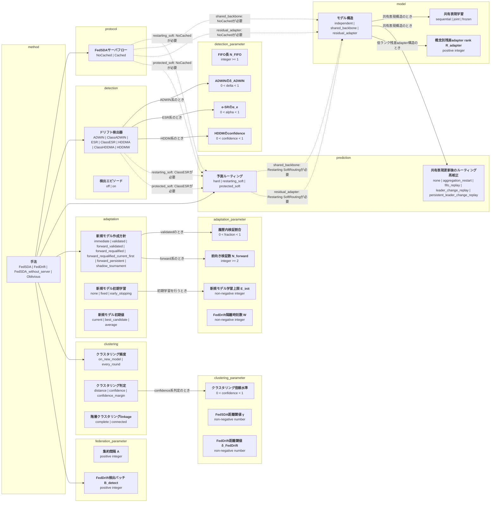
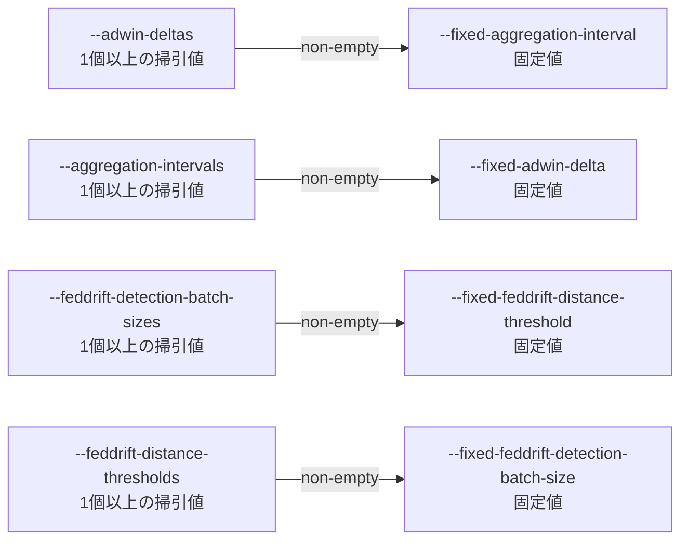

# 実験オプションの依存構造

この文書は`experiment_spec/options.py`から自動生成する。直接編集せず、
`python -m tools.generate_option_docs`で更新する。
対象はアルゴリズムの挙動を変えるオプションであり、出力先・seed・再描画などの
実験運用オプションは含めない。数値パラメータのコード・CLI・論文記号の対応は
`experiment_spec/parameters.py`を正本とする。

## 読み方

- **実装済み**: 現在のコードとCLI/modeで選択可能。
- **理論上のみ**: 手法の性質上は移植可能だが、現在の処理フローには未実装。
- **対象外**: 現時点で適用対象としていない。
- `configuration_surface=mode`は、独立CLIではなくモード名へ組み込まれている。

## 依存構造

## 適用・実装状態

| オプション | 設定面 | FedSDA | FedDrift | FedSDA_without_server | Oblivious | 説明 |
|---|---|---|---|---|---|---|
| `method` | mode: `--mode` | 実装済み | 実装済み | 実装済み | 実装済み | 実験プロトコルを選択する最上位オプション |
| `server_flow` | mode | 実装済み | 対象外 | 対象外 | 対象外 | FedAvg前後のモデルキャッシュ利用と通信順序 |
| `detector` | mode | 実装済み | 対象外 | 実装済み | 対象外 | FedSDAクライアントが損失系列へ適用する検出器 |
| `routing` | mode | 実装済み | 理論上のみ | 対象外 | 対象外 | 保持モデルから予測を選択または混合する方式 |
| `model_architecture` | mode | 実装済み | 理論上のみ | 対象外 | 対象外 | 概念モデルを独立保持するか、特徴抽出部を共有して概念別ヘッドを持つか |
| `shared_backbone_training` | cli: `--shared-backbone-training` | 実装済み | 理論上のみ | 対象外 | 対象外 | 通常ローカル更新で共有部を逐次更新・共同更新・固定のどれにするか |
| `shared_backbone_routing_recalibration` | cli: `--shared-backbone-routing-recalibration` | 実装済み | 理論上のみ | 対象外 | 対象外 | サーバ集約で共有表現が変化した後にSoftRoutingの累積証拠を扱う方式 |
| `shared_adapter_rank` | cli: `--shared-adapter-rank` | 実装済み | 理論上のみ | 対象外 | 対象外 | 低ランク残差adapterの最大rank。特徴次元を上限とする |
| `new_model_creation_policy` | cli: `--new-model-creation-policy` | 実装済み | 理論上のみ | 対象外 | 対象外 | 警報後に新規モデルを即時作成するか、検証してから採用するか |
| `new_model_training` | cli: `--new-model-training` | 実装済み | 理論上のみ | 対象外 | 対象外 | 新規モデル候補の初期学習方法 |
| `new_model_epochs` | cli: `--new-model-epochs` | 実装済み | 理論上のみ | 対象外 | 対象外 | fixedのエポック数またはearly_stoppingの最大エポック数 |
| `new_model_initialization` | cli: `--new-model-initialization` | 実装済み | 理論上のみ | 対象外 | 対象外 | 新規モデル候補を初期化する既存パラメータの選択方法 |
| `new_model_validation_fraction` | cli: `--new-model-validation-fraction` | 実装済み | 理論上のみ | 対象外 | 対象外 | validated方式でFIFO末尾から検証用に確保する割合 |
| `new_model_forward_validation_samples` | cli: `--new-model-forward-validation-samples` | 実装済み | 理論上のみ | 対象外 | 対象外 | forward系方式で警報後に収集する将来サンプル数 |
| `fifo_size` | cli: `--fifo-size` | 実装済み | 対象外 | 実装済み | 対象外 | FedSDAの検出・ドリフト解決に保持する直近データ数 |
| `detection_episodes` | cli: `--detection-episodes` | 実装済み | 理論上のみ | 対象外 | 対象外 | 近接した警報をN_FIFO幅の一つの適応エピソードへ統合する |
| `adwin_delta` | cli: `--adwin-deltas` | 実装済み | 対象外 | 実装済み | 対象外 | ADWIN系検出器の信頼度パラメータ |
| `e_detector_alpha` | config | 実装済み | 対象外 | 対象外 | 対象外 | ESR系検出器の誤警報制御値 |
| `hddm_drift_confidence` | config | 実装済み | 対象外 | 対象外 | 対象外 | HDDM系検出器のドリフト判定信頼度 |
| `clustering_policy` | cli: `--clustering-policy` | 実装済み | 対象外 | 対象外 | 対象外 | FedSDAサーバがモデル統合判定を実行するタイミング |
| `clustering_decision` | cli: `--clustering-decision` | 実装済み | 理論上のみ | 対象外 | 対象外 | モデル対を統合する判定規則 |
| `clustering_confidence` | config | 実装済み | 理論上のみ | 対象外 | 対象外 | confidence系統合判定の信頼水準 |
| `cluster_linkage` | cli: `--cluster-linkage` | 実装済み | 実装済み | 対象外 | 対象外 | モデル対判定からクラスタを構成する方法 |
| `fedsda_distance_threshold` | cli: `--fedsda-distance-threshold` | 実装済み | 対象外 | 対象外 | 対象外 | モデル適合・再利用および距離ベース統合の閾値 |
| `feddrift_distance_threshold` | cli: `--feddrift-distance-thresholds` | 対象外 | 実装済み | 対象外 | 対象外 | FedDriftのドリフト判定とモデル統合で共有する閾値 |
| `aggregation_interval` | cli: `--aggregation-intervals` | 実装済み | 対象外 | 実装済み | 実装済み | FedSDAとObliviousの通信ラウンド間隔 |
| `feddrift_detection_batch_size` | cli: `--feddrift-detection-batch-sizes` | 対象外 | 実装済み | 対象外 | 対象外 | FedDriftの処理・検出・通信を兼ねるバッチサイズ |
| `feddrift_isolation_timesteps` | cli: `--feddrift-isolation` | 対象外 | 実装済み | 対象外 | 対象外 | 新規FedDriftモデルをマージ対象から外す時刻数 |

## 重要な依存関係

- `new_model_validation_fraction`は`new_model_creation_policy=validated`でのみ有効。
- `new_model_forward_validation_samples`はforward系またはshadow tournamentでのみ有効。
- forward検証は検出器には依存しないが、現在はFedSDAの仮モデル処理にのみ実装済み。
- SoftRoutingは原理上は検出器から独立しているが、現在の実装はNoCached ClassESRのmodeに限定。
- `server_flow`、`detector`、`routing`は現在独立CLIではなくmode名で組み合わされる。

## 選択肢固有の実装制約

| オプション値 | 実装済みmode | 追加前提 | 備考 |
|---|---|---|---|
| `detector` = `ADWIN` | `FedSDA_NoCached_ADWIN` `FedSDA_Cached_ADWIN` `FedSDA_without_server` | なし | without_serverで選べる検出器は現在ADWINのみ |
| `detector` = `ClassADWIN` | `FedSDA_NoCached_ClassADWIN` `FedSDA_Cached_ClassADWIN` | なし |  |
| `detector` = `ESR` | `FedSDA_NoCached_ESR` `FedSDA_Cached_ESR` | なし |  |
| `detector` = `ClassESR` | `FedSDA_NoCached_ClassESR` `FedSDA_Cached_ClassESR` `FedSDA_NoCached_ClassESR_RestartingSoftRouting` `FedSDA_NoCached_SharedBackbone_ClassESR_RestartingSoftRouting` `FedSDA_NoCached_ResidualAdapter_ClassESR_RestartingSoftRouting` `FedSDA_NoCached_ClassESR_ProtectedSoftRouting` | なし |  |
| `detector` = `HDDMA` | `FedSDA_NoCached_HDDMA` `FedSDA_Cached_HDDMA` | なし |  |
| `detector` = `ClassHDDMA` | `FedSDA_NoCached_ClassHDDMA` `FedSDA_Cached_ClassHDDMA` | なし |  |
| `detector` = `HDDMW` | `FedSDA_NoCached_HDDMW` `FedSDA_Cached_HDDMW` | なし |  |
| `routing` = `restarting_soft` | `FedSDA_NoCached_ClassESR_RestartingSoftRouting` `FedSDA_NoCached_SharedBackbone_ClassESR_RestartingSoftRouting` `FedSDA_NoCached_ResidualAdapter_ClassESR_RestartingSoftRouting` | NoCachedが必要 ClassESRが必要 | 現在は専用modeでのみ実装 |
| `model_architecture` = `shared_backbone` | `FedSDA_NoCached_SharedBackbone_ClassESR_RestartingSoftRouting` | NoCachedが必要 Restarting SoftRoutingが必要 | 共有バックボーンは専用modeで実装 |
| `model_architecture` = `residual_adapter` | `FedSDA_NoCached_ResidualAdapter_ClassESR_RestartingSoftRouting` | NoCachedが必要 Restarting SoftRoutingが必要 | 低ランク残差adapterは専用modeで実装 |
| `routing` = `protected_soft` | `FedSDA_NoCached_ClassESR_ProtectedSoftRouting` | NoCachedが必要 ClassESRが必要 | 現在は専用modeでのみ実装 |

## 掃引オプションの依存構造

掃引は対応する`--no-*-sweep`で無効化する。対応する固定値も不要となり、
無効化した掃引へ固定値だけを明示した場合はCLIエラーとする。

## 集合オプションの既定値と無効化

| 対象 | 値指定 | 省略時 | 正式な無効化 | 従来の空指定 |
|---|---|---|---|---|
| `fedsda_modes` | `--fedsda-modes ...` | 全FedSDA mode | `--no-fedsda` | 不可 |
| `feddrift_modes` | `--feddrift-modes ...` | FedDrift | `--no-feddrift` | 不可 |
| `baseline_modes` | `--baseline-modes ...` | 全baseline | `--no-baselines` | 不可 |
| `adwin_delta_sweep` | `--adwin-deltas ...` | 既定δ_ADWIN集合 | `--no-adwin-sweep` | 不可 |
| `aggregation_sweep` | `--aggregation-intervals ...` | 既定A集合 | `--no-aggregation-sweep` | 不可 |
| `feddrift_batch_sweep` | `--feddrift-detection-batch-sizes ...` | 既定B_detect集合 | `--no-feddrift-batch-sweep` | 不可 |
| `feddrift_distance_sweep` | `--feddrift-distance-thresholds ...` | 既定δ_FedDrift集合 | `--no-feddrift-distance-sweep` | 不可 |
