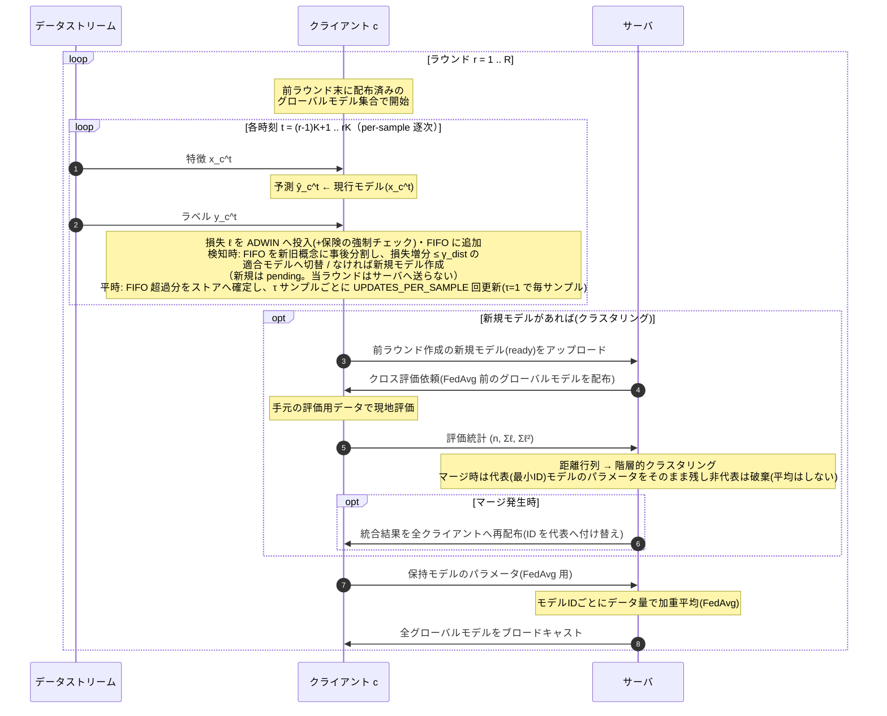
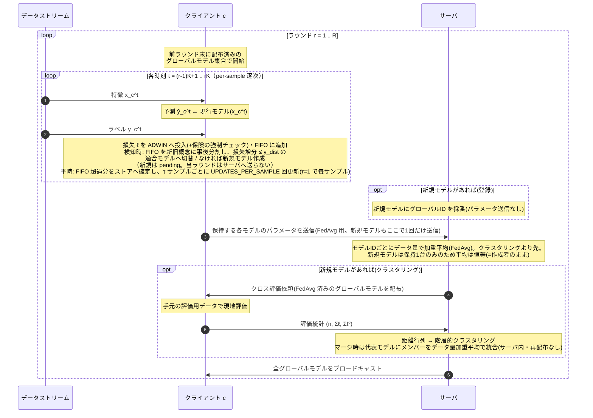
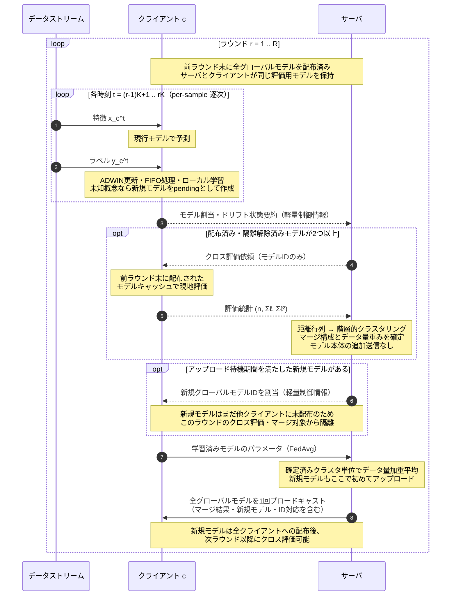
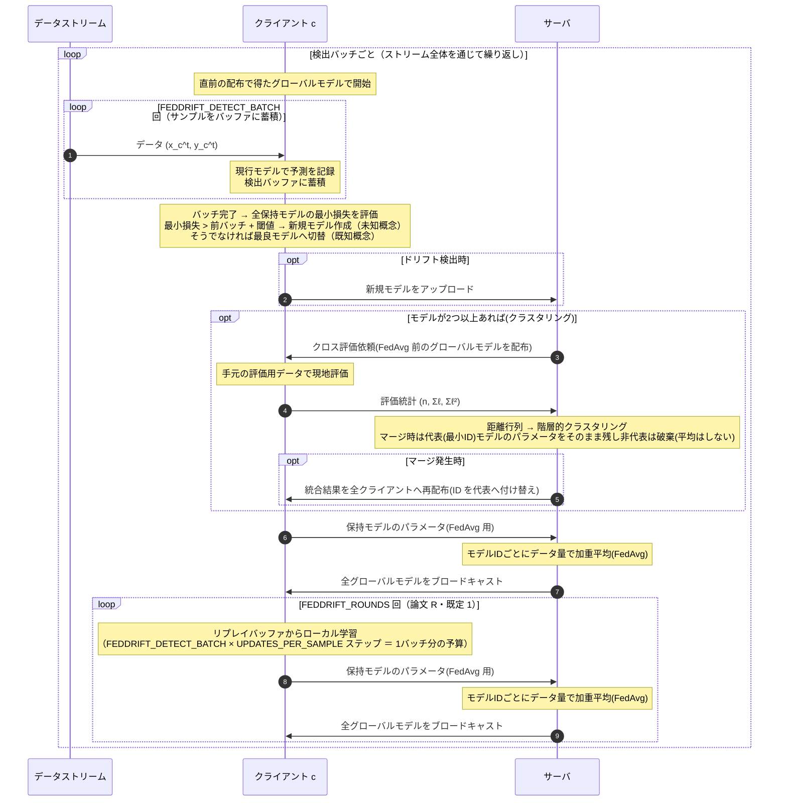
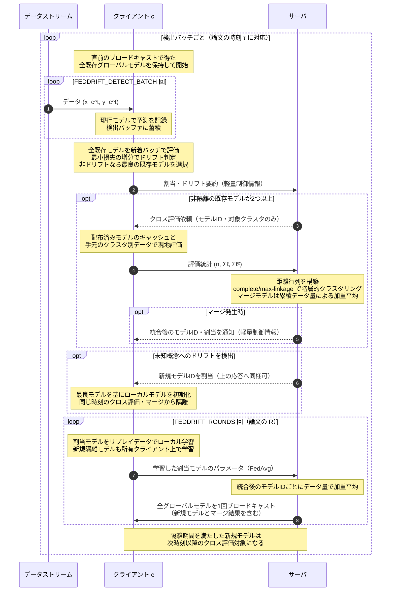

# シーケンス図 (mermaid)

図中の矢印はモデル/データの転送(=通信)を表し、省略しない。グローバルモデルのブロードキャストは
実装(`server.run_round` の末尾)に合わせて**ループの最後**に置く(各ループは直前の配布で得た
モデルで開始する)。クロス評価の依頼はモデル対 (i, j) ごとにモデル i を最大
`CROSS_EVAL_MAX_CLIENTS` 台のクライアントへ送る転送だが、図では1往復に代表させて描く
(評価依頼・損失統計返送は `comm_messages_down/up`、モデル本体は `comm_models_down/up` で別々に数える)。

FedSDA は **v1（モード `FedSDA`）**、**v2（モード `FedSDA_v2`）**、
**v3（モード `FedSDA_v3`）** を載せる。

**v1 と v2 の違いはサーバ処理の順序**(と、その帰結としての新規モデルのアップロード方式)。
モードで切替(実装: `servers/clustering.py::ClusteringServer` / `servers/fedsda.py::FedSDAV2Server`。クライアント側は
両者とも同じ `FedSDAClient`):
- v1(`FedSDA`): 回収(新規のパラメータ送信) → クロス評価 → クラスタリング/マージ(再配布) → FedAvg(新規を再送=二重送信) → 配布
- v2(`FedSDA_v2`): 回収(ID採番のみ) → FedAvg(新規もここで1回だけ送信) → クロス評価 → クラスタリング/マージ(サーバ内加重平均) → 配布
- v3(`FedSDA_v3`): 配布済みキャッシュでクロス評価 → クラスタリング → 新規ID採番 → FedAvg → 配布
- v2 の狙い: **今ラウンドの学習を反映した(FedAvg 済み)モデル同士でクラスタリング**できる
  (v1 のクロス評価は前ラウンド末のモデルを配るため、既存モデルだけ1ラウンド古い非対称な評価に
  なる)。また v1 のマージ発生ラウンドの**二重ブロードキャスト**(マージ時の再配布 + ラウンド末の
  配布)が解消され(v2 は配布1回)、**新規モデルの二重送信**も解消される(クロス評価が FedAvg 後
  なので、回収時にパラメータを送る必要がない)。

**τ(`LOCAL_UPDATE_TAU`)はこれと直交する config ノブ**で、**モードに依らず全逐次手法
(FedSDA / FedSDA_v2 / FedSDA_v3 / Oblivious 等)に適用される**(実装: `clients/base.py::train_step`)。
τ サンプルごとに τ×`UPDATES_PER_SAMPLE` 回まとめて更新する(総更新回数は不変。τ=1 で毎サンプル。
ラウンド境界・ドリフト解決前にフラッシュ)。「更新頻度 ↔ モデル鮮度」のトレードオフ軸。

したがって **順序(2モード)× τ(2値)= {`FedSDA`, `FedSDA_v2`} × {τ=1, τ>1} の4構成**で、
順序と τ の効果を分離してアブレーション比較できる。以下の2図は τ=1(既定)を描くが、τ 部分の
ノートは τ 一般で記す。

なお新規モデルは作成ラウンド中は pending とし、`FEDSDA_MODEL_UPLOAD_DELAY_ROUNDS` ラウンドの
学習を経て回収する(既定値1では次ラウンド末に送信)。
2図の差分は上記(順序と新規モデルのアップロード方式)のみで、それ以外は同一構造。

---

## FedSDA v1（現行実装）

`federated_drift_experiment/experiment.py::_run_per_sample_timestep` / `clients/fedsda.py` / `servers/base.py::BaseServer.run_round` に
忠実な図。ブロードキャストはラウンド末に行われ、次ラウンドはその配布済みモデルで開始する。

**v1 の要点**(実装上の細部):

- ドリフト検知は **ADWIN の統計検定 + 保険の強制チェック**(`_forced_drift_check`)の OR。
- 新規モデルは作成ラウンド中 pending(`pending_ready=False`)で、**次ラウンドの集約で初めて回収**
  される(検知→グローバル統合に1ラウンドの遅延)。
- クロス評価・クラスタリングは**新規モデルを回収したラウンドのみ**実行(毎ラウンドではない)。
- クロス評価が配るのは **FedAvg 前(=前ラウンド末)のグローバルモデル**。今ラウンドのローカル
  学習は反映されていない(新規回収モデルだけ新鮮、という非対称がある)。
- マージは**代表(最小ID)モデルのパラメータを残し、非代表側のパラメータは破棄**する。さらに
  マージ時の再配布がラウンド途中で全クライアントのモデルを上書きするため、**マージ発生
  ラウンドではその回のローカル学習が FedAvg に反映されない**(v2 で自然に解消される)。

---

## FedSDA v2（モード `FedSDA_v2`）

実装は `servers/fedsda.py::FedSDAV2Server`(クライアント側は v1 と共通)。v1 との違いは次の3点で、
他は v1 と同一構造:
- **FedAvg をクロス評価/クラスタリングより先**に行う(今ラウンドの学習を反映したモデルで距離評価)。
- **マージをサーバ内のデータ量加重平均**で行い再配布を省く(配布1回)。
- **新規モデルの回収を ID 採番だけ**にし、パラメータ送信を FedAvg の1回に集約する
  (v1 は回収時にもパラメータを送るため二重送信するが、v2 はクロス評価が FedAvg 後なので解消)。

**v2 の要点**(v1 との差分):

- クロス評価・クラスタリングを **FedAvg 済み(=今ラウンドの学習を反映した)モデル**に対して
  行うため、距離評価の鮮度が揃う。
- マージ後のパラメータは、FedAvg 済みメンバーを**サーバ側でデータ数加重平均**して作る
  (追加通信ゼロ)。加重平均の結合則で「統合クラスタの全データでの加重平均」と同値、非代表を破棄しない。
- 配布はラウンド末の1回のみ(v1 のマージ発生ラウンドの二重配布を解消)。
- **新規モデルの回収は ID 採番のみ**で、パラメータは FedAvg の1回だけ送る(v1 の二重送信を解消)。
  新規モデルは保持1台のため FedAvg は恒等(=そのまま登録。計算量ゼロなので許容し維持)。

### FedSDA v2.1（モード `FedSDA_v2.1`）

v2.1はv2のサーバ処理・通信フローを変更せず、クライアントのドリフト検知だけを拡張する。
各サンプルで一度計算した現行モデルの損失を、従来の全体ADWINに加えて、正解クラスに対応する
クラス別ADWINにも投入する。いずれか一つが発火した場合に従来と同じドリフト解決へ進む。

- 全体ADWINが発火: v2と同じ新概念側ウィンドウ幅でFIFOを分割する。
- クラス別ADWINだけが発火: その検知器に残った新ウィンドウの最初のサンプル位置を
  全体ストリーム上の分割点へ変換する。
- 解決後: 全体・全クラスのADWINを同時にリセットする。
- `delta`は全検知器で共通の`ADWIN_DELTA`を使い、新しいハイパーパラメータは増やさない。

正解ラベルを受信した後に検知するprequential処理なので、推論時に未知の正解クラスを使うものではない。
circleのように変化が一部クラス・局所領域へ集中し、全体平均損失では薄まるドリフトを対象とする。

---

## FedSDA v3（モード `FedSDA_v3`）

実装は `servers/fedsda.py::FedSDAV3Server` と
`experiment.py::_run_fedsda_v3_timestep`。FedDrift v2 と同様に、前ラウンド末に配布済みのモデルを
クライアントが不変キャッシュとして保持し、クロス評価時にモデル本体を再送しない。基本となるモデル通信は、各ラウンドの
`FedAvg アップロード1回 + 全モデルブロードキャスト1回` の1往復だけになる。

FedSDA v2 は今ラウンドのFedAvg済みモデルでクロス評価するため、評価担当クライアントへ最新モデルを
送る必要がある。v3では順序を入れ替え、**前ラウンド末のブロードキャストを受信済みのモデルを先に
クロス評価・クラスタリングし、その後に今ラウンドのFedAvgを行う**。これによりモデル再送を除去する
代わりに、距離評価に使用するモデルは1ラウンド前の状態になる。

### v3 の設計上の要点

1. **クロス評価でモデル本体を送らない。** 評価依頼はモデルIDなどの軽量情報だけとし、クライアントは
   前回の通常ブロードキャストで取得したモデルを使う。
2. **クラスタリングをFedAvgより前に行う。** サーバとクライアントのキャッシュが一致している時点で
   距離評価を行い、そのクラスタ構成に今ラウンドの更新を集約する。
3. **新規モデルを即時クラスタリングしない。** 未配布の新規モデルを評価するには追加モデル送信が必要な
   ため、最初のFedAvg・ブロードキャストが完了するまで隔離する。
4. **マージ専用の再配布を行わない。** マージ後モデル、新規モデル、ID対応はラウンド末の通常
   ブロードキャストへまとめる。
5. **FedSDAの逐次検出は変更しない。** ADWIN、FIFO、ローカルモデル選択、新規モデル作成、
   `FEDSDA_MODEL_UPLOAD_DELAY_ROUNDS` の意味はv1/v2と同じに保つ。
6. **クラスタリング隔離用の追加パラメータは設けない。** 新規モデルは
   `FEDSDA_MODEL_UPLOAD_DELAY_ROUNDS` ラウンドのローカル学習後に初回アップロードし、同じラウンド末の
   通常ブロードキャストで全クライアントへ共有する。初回ブロードキャスト完了前はクラスタリング不可、
   完了後の次ラウンドからクロス評価可能、という固定ルールにする。

アップロード可能になる時点とクラスタリング可能になる時点は同一ではない。キャッシュを使うため、
新規モデルは初回アップロードに続くブロードキャストが完了するまで評価できない。ただし、この差は
プロトコル上必須であり、独立して調整する状況を想定しないため、隔離期間用の別パラメータにはしない。
サーバはラウンド数だけでなく、モデルごとの初回ブロードキャスト完了状態を保持して判定する。

既定値 `FEDSDA_MODEL_UPLOAD_DELAY_ROUNDS=1` では、新規モデルは作成の次ラウンドで学習された後、
そのラウンド末にアップロード・配布され、さらに次のラウンドからクロス評価対象になる。

| 項目 | FedSDA v2 | FedSDA v3 |
|---|---|---|
| クロス評価モデル | 今ラウンドのFedAvg済みモデル | 前ラウンド末の配布済みモデル |
| クロス評価用モデル送信 | 必要 | 不要（キャッシュ利用） |
| 新規モデルの即時評価 | 可能 | 不可（初回配布まで隔離） |
| モデル通信の基本形 | FedAvg upload + 評価用送信 + broadcast | FedAvg upload + broadcast |
| 距離評価の鮮度 | 最新 | 1ラウンド前 |

この方式が有効かは、通信削減量だけでなく、1ラウンド古い距離評価によるマージ判断、モデル数、精度、
ドリフト検出性能への影響をFedSDA v2と比較して判断する必要がある。

---

## FedDrift シーケンス図

対比用（本実装の `clients/feddrift.py` / `_run_batch_timestep` 準拠）。FedSDA と異なり
**バッチベース**で、`FEDDRIFT_DETECT_BATCH` 件を溜めてから検出・通信する。検出バッチ完了時は
まず**クラスタリング付き集約**(配布まで)を1回行い、続いて論文の R ラウンドに倣い
{ローカル学習 → FedAvg 集約 → 配布} を `FEDDRIFT_ROUNDS` 回（既定 1）行う。

**FedDrift の要点**: ドリフト検知は **検出バッチ単位の最小損失の増分**（`FEDDRIFT_DETECT_BATCH`件ごと）。通信もこのバッチ完了時のみ。新規モデルは即時 ready のため**同一バッチの集約で回収**される(FedSDA の次ラウンド回収と異なる)。クラスタリング(クロス評価)は**新規モデルの有無に依らず、モデルが2つ以上あれば毎バッチ実行**される(通信面では FedSDA より重い)。`FEDDRIFT_DETECT_BATCH`（検出粒度↔通信）と
`FEDDRIFT_ROUNDS`（バッチあたり収束度↔通信）が 2 つの通信軸。各変数の詳細は[hyperparameters.md](hyperparameters.md) を参照。

---

## FedDrift v2 シーケンス図（実装モード `FedDrift_v2`）

FedDrift v2 は、上の現行実装から余分な FedAvg 往復を除き、論文の「時刻ごとのクラスタリング →
`R` 通信ラウンド」の順序に合わせた設計である。クライアントは直前のブロードキャストで全既存モデルを
保持しているため、既存モデルのクロス評価ではパラメータを再送せず、そのキャッシュを利用する。
実装は `FedDriftV2Client` / `FedDriftV2Server` / `_run_feddrift_v2_timestep`。

新規作成モデルを**同じ検出バッチで距離評価する設計**なら、サーバで集約した新規モデルを他の評価担当
クライアントへ送る必要がある。しかし、FedDrift 論文と参照実装では新規モデルをいったん隔離し、同じ
時刻のマージ対象から外す。したがって v2 では、新規モデルは最初の学習ラウンドの FedAvg で回収し、
そのラウンド末の通常ブロードキャストで全クライアントへ配布する。隔離解除後にクロス評価対象となる
時点では、すでに各クライアントがモデルをキャッシュしている。

### 現行 FedDrift から v2 への修正点

1. **FedAvg を正確に `FEDDRIFT_ROUNDS` 回だけ実行する。** クラスタリングのためだけに行っていた
   学習前の `{アップロード → FedAvg → ブロードキャスト}` 1往復を削除する。
2. **既存モデルをクロス評価のたびに再送しない。** 直前の全モデルブロードキャストをキャッシュし、
   クロス評価依頼はモデルIDなどの軽量制御情報だけにする。評価統計の返送回数は別途記録する。
3. **新規モデルを同一時刻のマージ対象から外す。** 新規モデルはローカルで初期化・学習し、最初の
   FedAvg アップロードで回収する。通常ブロードキャスト後も所定の隔離期間までは距離評価しない。
4. **クラスタリング戦略を共通部品として選択可能にする。** 既定の `complete` は論文どおりの
   complete/max-linkage。比較実験では `CLUSTER_LINKAGE=connected` により従来の閾値グラフ
   連結成分(single-linkage cut相当)も選べる。
5. **マージモデルを累積データ量で加重平均する。** 代表モデルをそのまま残して非代表モデルを破棄せず、
   マージ対象モデルの学習データ量に比例した平均をサーバ内で計算する。
6. **マージ専用の再配布を行わない。** ID付替え・マージ済みパラメータ・新規モデルの配布は、各学習
   ラウンド末の1回のブロードキャストへまとめる。
7. **通信指標を分離する。** モデルパラメータ転送数（または実バイト数）と、割当通知・評価依頼・
   評価統計返送などの軽量メッセージ回数を別々に報告する。

この v2 では、モデルパラメータ通信の基本回数は検出バッチあたり `R` 回の FedAvg 往復となる。
新規モデルが生じても同一時刻のクロス評価用モデル送信は追加されず、最初の通常ブロードキャストに
包含される。即時マージを行う派生方式だけは例外で、新規モデルの集約後に評価担当クライアントへの
追加送信が必要になる。

`FEDDRIFT_ISOLATION_TIMESTEPS` はFedDriftのクロス評価・マージ隔離期間であり、FedSDAのpending
モデル回収遅延とは意味が異なるため共有していない。FedSDAは引き続き、作成ラウンドでは回収せず
次ラウンドの学習後に送信する既存動作を維持する。
