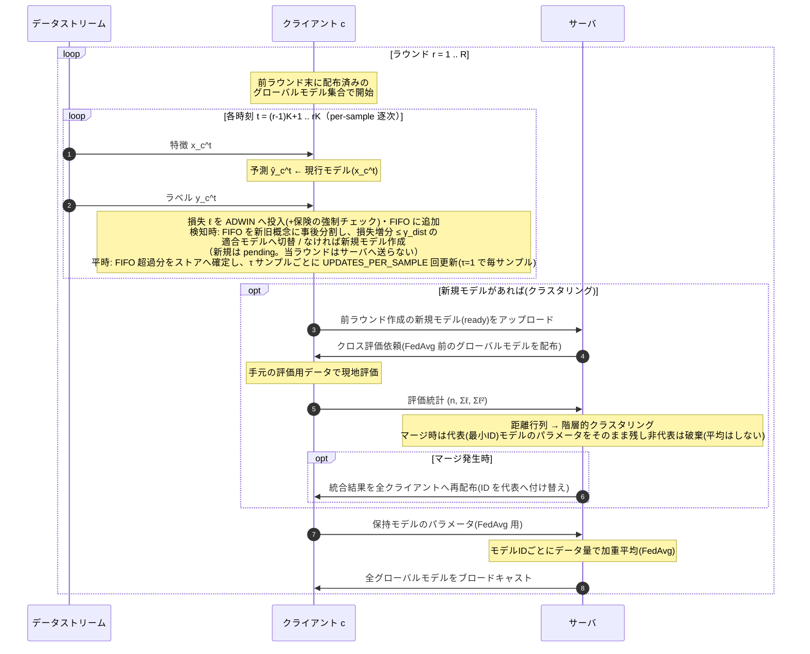
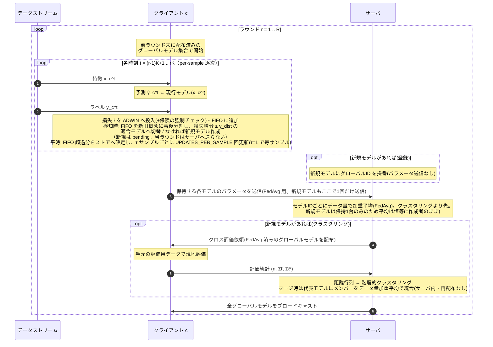
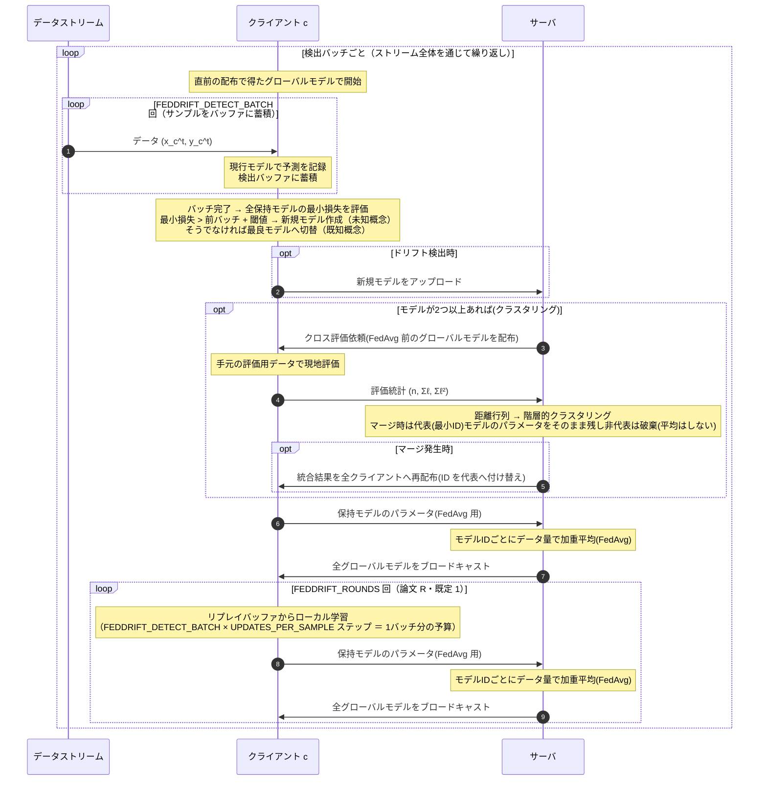

# シーケンス図 (mermaid)

図中の矢印はモデル/データの転送(=通信)を表し、省略しない。グローバルモデルのブロードキャストは
実装(`server.run_round` の末尾)に合わせて**ループの最後**に置く(各ループは直前の配布で得た
モデルで開始する)。クロス評価の依頼はモデル対 (i, j) ごとにモデル i を最大
`CROSS_EVAL_MAX_CLIENTS` 台のクライアントへ送る転送だが、図では1往復に代表させて描く
(損失統計の返送は軽量のため通信量カウント comm_up/down の対象外)。

FedSDA は **v1（モード `FedSDA`）** と **v2（モード `FedSDA_v2`）** を載せる。

**v1 と v2 の違いはサーバ処理の順序**(と、その帰結としての新規モデルのアップロード方式)。
モードで切替(実装: `server.py::ClusteringServer` / `ClusteringServerV2`。クライアント側は
両者とも同じ `AdwinClient`):
- v1(`FedSDA`): 回収(新規のパラメータ送信) → クロス評価 → クラスタリング/マージ(再配布) → FedAvg(新規を再送=二重送信) → 配布
- v2(`FedSDA_v2`): 回収(ID採番のみ) → FedAvg(新規もここで1回だけ送信) → クロス評価 → クラスタリング/マージ(サーバ内加重平均) → 配布
- v2 の狙い: **今ラウンドの学習を反映した(FedAvg 済み)モデル同士でクラスタリング**できる
  (v1 のクロス評価は前ラウンド末のモデルを配るため、既存モデルだけ1ラウンド古い非対称な評価に
  なる)。また v1 のマージ発生ラウンドの**二重ブロードキャスト**(マージ時の再配布 + ラウンド末の
  配布)が解消され(v2 は配布1回)、**新規モデルの二重送信**も解消される(クロス評価が FedAvg 後
  なので、回収時にパラメータを送る必要がない)。

**τ(`LOCAL_UPDATE_TAU`)はこれと直交する config ノブ**で、**モードに依らず全逐次手法
(FedSDA / FedSDA_v2 / Oblivious 等)に適用される**(実装: `clients/base.py::train_step`)。
τ サンプルごとに τ×`UPDATES_PER_SAMPLE` 回まとめて更新する(総更新回数は不変。τ=1 で毎サンプル。
ラウンド境界・ドリフト解決前にフラッシュ)。「更新頻度 ↔ モデル鮮度」のトレードオフ軸。

したがって **順序(2モード)× τ(2値)= {`FedSDA`, `FedSDA_v2`} × {τ=1, τ>1} の4構成**で、
順序と τ の効果を分離してアブレーション比較できる。以下の2図は τ=1(既定)を描くが、τ 部分の
ノートは τ 一般で記す。

なお**新規モデルの回収タイミングは両モード共通で「次ラウンド」**(作成ラウンド中は pending)。
2図の差分は上記(順序と新規モデルのアップロード方式)のみで、それ以外は同一構造。

---

## FedSDA v1（現行実装）

`FedSDA/experiment.py::_run_per_sample_timestep` / `clients/fedsda.py` / `server.py::run_round` に
忠実な図。ブロードキャストはラウンド末に行われ、次ラウンドはその配布済みモデルで開始する。

**v1 の要点**(実装上の細部):

- ドリフト検知は **ADWIN の統計検定 + 保険の強制チェック**(`_forced_drift_check`)の OR。
- 新規モデルは作成ラウンド中 pending(`pending_ready=False`)で、**次ラウンドの集約で初めて回収**
  される(検知→グローバル統合に1ラウンドの遅延)。
- クロス評価・クラスタリングは**新規モデルを回収したラウンドのみ**実行(毎ラウンドではない)。
- クロス評価が配るのは **FedAvg 前(=前ラウンド末)のグローバルモデル**。今ラウンドのローカル
  学習は反映されていない(新規回収モデルだけ新鮮、という非対称がある)。
- マージは**代表(最小ID)モデルのパラメータを残し、非代表側のパラメータは破棄**する。さらに
  マージ時の再配布がラウンド途中で全クライアントのモデルを上書きするため、**マージ発生
  ラウンドではその回のローカル学習が FedAvg に反映されない**(v2 で自然に解消される)。

---

## FedSDA v2（モード `FedSDA_v2`）

実装は `server.py::ClusteringServerV2`(クライアント側は v1 と共通)。v1 との違いは次の3点で、
他は v1 と同一構造:
- **FedAvg をクロス評価/クラスタリングより先**に行う(今ラウンドの学習を反映したモデルで距離評価)。
- **マージをサーバ内のデータ量加重平均**で行い再配布を省く(配布1回)。
- **新規モデルの回収を ID 採番だけ**にし、パラメータ送信を FedAvg の1回に集約する
  (v1 は回収時にもパラメータを送るため二重送信するが、v2 はクロス評価が FedAvg 後なので解消)。

**v2 の要点**(v1 との差分):

- クロス評価・クラスタリングを **FedAvg 済み(=今ラウンドの学習を反映した)モデル**に対して
  行うため、距離評価の鮮度が揃う。
- マージ後のパラメータは、FedAvg 済みメンバーを**サーバ側でデータ数加重平均**して作る
  (追加通信ゼロ)。加重平均の結合則で「統合クラスタの全データでの加重平均」と同値、非代表を破棄しない。
- 配布はラウンド末の1回のみ(v1 のマージ発生ラウンドの二重配布を解消)。
- **新規モデルの回収は ID 採番のみ**で、パラメータは FedAvg の1回だけ送る(v1 の二重送信を解消)。
  新規モデルは保持1台のため FedAvg は恒等(=そのまま登録。計算量ゼロなので許容し維持)。

---

## FedDrift シーケンス図

対比用（本実装の `clients/feddrift.py` / `_run_batch_timestep` 準拠）。FedSDA と異なり
**バッチベース**で、`FEDDRIFT_DETECT_BATCH` 件を溜めてから検出・通信する。検出バッチ完了時は
まず**クラスタリング付き集約**(配布まで)を1回行い、続いて論文の R ラウンドに倣い
{ローカル学習 → FedAvg 集約 → 配布} を `FEDDRIFT_ROUNDS` 回（既定 1）行う。

**FedDrift の要点**: ドリフト検知は **検出バッチ単位の最小損失の増分**（`FEDDRIFT_DETECT_BATCH`件ごと）。通信もこのバッチ完了時のみ。新規モデルは即時 ready のため**同一バッチの集約で回収**される(FedSDA の次ラウンド回収と異なる)。クラスタリング(クロス評価)は**新規モデルの有無に依らず、モデルが2つ以上あれば毎バッチ実行**される(通信面では FedSDA より重い)。`FEDDRIFT_DETECT_BATCH`（検出粒度↔通信）と
`FEDDRIFT_ROUNDS`（バッチあたり収束度↔通信）が 2 つの通信軸。各変数の詳細は[hyperparameters.md](hyperparameters.md) を参照。
