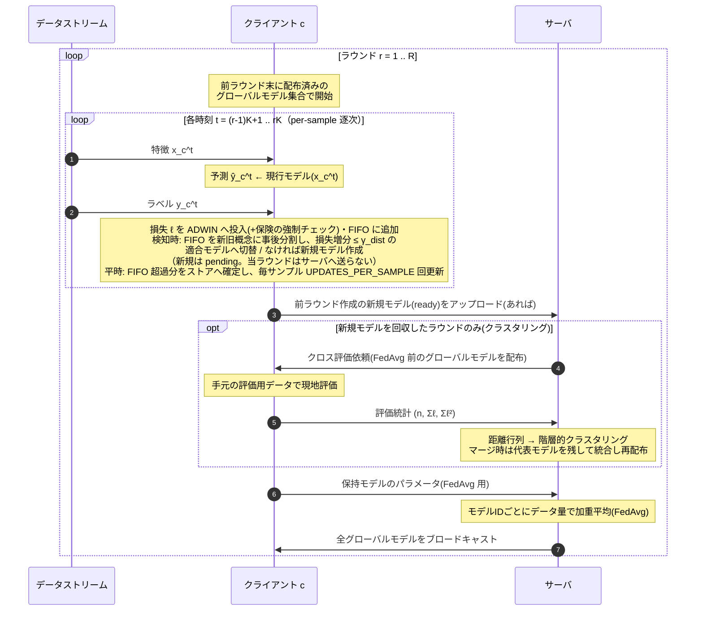
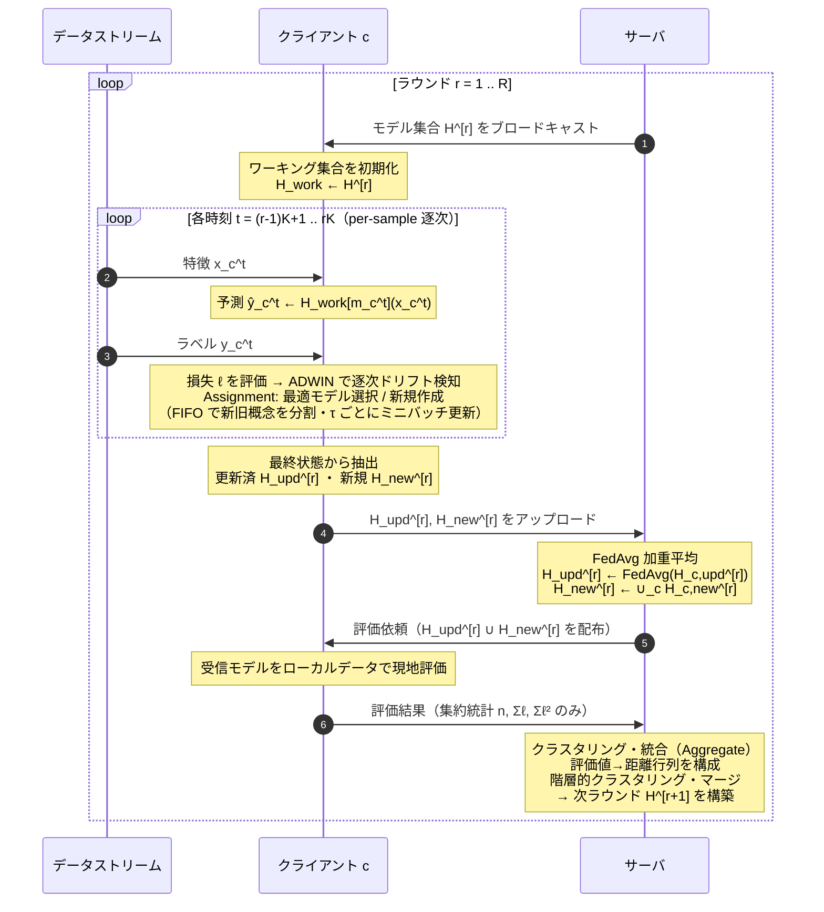
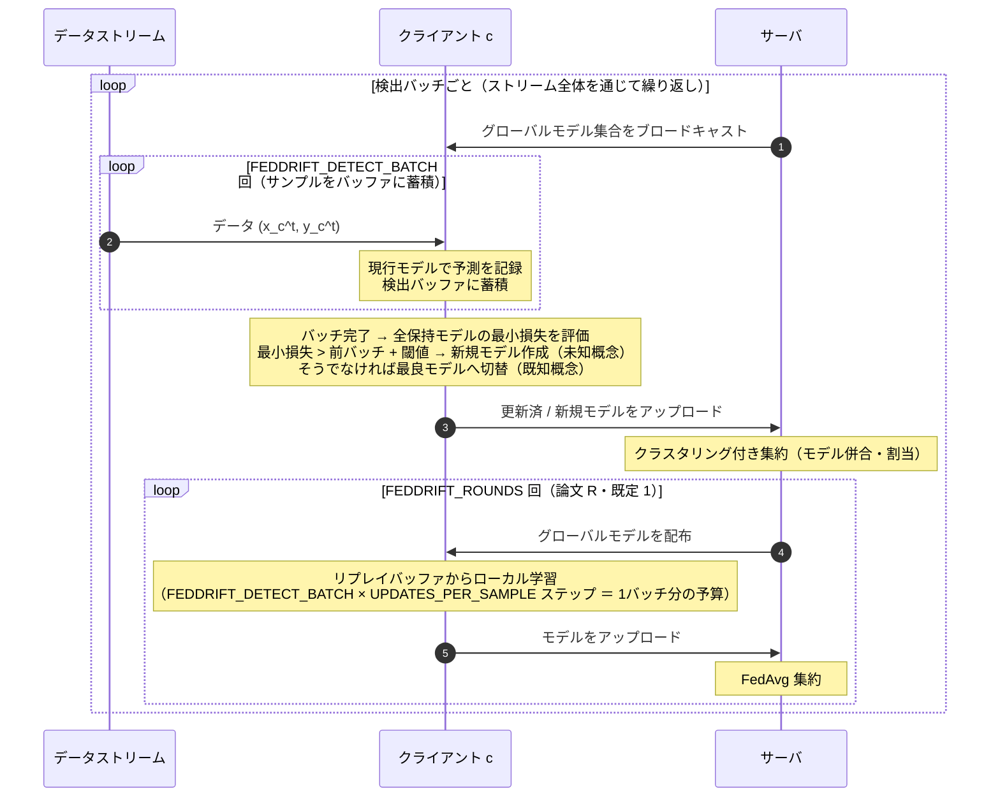

# シーケンス図 (mermaid)

FedSDA は **v1（モード `FedSDA`）** と **v2（モード `FedSDA_v2`）** の2図を載せる。v2 は論文
執筆時に意図した改良であり、v1 との差分は次の2点。差分は直交しており、
{`FedSDA`, `FedSDA_v2`} × {`LOCAL_UPDATE_TAU`=1, >1} の4構成でアブレーション比較できる。

1. **サーバ処理の順序**(モードで切替。実装: `server.py::ClusteringServerV2`):
   - v1(`FedSDA`): 新規モデル回収 → クロス評価 → クラスタリング/マージ → FedAvg → 配布
   - v2(`FedSDA_v2`): 回収 → FedAvg → クロス評価 → クラスタリング/マージ → 配布
   - v2 の狙い: **今ラウンドの学習を反映したモデル同士でクラスタリング**できる(v1 のクロス評価は
     前ラウンド末のグローバルモデルを配るため、既存モデルだけ1ラウンド分古い非対称な距離評価に
     なる)。また v1 でマージ発生ラウンドに生じる**二重ブロードキャスト**(マージ時の再配布 +
     ラウンド末の配布)が解消される。
2. **ローカル更新のタイミング**(config `LOCAL_UPDATE_TAU` で切替。実装: `clients/base.py::train_step`):
   - v1(τ=1): 毎サンプル `UPDATES_PER_SAMPLE` 回のミニバッチ更新
   - v2(τ>1): τ サンプルごとにまとめて τ × `UPDATES_PER_SAMPLE` 回
   - 総更新回数は不変(学習予算は変わらない)。τ は「更新頻度 ↔ モデル鮮度」のトレードオフ軸。
     ラウンド境界・ドリフト解決前には保留分をフラッシュする。

なお**新規モデルの回収タイミングは v1/v2 共通で「次ラウンド」**(作成ラウンド中は pending)。
v2 図は簡略化として同一ラウンド末に送るように描いているが、実装は次ラウンド回収を維持している
(順序と τ の効果を分離測定するため)。

---

## FedSDA v1（現行実装）

`FedSDA/experiment.py::_run_per_sample_timestep` / `clients/fedsda.py` / `server.py::run_round` に
忠実な図。ブロードキャストはラウンド末に行われ、次ラウンドはその配布済みモデルで開始する。

**v1 の要点**(実装上の細部):

- ドリフト検知は **ADWIN の統計検定 + 保険の強制チェック**(`_forced_drift_check`)の OR。
- 新規モデルは作成ラウンド中 pending(`pending_ready=False`)で、**次ラウンドの集約で初めて回収**
  される(検知→グローバル統合に1ラウンドの遅延)。
- クロス評価・クラスタリングは**新規モデルを回収したラウンドのみ**実行(毎ラウンドではない)。
- クロス評価が配るのは **FedAvg 前(=前ラウンド末)のグローバルモデル**。今ラウンドのローカル
  学習は反映されていない(新規回収モデルだけ新鮮、という非対称がある)。
- マージは**代表(最小ID)モデルのパラメータを残し、非代表側のパラメータは破棄**する。さらに
  マージ時の再配布がラウンド途中で全クライアントのモデルを上書きするため、**マージ発生
  ラウンドではその回のローカル学習が FedAvg に反映されない**(v2 で自然に解消される)。

---

## FedSDA v2（モード `FedSDA_v2` + `LOCAL_UPDATE_TAU`）

上記の差分 1(FedAvg 先行)・2(τ バッチ更新)を反映した設計(論文の図)。実装は
`server.py::ClusteringServerV2`(クライアント側は v1 と共通)。なお本図は簡略化として
「新規モデルを同一ラウンド末に送る」「毎ラウンド評価・クラスタリングする」ように描いているが、
実装は v1 と同じく**次ラウンド回収・新規回収ラウンドのみクラスタリング**である。

**v2 の要点**(v1 からの改善点):

- クロス評価・クラスタリングを **FedAvg 済み(=今ラウンドの学習を反映した)モデル**に対して
  行うため、距離評価の鮮度が揃う。
- マージ後のパラメータは、FedAvg 済みメンバーを**サーバ側でデータ数加重平均**して作る
  (追加通信ゼロ)。加重平均の結合則により「統合クラスタの全データでの加重平均」と数学的に
  同値で、v1 のように非代表側のパラメータを破棄しない。
- 配布はラウンド末の1回のみ(v1 のマージ発生ラウンドの二重配布を解消)。
- τ ごとのバッチ更新(τ=1 で v1 と互換)。

---

## FedDrift シーケンス図

対比用（本実装の `clients/feddrift.py` / `_run_batch_timestep` 準拠）。FedSDA と異なり
**バッチベース**で、`FEDDRIFT_DETECT_BATCH` 件を溜めてから検出・通信する。検出バッチ完了時は論文の R ラウンドに倣い {配布 → ローカル学習 → 集約} を `FEDDRIFT_ROUNDS` 回（既定 1）。

**FedDrift の要点**: ドリフト検知は **検出バッチ単位の最小損失の増分**（`FEDDRIFT_DETECT_BATCH`件ごと）。通信もこのバッチ完了時のみで、`FEDDRIFT_DETECT_BATCH`（検出粒度↔通信）と
`FEDDRIFT_ROUNDS`（バッチあたり収束度↔通信）が 2 つの通信軸。各変数の詳細は[hyperparameters.md](hyperparameters.md) を参照。
