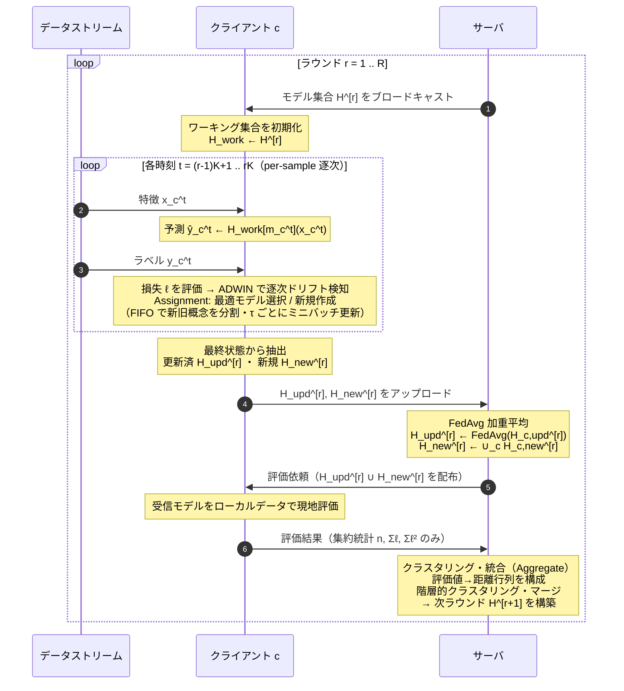
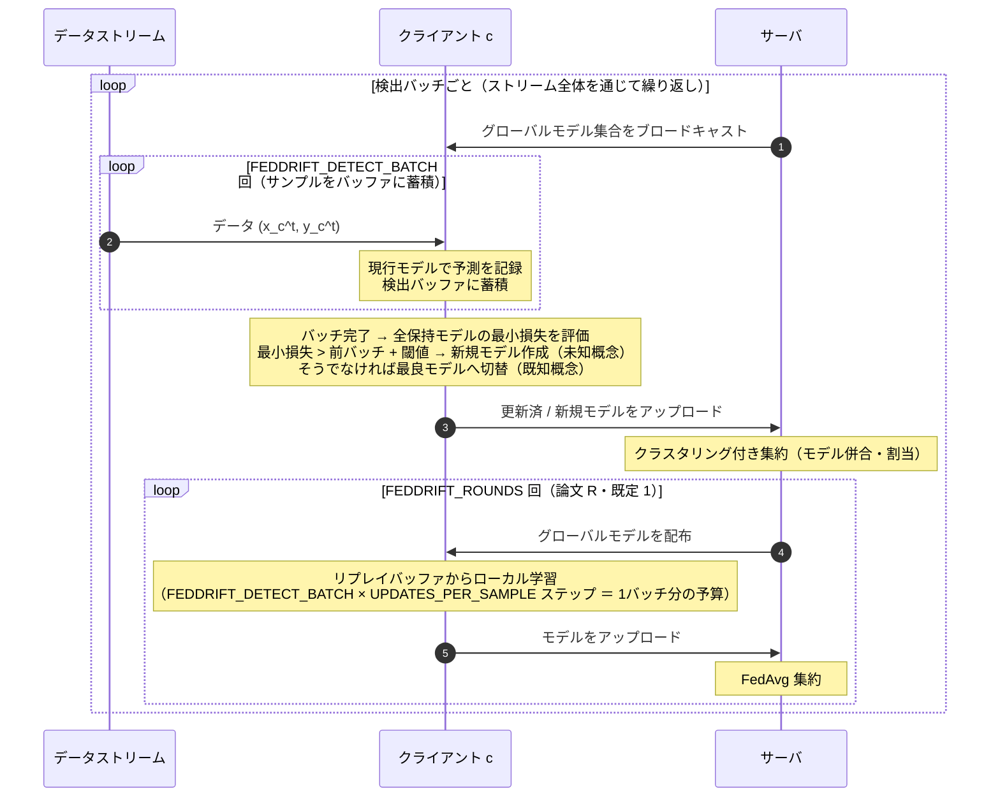

## FedSDA シーケンス図 (mermaid)

1 ラウンド = K 時刻分の逐次処理 + 1 回のサーバ集約。K は `AGG_INTERVAL`。

**FedSDA の要点**: ドリフト検知は **ADWIN による per-sample の統計検定**で、時刻ごとに逐次
（`process_one_step`）。集約は K 時刻ごとに 1 回。新規/更新モデルはサーバの**階層的クラスタリング**で併合される。

---

## FedDrift シーケンス図 (mermaid)

対比用（本実装の `clients/feddrift.py` / `_run_batch_timestep` 準拠）。FedSDA と異なり
**バッチベース**で、`FEDDRIFT_DETECT_BATCH` 件を溜めてから検出・通信する。検出バッチ完了時は論文の R ラウンドに倣い {配布 → ローカル学習 → 集約} を `FEDDRIFT_ROUNDS` 回（既定 1）。

**FedDrift の要点**: ドリフト検知は **検出バッチ単位の最小損失の増分**（`FEDDRIFT_DETECT_BATCH`件ごと）。通信もこのバッチ完了時のみで、`FEDDRIFT_DETECT_BATCH`（検出粒度↔通信）と
`FEDDRIFT_ROUNDS`（バッチあたり収束度↔通信）が 2 つの通信軸。各変数の詳細は[hyperparameters.md](hyperparameters.md) を参照。
