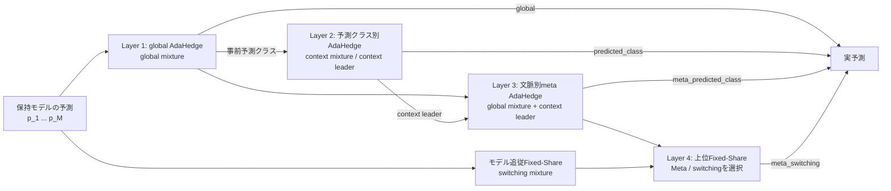

# SoftRoutingの予測レイヤー

## 位置づけ

SoftRoutingは、ドリフト検出、モデル作成、クラスタリングとは独立した**予測時のモデル統合層**である。
保持モデルや共有バックボーンの構造を変えず、既に計算したモデル別予測をどの重みで統合するかを
決める。現行実装ではRestarting SoftRoutingを持つFedSDA modeで利用できる。

正解ラベルは各AdaHedgeの重みを決めた後の更新にだけ使う。予測クラスもglobal mixtureから求めるため、
予測時のラベル漏洩はない。

## 各候補の意味

| 名称 | レイヤー | CLIで実予測に使用 | 内容 |
|---|---:|---|---|
| Global mixture | 1 | `--soft-routing-context global` | 全入力で共有したモデル別累積損失から全モデルを混合する |
| Context mixture | 2 | `--soft-routing-context predicted_class` | globalの事前予測クラスごとに別の累積損失を持ち、全モデルを再混合する |
| Context leader | 2 | 単独選択不可 | Context mixtureで最大重みのモデル。meta-routerの候補兼診断値 |
| Shadow meta | 3 | `predicted_class`時は診断のみ | Global mixtureとContext leaderを文脈別AdaHedgeで再混合する |
| Meta mixture | 3 | `--soft-routing-context meta_predicted_class` | Shadow metaと同じ候補混合を実予測に採用する |
| Meta-switching selector | 4 | `--soft-routing-context meta_switching` | Meta mixtureとswitching mixtureのうち、上位Fixed-Shareが選んだ一方を採用する |

`meta_predicted_class`は、モデル別の実効重みに展開すると、global重みとcontext leaderへの一点重みを
上位AdaHedgeの比率で加えた混合になる。追加のモデルforward、通信、数値ハイパーパラメータはない。

候補間の重みは累積損失とmixability gapからAdaHedgeが自動計算する。学習率や切替閾値を
利用者が設定する必要はない。診断指標で使う重み`0.5`は「どちらをより重くしたか」の集計境界であり、
予測方式を切り替える条件ではない。

Meta-routerの更新損失は`--soft-routing-meta-loss`で選ぶ。

- `bounded_score`は、正解クラスへ割り当てた確率に基づく`[0, 1]`有界損失を使う。
  予測確率の較正も評価できる一方、最終0/1 accuracyと候補の優劣が逆転する場合がある。
- `zero_one`（既定値）は、候補の最終予測が正解なら0、不正解なら1として更新する。Meta-routerの目的を
  accuracyへ直接合わせるが、予測確率の確信度情報は使わない。

どちらも新しい数値閾値を導入せず、同じAdaHedge更新を使う。比較後は一方へ整理する前提の
実験的選択肢である。

## Shadow診断と実運用の関係

`predicted_class`では実予測をContext mixtureのまま維持し、同じ標本についてMeta mixtureをshadowで
計算する。`meta_predicted_class`ではそのMeta mixtureを実予測へ昇格する。どちらも同じ順序で、
予測後にglobal、context、metaの各AdaHedgeを更新する。

SoftRoutingの予測結果はモデル学習、ドリフト検出、モデル作成判断へ戻さない。そのため、同じseedと
設定なら、`predicted_class`で記録したshadow meta精度と`meta_predicted_class`の実accuracyは一致する。

## モデル別leave-one-out寄与診断

モデルrepositoryを距離ではなく実際の予測寄与から整理できるかを調べるため、実予測の混合から保持モデルを
一つずつ除く反実仮想診断を行う。モデル`m`を除いた残りの実効routing重みを再正規化し、
`loss(without m) - loss(actual)`をモデル`m`の寄与とする。正の値は除外で予測が悪化したこと、0以下は
除外しても改善または不変だったことを表す。

この処理は同じ標本ですでに得た全モデルの出力を再結合するだけで、追加forward、通信、学習を行わない。
クライアント・保持モデル集合epoch・通信区間・モデルごとの十分統計をrawへ保存し、最終active集合では
未割当かつ寄与が非正のモデル数もCSVへ要約する。モデル集合の変更でepochを分けるため、クラスタリング後に
同じIDが代表として残っても、変更前後のモデル実体を混同しない。現段階では診断専用であり、この値による
archive・削除は行わない。保存項目の定義は[metrics.md](metrics.md)を参照する。

## Switching-expert shadow診断

通常のAdaHedgeは全履歴の累積損失を使うため、長く優勢だったモデルから新しい優勢モデルへの移行が
遅れる場合がある。switching-expert診断は、モデル別損失にFixed-Share型の更新を適用し、最良モデルが
時間とともに切り替わる状況を追跡する。二次損失から学習率を自動調整し、一様分布へ戻す時間尺度には
既存の`N_FIFO`を使うため、新しい利用者設定は追加しない。

モデル直接のswitching mixtureは、すべてのRestarting SoftRouting modeでshadowとして計算する。
共有表現の`fifo_replay`後は、集約後モデルで再計算したFIFO損失から状態も再構築する。

`meta_switching`は、現行Meta mixtureとswitching mixtureをさらに2候補のFixed-Shareで追跡し、予測前に
最大重み候補を選ぶ。候補の同率時は、定常時に安定していた現行Metaを優先する。正解取得後に両候補の
0/1損失で上位重みを更新するため、ラベル漏洩はない。一様分布へ戻す時間尺度には既存の`N_FIFO`を
再利用し、固定閾値や新しい数値ハイパーパラメータを追加しない。すべて既に得たモデル出力を使うため、
追加forwardと通信も発生しない。

## 比較上の扱い

- `global`は単純で安定した基準方式であり、当面の既定値として残す。
- `meta_predicted_class`はSine2・MNIST2・MNIST4でglobalを上回った一方、Circle2では5 seedすべてで
  わずかに下回った。現時点では一律の既定値ではなく、更新損失との整合性を検証する候補である。
- `meta_switching`は、switching mixtureの回復速度とMeta mixtureの定常安定性を閾値なしで選択する
  実験的候補である。主要方式への昇格は実予測としての複数seed検証後に判断する。

上位Fixed-Shareの利用方法は、`--soft-routing-top-combination`で次の二方式を選べる。

- `leader`（既定）: 重み最大のMeta mixtureまたはswitching mixtureだけを実予測へ使う。
- `mixture`: 両候補の予測を上位Fixed-Share重みでさらに混合する。

`mixture`は標準的なexpert aggregationの重み付き予測に近く、`leader`は離散的な選択によって
急な切替を表現しやすい。両方式は下位候補、上位重み更新、通信、学習処理を共有するため、比較では
最上位の出力規則だけを切り分けられる。現段階では上位更新に同じ0/1候補損失を使うので、
`mixture`を選んだだけで混合予測自体の凸損失に対する理論保証が直ちに得られるわけではない。

random schedule・6データセット・5 seed・集約間隔`50/100/200/500`の比較では、`mixture`は
`leader`に対してSine2で平均0.088ポイント、MNIST2で0.099ポイント、MNIST4で0.041ポイント、
Circle2で0.074ポイントaccuracyが低かった。差は主に真ドリフト後200サンプルの回復区間へ集中し、
MNIST4のstable accuracyだけは平均0.051ポイント改善した。soft混合は定常時の不確実性を緩和できる
場合がある一方、変化直後に優勢候補へ切り替える効果を弱めたため、`leader`を主要候補として維持し、
`mixture`は理論上自然な出力規則とのablationとして扱う。
- `predicted_class`は現時点の実験ではglobalまたはmetaにほぼ支配されている。素朴な文脈別再混合の
  ablationとしては意味があるが、主要方式へ昇格しない場合は将来の整理候補である。
- `context leader`は独立方式ではなくmetaの構成要素なので、CLI modeを増やさない。
- Shadow診断は新方式の導入前後で同一系列上の反実仮想比較を行えるため維持する。

## ローカルactive/archiveのshadow診断

SoftRoutingでは同じグローバルモデルでもクライアントごとの寄与が異なる。そのため、モデルを全体で
平均・削除する前に、クライアントごとに配布・予測対象だけを絞る可逆なrepository管理を検討する。
`--routing-archive-shadow-diagnostics`で有効にする`routing_archive_shadow_*`は実配布を変えず、
leave-one-out有界損失と0/1損失の双方が非正だったモデルを反実仮想予測から外す。
`--routing-archive-shadow-policy previous_block`は直前の通信区間から次区間を決める。
`forward_probe`は各区間の先頭`N_forward`件では全モデルを評価し、その因果的な観測だけから同一区間の
残りを絞る。`periodic_forward_probe`は通信区間に依存せず、`N_forward`件の全モデルprobeと
`N_forward`件の絞り込みを交互に繰り返す。現行hard割当モデル、ローカル仮モデル、寄与記録のない
モデルは必ず残し、モデル集合が変われば全保持へ戻す。

この方式はデータセット名による分岐や追加閾値を持たない。`forward_probe`は新しい窓長を増やさず、
新規モデル作成にも使う`N_forward`をprobe長として共有する。shadow accuracyを維持しながら保持率を
下げられる場合に限り、次段階でサーバrepositoryは維持したままクライアント別配布を減らす方式へ進む。
悪化する場合は、全体マージへ流用せず診断だけで終了する。

`previous_block`をCircle2・Sine2・MNIST4、2 seed、4集約間隔で評価すると、保持率は平均57～69%まで
下がった一方、24条件中23条件でaccuracyが悪化した。Sine2の平均低下は約0.79ポイントであり、直前区間の
非正寄与が次区間まで持続する仮定は成立しなかった。このため実archiveには昇格させず、現在区間先頭の
因果的な証拠を使う`forward_probe`を次の診断候補とする。

`forward_probe`も同じ24条件すべてでaccuracyが悪化し、特にA=200/500では`previous_block`より
悪化した。先頭10件の判断を通信区間末まで固定したため、Aが大きいほど証拠の有効期限を超えて除外が
継続したと考えられる。`periodic_forward_probe`はこの結果を受けた最終診断候補であり、archive判断も
通信間隔から切り離す。これでもaccuracyを維持できなければ、LOO active/archiveは実方式へ昇格させない。

`periodic_forward_probe`では平均保持率を約72.9%としつつ、accuracy差を全体平均-0.056ポイントまで
縮小した。集約間隔別の差も-0.047～-0.063ポイントに収まり、通信間隔から切り離す目的は達成した。
一方、Circle2は両seedで平均+0.049ポイント、Sine2は-0.125ポイント、MNIST4は-0.091ポイントとなり、
効果の符号がデータに依存した。実archiveでは除外中のexpertに対するrouter証拠も更新できず、全モデルを
評価し続けるshadowより乖離が大きくなり得る。このため実active/archiveには昇格させず、LOOはモデル寄与を
診断する基盤として維持する。repository圧縮を再検討する場合は、寄与が時間変化しても全混合予測を保存する
蒸留など、不可逆な除外とは異なる方式を独立に評価する。

### 周期probeによる実予測active集合

クラスタリングを無効化した20,000 stepの長期診断（Circle2・MNIST2・MNIST4、各2 seed、`A=500`）では、
`periodic_forward_probe`のshadow予測は実予測に対して平均-0.0015ポイントで、差は事実上なかった。
全期間のグローバルモデル保持率は平均67.8%であり、全モデルを評価するprobe区間を除いた適用区間では
約30～40%だけを残した。この条件では、モデル数は前半で4～11個へ増えた後にほぼ横ばいとなる一方、
SoftRoutingの実効expert数は約2～5に留まった。したがって、全モデルを常時forwardする必要は小さい。

この結果を受け、`--routing-active-set-policy periodic_forward_probe`を実験的な実方式として実装する。
`N_forward`件では全repositoryを評価し、その区間のleave-one-out寄与が有界損失・0/1損失のどちらでも
正でないexpertを、続く`N_forward`件だけ休止する。現行モデルとローカル仮モデルは常に残し、次のprobeで
全expertを再活性化するため、除外は可逆である。

最初の実方式では、休止expertへ実混合の損失を代入するsleeping-expert更新を行った。長期診断と同じ
6条件では推論例数を平均23.0%、実行時間を平均12.0%減らした一方、accuracyは6条件すべてで低下し、
平均低下は0.130ポイントだった。低下は真のドリフト後10～30標本に集中し、全expertを評価するprobe中にも
残った。モデル作成、検出、通信、学習量は対照と完全に同じだったため、未観測損失の代入でルータの累積証拠を
変えたことが主因と考えられる。

修正版では、全expertの真の損失を観測できるprobe中だけ全ルータを更新し、適用区間では証拠を凍結する。
これにより全expertの比較を同じfull-information標本へ揃える。また、確定したモデル切替またはrepository変更時は
周期境界を待たず、全expertによる新しいprobeを開始する。新しい数値閾値は追加しない。

この段階で削減するのは**クライアントの予測forwardだけ**である。サーバrepository、クライアントへの配布、
学習対象は変えないため、モデル通信量はまだ減らない。まず実経路でaccuracyとforward計算量の因果効果を
確認し、成立した場合に限って、休止中モデルの配布省略と周期probe時の再取得を別段階で評価する。

## 実験上の位置づけ

5 seed・5000 stepの`bounded_score`診断では、Meta mixtureはGlobal mixtureに対してSine2で
約0.37ポイント、MNIST2で約0.11ポイント、MNIST4で約0.38ポイントaccuracyを改善した。
SEA2・SEA4ではほぼ同等で、Circle2では約0.07ポイント下回った。したがって、Metaは全データで
Globalを支配する方式ではないが、複雑な多クラス問題とSine2で比較的大きな利得を示す有力候補である。

6データセット・5 seed・4集約間隔のshadow診断では、モデル直接のswitching mixtureはSine2の全20条件、
MNIST2・MNIST4の各17条件で現行Metaを上回った。改善は真のドリフト後200標本の回復区間へ集中し、
定常区間ではCircle2・MNIST系を悪化させる条件もあった。一方、同じ系列上でMetaとswitching mixtureを
上位Fixed-Shareにより選ぶ再生診断では、Circle2・Sine2・MNIST2・MNIST4の全80条件で現行Metaを
上回った。この結果を根拠に、直接switching mixtureではなく`meta_switching`を実予測候補として追加した。

5 seed・5000 stepでは、`zero_one`は`bounded_score`に対してCircle2を約0.03ポイント、MNIST2を
約0.06ポイント、MNIST4を約0.10ポイント改善し、各データの全seedで上回った。SEA2・SEA4・Sine2は
実質同等だった。数値閾値を増やさず評価目的をaccuracyへ揃えられるため、Metaの既定損失には
`zero_one`を採用する。

Global mixtureとの比較では、`zero_one` MetaはSine2を約0.37ポイント、MNIST2を約0.17ポイント、
MNIST4を約0.48ポイント改善し、全seedで上回った。SEA2・SEA4は同等である。Circle2だけは従来Metaの
劣後を約0.07ポイントから約0.04ポイントへ縮めたものの、全seedでGlobalをわずかに下回った。
このため、Metaを全データ共通の既定ルーティングにはせず、有力な拡張としてGlobalと併記する。

論文上は、Global mixtureを単純な基準とし、Meta mixtureを「Global mixtureと予測クラス別leaderを
2-expert AdaHedgeで統合する拡張」として分けて説明する。Metaは既存のモデル出力だけを再利用し、
追加forward・通信・数値閾値を必要としないため、三層すべてを個別手法として並べる必要はない。
Context mixtureはMetaの比較ablation、Context leaderは内部候補として扱う。

共有バックボーンやResidual Adapterとの関係は[shared-backbone.md](shared-backbone.md)、保存指標は
[metrics.md](metrics.md)、CLI依存関係は自動生成される[options.md](options.md)を参照する。
