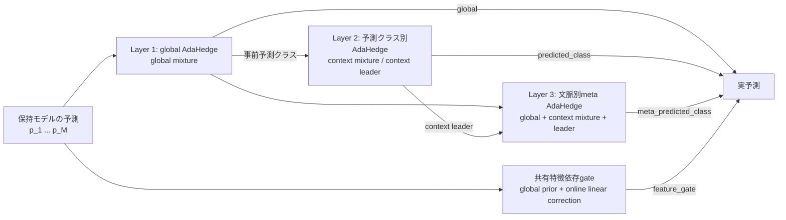

# SoftRoutingの予測レイヤー

## 位置づけ

SoftRoutingは、ドリフト検出、モデル作成、クラスタリングとは独立した**予測時のモデル統合層**である。
保持モデルや共有バックボーンの構造を変えず、既に計算したモデル別予測をどの重みで統合するかを
決める。現行実装ではRestarting SoftRoutingを持つFedSDA modeで利用できる。

正解ラベルは各AdaHedgeの重みを決めた後の更新にだけ使う。予測クラスもglobal mixtureから求めるため、
予測時のラベル漏洩はない。

## 各候補の意味

| 名称 | レイヤー | CLIで実予測に使用 | 内容 |
|---|---:|---|---|
| Global mixture | 1 | `--soft-routing-context global` | 全入力で共有したモデル別累積損失から全モデルを混合する |
| Context mixture | 2 | `--soft-routing-context predicted_class` | globalの事前予測クラスごとに別の累積損失を持ち、全モデルを再混合する |
| Context leader | 2 | 単独選択不可 | Context mixtureで最大重みのモデル。meta-routerの候補兼診断値 |
| Shadow meta | 3 | `predicted_class`時は診断のみ | Global mixtureとContext leaderを文脈別AdaHedgeで再混合する |
| Meta mixture | 3 | `--soft-routing-context meta_predicted_class` | Shadow metaと同じ候補混合を実予測に採用する |
| Feature gate | 特徴依存 | `--soft-routing-context feature_gate` | 共有特徴から入力ごとのモデル重みを計算する |

`meta_predicted_class`は、モデル別の実効重みに展開すると、global重み、context重み、context leaderへの
一点重みを上位AdaHedgeの比率で加えた混合になる。追加のモデルforward、通信、数値ハイパーパラメータはない。

候補集合は`--soft-routing-meta-candidates`で選ぶ。

- `global_leader`（既定値）はGlobal mixtureとContext leaderの2候補を混合する既存方式である。
- `global_context_leader`はContext mixtureも含む3候補を混合する。Globalの安定性、Context mixtureの
  滑らかさ、Context leaderの概念特化を同じAdaHedgeで比較し、固定閾値による切替を行わない。

いずれも候補間の重みは累積損失とmixability gapからAdaHedgeが自動計算する。学習率や切替閾値を
利用者が設定する必要はない。診断指標で使う重み`0.5`は「どちらをより重くしたか」の集計境界であり、
予測方式を切り替える条件ではない。

## 特徴依存のオンラインgate

`feature_gate`は、共有バックボーンが抽出した特徴ベクトルを入力とするsoftmax線形gateである。
Global AdaHedgeの重みを事前分布として使い、特徴に依存する補正を加えるため、未学習時はGlobal routingへ
一致する。正解ラベルが判明した後、同じサンプルについて既に計算済みの全モデル損失から、gateの
期待損失を下げるオンライン勾配更新を行う。予測時のラベル漏洩はない。

特徴は単位ノルム化し、更新幅は累積勾配ノルムの逆平方根から自動計算する。このため、routing用の
学習率・温度・切替閾値は追加しない。モデル集合、確定概念、または共有表現が変化した場合は、古い
特徴空間の証拠を持ち越さずgateを再始動する。共有特徴を必要とするため、現行実装はShared Backboneと
Residual AdapterのRestarting SoftRouting modeに限定する。

追加のモデルforwardや通信は発生しないが、特徴次元×モデル数の小さなローカルgate状態と、各サンプルの
softmax・オンライン更新計算が増える。これはモデル選択を予測クラスだけに限定しない、Meta routingとは
異なる比較軸である。

Meta-routerの更新損失は`--soft-routing-meta-loss`で選ぶ。

- `bounded_score`は、正解クラスへ割り当てた確率に基づく`[0, 1]`有界損失を使う。
  予測確率の較正も評価できる一方、最終0/1 accuracyと候補の優劣が逆転する場合がある。
- `zero_one`（既定値）は、候補の最終予測が正解なら0、不正解なら1として更新する。Meta-routerの目的を
  accuracyへ直接合わせるが、予測確率の確信度情報は使わない。

どちらも新しい数値閾値を導入せず、同じAdaHedge更新を使う。比較後は一方へ整理する前提の
実験的選択肢である。

## Shadow診断と実運用の関係

`predicted_class`では実予測をContext mixtureのまま維持し、同じ標本についてMeta mixtureをshadowで
計算する。`meta_predicted_class`ではそのMeta mixtureを実予測へ昇格する。どちらも同じ順序で、
予測後にglobal、context、metaの各AdaHedgeを更新する。

SoftRoutingの予測結果はモデル学習、ドリフト検出、モデル作成判断へ戻さない。そのため、同じseedと
設定なら、`predicted_class`で記録したshadow meta精度と`meta_predicted_class`の実accuracyは一致する。

## 比較上の扱い

- `global`は単純で安定した基準方式であり、当面の既定値として残す。
- `meta_predicted_class`はSine2・MNIST2・MNIST4でglobalを上回った一方、Circle2では5 seedすべてで
  わずかに下回った。現時点では一律の既定値ではなく、更新損失との整合性を検証する候補である。
- `predicted_class`は現時点の実験ではglobalまたはmetaにほぼ支配されている。素朴な文脈別再混合の
  ablationとしては意味があるが、主要方式へ昇格しない場合は将来の整理候補である。
- `context leader`は独立方式ではなくmetaの構成要素なので、CLI modeを増やさない。
- Shadow診断は新方式の導入前後で同一系列上の反実仮想比較を行えるため維持する。

## 実験上の位置づけ

5 seed・5000 stepの`bounded_score`診断では、Meta mixtureはGlobal mixtureに対してSine2で
約0.37ポイント、MNIST2で約0.11ポイント、MNIST4で約0.38ポイントaccuracyを改善した。
SEA2・SEA4ではほぼ同等で、Circle2では約0.07ポイント下回った。したがって、Metaは全データで
Globalを支配する方式ではないが、複雑な多クラス問題とSine2で比較的大きな利得を示す有力候補である。

5 seed・5000 stepでは、`zero_one`は`bounded_score`に対してCircle2を約0.03ポイント、MNIST2を
約0.06ポイント、MNIST4を約0.10ポイント改善し、各データの全seedで上回った。SEA2・SEA4・Sine2は
実質同等だった。数値閾値を増やさず評価目的をaccuracyへ揃えられるため、Metaの既定損失には
`zero_one`を採用する。

Global mixtureとの比較では、`zero_one` MetaはSine2を約0.37ポイント、MNIST2を約0.17ポイント、
MNIST4を約0.48ポイント改善し、全seedで上回った。SEA2・SEA4は同等である。Circle2だけは従来Metaの
劣後を約0.07ポイントから約0.04ポイントへ縮めたものの、全seedでGlobalをわずかに下回った。
このため、Metaを全データ共通の既定ルーティングにはせず、有力な拡張としてGlobalと併記する。

論文上は、Global mixtureを単純な基準とし、Meta mixtureを「Global mixtureと予測クラス別leaderを
2-expert AdaHedgeで統合する拡張」として分けて説明する。Metaは既存のモデル出力だけを再利用し、
追加forward・通信・数値閾値を必要としないため、三層すべてを個別手法として並べる必要はない。
Context mixtureはMetaの比較ablation、Context leaderは内部候補として扱う。

共有バックボーンやResidual Adapterとの関係は[shared-backbone.md](shared-backbone.md)、保存指標は
[metrics.md](metrics.md)、CLI依存関係は自動生成される[options.md](options.md)を参照する。
