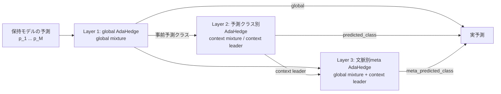

# SoftRoutingの予測レイヤー

## 位置づけ

SoftRoutingは、ドリフト検出、モデル作成、クラスタリングとは独立した**予測時のモデル統合層**である。
保持モデルや共有バックボーンの構造を変えず、既に計算したモデル別予測をどの重みで統合するかを
決める。現行実装ではRestarting SoftRoutingを持つFedSDA modeで利用できる。

正解ラベルは各AdaHedgeの重みを決めた後の更新にだけ使う。予測クラスもglobal mixtureから求めるため、
予測時のラベル漏洩はない。

## 各候補の意味

| 名称 | レイヤー | CLIで実予測に使用 | 内容 |
|---|---:|---|---|
| Global mixture | 1 | `--soft-routing-context global` | 全入力で共有したモデル別累積損失から全モデルを混合する |
| Context mixture | 2 | `--soft-routing-context predicted_class` | globalの事前予測クラスごとに別の累積損失を持ち、全モデルを再混合する |
| Context leader | 2 | 単独選択不可 | Context mixtureで最大重みのモデル。meta-routerの候補兼診断値 |
| Shadow meta | 3 | `predicted_class`時は診断のみ | Global mixtureとContext leaderを文脈別AdaHedgeで再混合する |
| Meta mixture | 3 | `--soft-routing-context meta_predicted_class` | Shadow metaと同じ計算を実予測に採用する |

`meta_predicted_class`は、モデル別の実効重みに展開すると、global重みとcontext leaderへの一点重みを
上位AdaHedgeの比率で加えた混合になる。追加のモデルforward、通信、数値ハイパーパラメータはない。

## Shadow診断と実運用の関係

`predicted_class`では実予測をContext mixtureのまま維持し、同じ標本についてMeta mixtureをshadowで
計算する。`meta_predicted_class`ではそのMeta mixtureを実予測へ昇格する。どちらも同じ順序で、
予測後にglobal、context、metaの各AdaHedgeを更新する。

SoftRoutingの予測結果はモデル学習、ドリフト検出、モデル作成判断へ戻さない。そのため、同じseedと
設定なら、`predicted_class`で記録したshadow meta精度と`meta_predicted_class`の実accuracyは一致する。

## 比較上の扱い

- `global`は単純で安定した基準方式であり、当面の既定値として残す。
- `meta_predicted_class`はSine2・MNIST2・MNIST4でglobalを上回った次期候補である。
- `predicted_class`は現時点の実験ではglobalまたはmetaにほぼ支配されている。素朴な文脈別再混合の
  ablationとしては意味があるが、主要方式へ昇格しない場合は将来の整理候補である。
- `context leader`は独立方式ではなくmetaの構成要素なので、CLI modeを増やさない。
- Shadow診断は新方式の導入前後で同一系列上の反実仮想比較を行えるため維持する。

共有バックボーンやResidual Adapterとの関係は[shared-backbone.md](shared-backbone.md)、保存指標は
[metrics.md](metrics.md)、CLI依存関係は自動生成される[options.md](options.md)を参照する。
